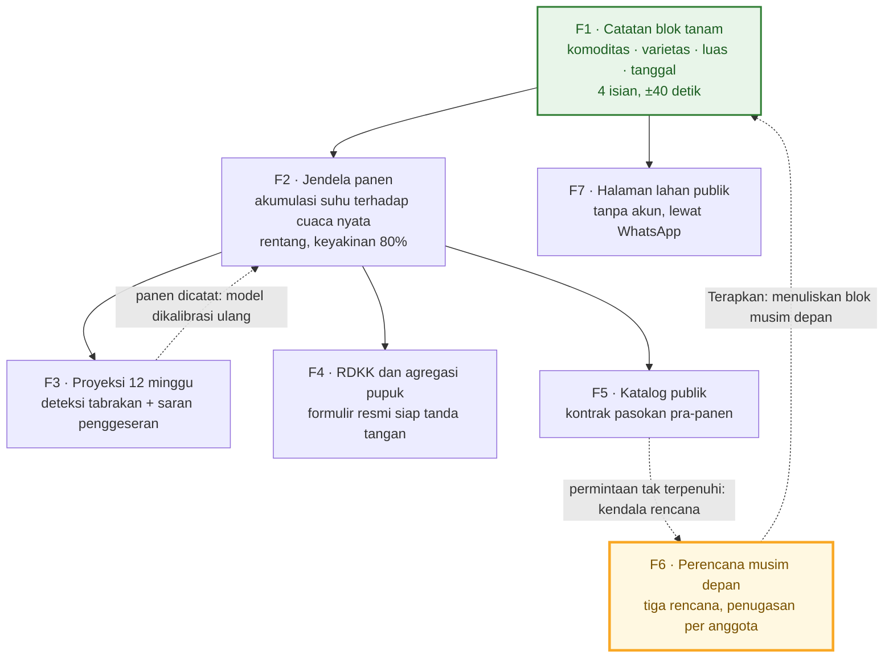
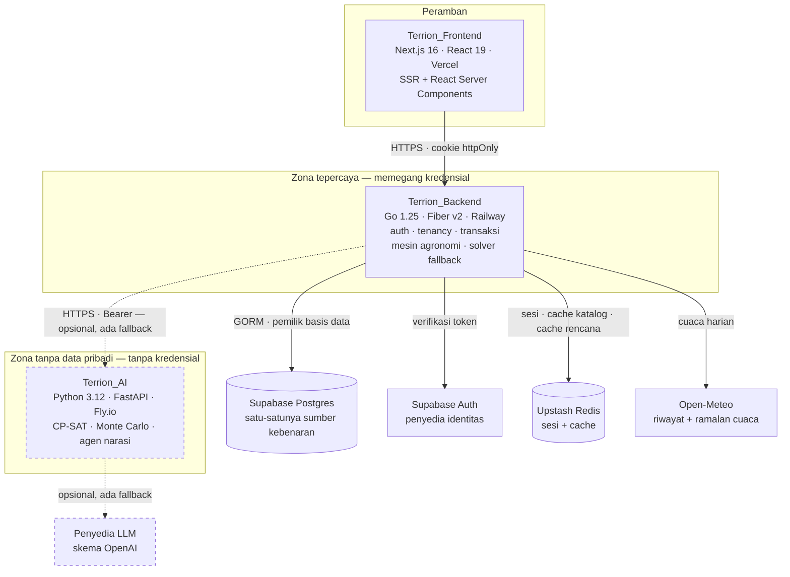

<div align="center">

# 🌾 TERRION

### Satu catatan tanam, empat keluaran. Satu rencana tanam, satu musim yang tidak menabrak dirinya sendiri.

**Sistem Pencatatan & Perencanaan Produksi untuk Koperasi Tani Indonesia**

[](https://terrion.vercel.app)
[](https://github.com/BRYAN1309/terrion)
[](LICENSE)

**Submission for ITECHNO CUP 2026 — Web Development (Mahasiswa)**

**By Tim S2U — BINUS University**

</div>

<div align="center">

| | |
|---|---|
| **Tema** | *Adaptive Innovation for a Future-Ready Digital Society* |
| **Subtema** | *Smart Sustainable Digital Solution for Inclusive Society* |
| **SDG yang diimplementasikan** | **SDG 8** (utama) · **SDG 9** (utama) · **SDG 11** (pendukung, target 11.a) |
| **Wilayah data awal** | Kabupaten Subang, Jawa Barat |
| **Unit yang dilayani** | Koperasi tani — bukan petani perorangan |

</div>

---

## 📋 Daftar Isi

- [👥 Anggota Tim](#-anggota-tim)
- [📐 Catatan Metodologi Angka](#-catatan-metodologi-angka)
- [🎯 1. Penjelasan Proyek](#-1-penjelasan-proyek)
  - [1.1 Latar Belakang](#11-latar-belakang)
  - [1.2 Gap Analysis](#12-gap-analysis)
  - [1.3 Keterkaitan Permasalahan dengan SDGs](#13-keterkaitan-permasalahan-dengan-sdgs)
  - [1.4 Rumusan Masalah](#14-rumusan-masalah)
  - [1.5 Deskripsi Solusi](#15-deskripsi-solusi)
  - [1.6 Tujuan](#16-tujuan)
  - [1.7 Target Pengguna](#17-target-pengguna)
  - [1.8 Value Proposition](#18-value-proposition)
- [✨ 2. Penjelasan Fitur](#-2-penjelasan-fitur)
  - [2.1 Cara Membaca Bab Ini](#21-cara-membaca-bab-ini)
  - [2.2 Peta Layar](#22-peta-layar)
  - [2.3 Fitur Utama](#23-fitur-utama)
  - [2.4 Fitur Tambahan](#24-fitur-tambahan)
  - [2.5 Ringkasan Keterlacakan Fitur](#25-ringkasan-keterlacakan-fitur)
- [🌍 3. Dampak Solusi terhadap SDGs](#-3-dampak-solusi-terhadap-sdgs)
  - [3.1 Cara Bab Ini Mengukur Dampak](#31-cara-bab-ini-mengukur-dampak)
  - [3.2 SDG 8 — Pekerjaan Layak dan Pertumbuhan Ekonomi](#32-sdg-8--pekerjaan-layak-dan-pertumbuhan-ekonomi-utama)
  - [3.3 SDG 9 — Industri, Inovasi, dan Infrastruktur](#33-sdg-9--industri-inovasi-dan-infrastruktur-utama)
  - [3.4 SDG 11 — Kota dan Komunitas Berkelanjutan](#34-sdg-11--kota-dan-komunitas-berkelanjutan-pendukung)
  - [3.5 Ko-manfaat yang Dinyatakan, Bukan Diklaim](#35-ko-manfaat-yang-dinyatakan-bukan-diklaim-)
  - [3.6 Inklusivitas sebagai Keputusan Arsitektur](#36-inklusivitas-sebagai-keputusan-arsitektur-bukan-kata-sifat)
  - [3.7 Batas Klaim Dampak](#37-batas-klaim-dampak--apa-yang-belum-bisa-dikatakan)
  - [3.8 Ringkasan Dampak](#38-ringkasan-dampak--sdg--gap--fitur--metrik--status)
- [📸 4. Demo & Screenshot](#-4-demo--screenshot)
- [🛠️ 5. Teknologi](#️-5-teknologi)
  - [5.1 Tech Stack](#51-tech-stack)
  - [5.2 Alasan Pemilihan Teknologi](#52-alasan-pemilihan-teknologi)
  - [5.3 Dependencies Utama](#53-dependencies-utama)
  - [5.4 Efisiensi Teknologi](#54-efisiensi-teknologi--angka-yang-menopang-pilihan)
  - [5.5 Yang Belum Ada di Sisi Teknologi](#55-yang-belum-ada-di-sisi-teknologi)
- [🏗️ 6. Arsitektur Sistem](#️-6-arsitektur-sistem)
  - [6.1 System Architecture](#61-system-architecture-fe--be--ai)
  - [6.2 Frontend Architecture](#62-frontend-architecture)
  - [6.3 Backend Architecture](#63-backend-architecture)
  - [6.4 AI Architecture](#64-ai-architecture)
  - [6.5 Database Schema (ERD)](#65-database-schema-erd)
  - [6.6 Folder Project Structure](#66-folder-project-structure)
- [⚙️ 7. Instalasi & Setup](#️-7-instalasi--setup)
  - [7.0 Layanan yang Sudah Berjalan](#70-layanan-yang-sudah-berjalan)
  - [7.1 Prerequisites](#71-prerequisites)
  - [7.2 Clone Ketiga Repositori](#72-clone-ketiga-repositori)
  - [7.3 Jalur A — Tanpa Docker](#73-jalur-a--instalasi-tanpa-docker)
  - [7.4 Jalur B — Dengan Docker](#74-jalur-b--instalasi-dengan-docker)
  - [7.5 Verifikasi Instalasi](#75-verifikasi-instalasi)
  - [7.6 Pemecahan Masalah](#76-pemecahan-masalah)
- [🚀 8. Penggunaan](#-8-penggunaan)
- [📚 9. API Documentation](#-9-api-documentation)
  - [9.1 Aturan Umum](#91-aturan-umum)
  - [9.2 Ringkasan Seluruh Endpoint](#92-ringkasan-seluruh-endpoint)
  - [9.3 Endpoint Publik](#93-endpoint-publik)
  - [9.4 Lahan, Panen, dan Dasbor](#94-endpoint-terautentikasi--lahan-panen-dan-dasbor)
  - [9.5 RDKK, Pasar, Penggeseran, Rencana](#95-endpoint-terautentikasi--rdkk-pasar-penggeseran-rencana)
  - [9.6 Endpoint Cron](#96-endpoint-cron)
  - [9.7 Kontrak Internal Dua Layanan](#97-kontrak-internal-dua-layanan--v10)
  - [9.8 Tipe Bersama](#98-tipe-bersama)
  - [9.9 Katalog Kode Kesalahan](#99-katalog-kode-kesalahan)
  - [9.10 Contoh Pemakaian](#910-contoh-pemakaian)
  - [9.11 CORS dan Batasan](#911-cors-dan-batasan)
- [🧪 10. Testing](#-10-testing)
  - [10.1 Running Tests](#101-running-tests)
  - [10.2 Test Coverage](#102-test-coverage)
  - [10.3 Sebaran Uji](#103-sebaran-uji)
  - [10.4 Kenapa Uji Berjalan Tanpa Infrastruktur](#104-kenapa-uji-bisa-berjalan-tanpa-docker-tanpa-basis-data-dan-tanpa-kunci-api)
  - [10.5 Jenis Uji yang Ada](#105-jenis-uji-yang-ada--dan-yang-tidak)
  - [10.6 Uji yang Mengunci Invarian](#106-uji-yang-mengunci-invarian)
  - [10.7 Yang Belum Ada](#107-yang-belum-ada)
- [🧭 Peta Dokumen ke Rubrik Penilaian](#-peta-dokumen-ke-rubrik-penilaian)
- [📖 Referensi](#-referensi)
- [📄 Lisensi](#-lisensi)

---

## 👥 Anggota Tim

**Tim S2U — Universitas Bina Nusantara**

| Nama | NIM | Peran | GitHub |
|---|---|---|---|
| **Bryan Thanaya** | 2702334784 | Project Lead · Backend & AI Engineer | [@BRYAN1309](https://github.com/BRYAN1309) |
| **Lavinia Nataniela Novyandi** | 2702331763 | `[PERAN — mis. Frontend Developer & UI/UX Designer]` | [@`[username]`](https://github.com/) |
| **David Christian** | 2702253143 | `[PERAN — mis. Frontend Developer & QA]` | [@`[username]`](https://github.com/) |

> 🔧 **Yang masih perlu diisi:** peran definitif dan tautan GitHub untuk dua anggota. Rubrik *Dokumentasi & Repositori* menilai kerapian repositori — pastikan setiap nama di tabel ini punya riwayat *commit* yang terlihat.

---

## 📐 Catatan Metodologi Angka

Terrion dibangun di atas satu aturan desain: **sistem yang menerbitkan angka wajib menyatakan dari mana angkanya datang.** Dokumen ini memakai aturan yang sama pada dirinya sendiri. Setiap angka diberi salah satu dari tiga label:

| Label | Arti |
|---|---|
| **DIKUTIP** | Diambil apa adanya dari sumber resmi yang tercantum di [daftar referensi](#-referensi) |
| **DITURUNKAN** | Dihitung dari angka DIKUTIP, dengan rumus yang ditulis terbuka |
| **ASUMSI** | Belum ada sumbernya; dinyatakan sebagai asumsi beserta alasannya, dan dibuat konservatif |

Tidak ada angka di dokumen ini yang tidak berlabel. Ini bukan formalitas — ini prinsip produk yang sama (`null` ≠ `0`) yang diterapkan pada dokumennya sendiri.

---

## 🎯 1. Penjelasan Proyek

### 1.1 Latar Belakang

#### Struktur yang membuat masalahnya tidak terlihat

Sensus Pertanian 2023 mencatat **27,8 juta petani pengguna lahan** di Indonesia, dan **17,25 juta di antaranya adalah petani gurem** dengan penguasaan lahan di bawah 0,5 hektare [1] **[DIKUTIP]**. Dari 28,4 juta rumah tangga usaha pertanian, **15,55 juta bergerak di subsektor tanaman pangan** [1] **[DIKUTIP]**. Artinya, produksi pangan nasional tidak dijalankan oleh perusahaan besar, melainkan oleh **puluhan juta unit keputusan yang sangat kecil dan sepenuhnya terpisah satu sama lain**.

Struktur ini melahirkan satu kegagalan yang tidak pernah muncul di neraca siapa pun: **kegagalan koordinasi**. Di satu desa, benih datang bersamaan, hujan pertama turun bersamaan, dan tetangga saling mengikuti. Puluhan petani menanam varietas yang sama di minggu yang sama — lalu memanen di minggu yang sama, dan pasar lokal kebanjiran satu komoditas persis ketika semua orang punya barang untuk dijual.

```
30 anggota menanam varietas yang sama di minggu yang sama
        (hal biasa di satu desa — bibit datang bersamaan,
         hujan pertama turun bersamaan, semua ikut tetangga)
                          ↓
     30 anggota panen di minggu yang sama, ±beberapa hari
                          ↓
             pasar lokal kebanjiran satu komoditas
                          ↓
    HARGA JATUH persis ketika semua orang punya barang dijual
                          ↓
     posisi tawar hilang; siapa pun yang datang membeli
              hari itu menentukan harganya
```

**Tidak ada yang merencanakan ini terjadi.** Ia terjadi karena tidak ada yang bisa melihatnya datang.

#### Buktinya terlihat pada sebaran harga, bukan pada rata-ratanya

Harga Pembelian Pemerintah (HPP) gabah kering panen ditetapkan **Rp6.500/kg** untuk 2025 dan dipertahankan pada 2026 [2] **[DIKUTIP]**. Namun laporan lapangan saat panen raya menyebut petani di sejumlah sentra — termasuk **Indramayu**, yang berbatasan langsung dengan wilayah data Terrion — menerima sekitar **Rp5.000/kg** [3] **[DIKUTIP]**, sementara di luar puncak panen raya harga gabah kering panen tercatat menembus **Rp7.000/kg** [4] **[DIKUTIP]**.

Selisih **Rp2.000/kg** antara Rp7.000 dan Rp5.000 **[DITURUNKAN]** sebagian besar bukan selisih mutu. Ia adalah **selisih kapan barang datang** — dan kapan barang datang ditentukan pada hari tanam, tiga sampai lima bulan sebelumnya.

Yang harus dinyatakan jujur, karena kejujurannya justru menguatkan argumen: **rata-rata nasional tidak turun di bawah HPP.** Artinya ini adalah **masalah sebaran, bukan masalah rata-rata** — kejatuhan harga bersifat lokal dan musiman. Persis jenis masalah yang **tidak terlihat pada statistik nasional dan hanya terlihat pada tingkat koperasi.** Dan persis jenis masalah yang tidak bisa diselesaikan dengan menaikkan HPP, karena penyebabnya adalah **waktu**, bukan harga.

#### Akar teknisnya: catatan yang ada, tetapi tidak bisa dijumlahkan

Sebuah koperasi dengan 47 lahan anggota tidak memegang satu pun angka gabungan. Setiap kader menyimpan catatannya di buku tulis atau lembar Excel terpisah. Ketika pengurus ditanya *"berapa ton yang akan panen bulan depan"*, jawabannya adalah **perkiraan lisan, bukan hitungan**.

Datanya sebenarnya **sudah ada**. Yang tidak ada adalah **bentuk yang bisa dijumlahkan**. Untuk melihat gelombang panen datang, seseorang harus mampu menjumlahkan 141 blok tanam menjadi satu grafik mingguan — dan itu persis yang tidak bisa dilakukan terhadap 47 buku tulis.

Konsekuensinya berantai: administrasi pupuk bersubsidi disalin ulang dengan tangan setiap musim; pembeli institusi tidak bisa menemukan panen sebelum panen terjadi sehingga celahnya diisi perantara yang datang di hari panen; dan perkiraan panen tetap memakai aturan kalender (*"padi Ciherang panen 110 hari setelah tanam"*) yang secara sistematis meleset, karena laju perkembangan tanaman adalah fungsi akumulasi suhu, bukan fungsi tanggal.

#### Kenapa sekarang — dua perubahan kebijakan bertemu di satu titik, dan titik itu koperasi

**Pertama, koperasi baru saja diberi anggaran untuk didigitalkan.** Program Koperasi Desa/Kelurahan Merah Putih (KDMP) berjalan atas Inpres Nomor 9 Tahun 2025 dengan target **80.000 koperasi** [5] **[DIKUTIP]**; per Juli 2026 tercatat **83.382 koperasi terdaftar** pada dashboard resmi, dan pemerintah menargetkan sekitar **60.000 aktif beroperasi pada akhir 2026** [6] **[DIKUTIP]**. Untuk menopangnya, Kementerian Koperasi menyatakan kebutuhan anggaran transformasi digital KDMP sebesar **Rp480 miliar pada 2026** — mencakup pengembangan aplikasi, infrastruktur, keamanan siber, dan integrasi data [7] **[DIKUTIP]**.

**Kedua, koperasi baru saja diberi tanggung jawab yang lebih besar.** Tata kelola pupuk bersubsidi berubah lewat **Perpres Nomor 6 Tahun 2025** dan **Permentan Nomor 15 Tahun 2025**: **titik serah** pupuk bersubsidi kini mencakup empat entitas — Pengecer, Gapoktan, Pokdakan, dan **Koperasi**. Skalanya bukan skala kecil: alokasi pupuk bersubsidi nasional 2026 ditetapkan **9,55 juta ton**, dengan **14,1 juta NIK petani** sudah disahkan di dalam sistem e-RDKK [8] **[DIKUTIP]**.

> **Kesimpulannya:** koperasi baru saja menjadi unit yang **diberi tanggung jawab lebih besar**, sekaligus unit yang **diberi anggaran untuk didigitalkan**, sekaligus unit yang **satu-satunya bisa melihat masalah koordinasi ini** — karena masalahnya baru muncul ketika puluhan lahan dijumlahkan. Terrion menargetkan tepat unit itu.

Sistem yang menyasar petani perorangan harus menunggu jutaan orang berubah kebiasaan. Sistem yang menyasar koperasi hanya perlu **satu kader per koperasi** — dan kader itu memang sudah dibayar untuk mencatat.

#### Kekosongan yang tersisa

Namun bahkan setelah pencatatan dirapikan, satu lubang tetap terbuka. Petakan seluruh perangkat lunak pertanian yang ada terhadap sumbu waktu satu musim:

```
    KEPUTUSAN               TANAM        TUMBUH       PANEN       JUAL      BAYAR
  (apa · varietas ·           │             │           │           │         │
   kapan · di lahan siapa)    │             │           │           │         │
         │                    │             │           │           │         │
    ┌────┴────┐          catat blok   prediksi    catat panen   katalog   laporan
    │ KOSONG  │          ─────────────────────────────────────────────────────────
    │         │          RDKK · deteksi tabrakan · penggeseran · permintaan pembeli
    └─────────┘
   3–5 bulan            ←─── SELURUH PERANGKAT LUNAK YANG ADA BEKERJA DI SINI ───→
   sebelum tanam
```

Keputusan yang menentukan apakah harga akan jatuh — **komoditas apa, varietas apa, tanggal berapa, di lahan siapa** — diambil di kotak `KOSONG` itu. **Tidak ada sistem yang menempatinya.** Bab ini menjelaskan mengapa kotak itu kosong, dan bagaimana Terrion mengisinya.

---

### 1.2 Gap Analysis

Lima kesenjangan. Empat yang pertama adalah rantai sebab-akibat dari satu akar yang sama; kesenjangan kelima letaknya satu langkah lebih ke hulu daripada keempatnya.

#### G1 · Kesenjangan Agregasi Data — data ada, tetapi tidak bisa dijumlahkan

Kader koperasi **sudah** mencatat siapa menanam apa di lahan seluas berapa. Catatan itu tersimpan di buku tulis dan lembar Excel terpisah, sehingga 47 catatan tidak pernah bisa menjadi satu grafik mingguan. Koperasi karena itu **tidak memiliki satu pun angka gabungan** tentang produksinya sendiri — tidak tahu berapa ton yang akan panen bulan depan, dan tidak bisa menjanjikan pasokan kepada siapa pun.

**Yang menanggung:** petani (harga jatuh di minggu ia panen), koperasi (tidak punya posisi tawar), pembeli institusi (pasokan tidak bisa diprediksi, terpaksa lewat perantara).

#### G2 · Kesenjangan Akurasi Prediksi — kalender dipakai sebagai pengganti model

Praktik lazim memakai aturan *"varietas X panen dalam N hari setelah tanam"*, yaitu rata-rata lintas lokasi dan lintas tahun, diterapkan seolah-olah berlaku untuk satu petak tertentu di satu musim tertentu. Laju perkembangan tanaman sebenarnya adalah fungsi **akumulasi suhu efektif** di atas suhu basal: musim hangat mematangkan lebih cepat, musim dingin memperlambat. Kalender tidak melihat itu sama sekali.

Kesalahannya **mengalir ke hilir**: jendela panen meleset seminggu → peringatan tumpukan panen menunjuk minggu yang salah → saran penggeseran menggeser blok yang salah → katalog menjanjikan pasokan pada minggu yang keliru. Ditambah satu cacat yang lebih halus: **tanggal tunggal mengklaim presisi yang tidak dimiliki siapa pun.** Menuliskan *"panen 14 Maret"* membuat pembacanya menyewa truk untuk tanggal 14; rentang *"12–18 Maret, keyakinan 80%"* membuatnya merencanakan satu minggu.

#### G3 · Kesenjangan Administratif — pekerjaan yang sama dikerjakan dua kali

Data untuk mengisi e-RDKK — siapa menanam apa, di lahan seluas berapa — **sudah dimiliki kader**, tetapi tersimpan dalam bentuk yang tidak bisa dijumlahkan. Maka setiap musim seseorang menyalin ulang informasi yang sama ke formulir dengan tangan, dan **setiap salinan adalah kesempatan baru untuk salah ketik**. Dua kegagalan turunannya nyata: anggota yang melewati batas subsidi 2 hektare tidak terdeteksi (pengajuan ditolak, atau kelebihan dipotong tanpa ada yang tahu anggota mana yang dikurangi), dan kebutuhan pupuk salah dijumlahkan (koperasi kurang atau lebih pesan — keduanya mahal).

**e-RDKK bukan yang kosong.** e-RDKK adalah ujung penyerahan ke pemerintah, dan ia berfungsi: 14,1 juta NIK sudah disahkan di dalamnya [8]. Yang kosong ada di hulu: **menyusun angkanya.**

#### G4 · Kesenjangan Informasi Pasar — dua pihak saling menunggu

```
Pembeli institusi menunggu kepastian pasokan  ←──┐
                                                  │  saling menunggu
Koperasi menunggu kepastian pembeli           ←──┘
                          ↓
        celahnya diisi perantara yang datang di HARI PANEN,
             ketika petani sudah tidak punya pilihan lain
```

Informasi untuk menutup celah ini sederhana — **komoditas apa, berapa ton, kira-kira minggu ke berapa** — dan bisa diturunkan dari catatan tanam yang sudah ada, **kalau saja catatan itu berbentuk angka**. Kesenjangan ini adalah anak langsung dari G1 dan G2.

#### G5 · Kesenjangan Temporal — tidak ada tempat untuk menyatakan apa yang *akan* ditanam

Ini kesenjangan yang paling menentukan, dan yang paling jarang disebut. Seluruh perangkat lunak pertanian yang ada — termasuk empat belas layar pertama Terrion sendiri — **membaca fakta yang sudah terjadi**. Padahal keputusan yang menentukan apakah harga akan jatuh diambil **3–5 bulan sebelum benih masuk tanah**.

Akibatnya bisa ditunjuk satu per satu:

| Akibat | Wujudnya |
|---|---|
| Fitur penggeseran tanam tidak pernah bisa menyala | Menggeser tanggal tanam yang **sudah lewat** tidak memindahkan satu ton panen pun; ia hanya membuat catatan bertengkar dengan lapangan. Karena koperasi mencatat **setelah** tanam, populasi blok yang memenuhi syarat adalah **nol** |
| RDKK terbit setelah tanam | RDKK adalah singkatan dari **Rencana** Definitif Kebutuhan Kelompok — menurut definisinya dokumen pra-musim. Menyusunnya dari tanaman yang sudah tumbuh membuat angkanya benar dan **waktunya terlambat** untuk jalur alokasi subsidi |
| Katalog hanya berisi yang sudah di tanah | Pembeli baru bisa mengikat **setelah** benih ditanam, padahal keputusan menanam itulah yang sebenarnya ingin ia pengaruhi |
| Sinyal permintaan pasar tidak pernah dibaca balik | Permintaan yang ditolak dan jendela yang kehabisan alokasi tersimpan tetapi tidak dibaca satu layar pun — padahal digabungkan, keduanya adalah **kurva permintaan koperasi itu sendiri** |

**Kesimpulan yang mudah diambil dan salah:** *"koperasi harus berubah kebiasaan, mencatat rencana sebelum tanam."* Beban seperti itu tidak akan diambil siapa pun — tidak ada koperasi yang akan mengetik 47 rencana tanam ke dalam formulir hanya supaya sebuah tombol di dasbor bisa aktif.

**Kesimpulan yang benar: sistem harus menyediakan alasan sekaligus alatnya** — rencana yang lebih baik daripada yang bisa disusun sendiri di atas kertas, dan yang **menuliskan dirinya ke sistem tanpa satu pun pengetikan ulang**.

#### Peta kesenjangan terhadap solusi yang sudah ada

Bagian ini menjawab pertanyaan juri yang paling wajar: *"bukankah ini sudah ada?"*

| Solusi yang sudah ada | Yang dikerjakannya | Yang **tidak** dikerjakannya | Gap tersisa |
|---|---|---|---|
| **KATAM Terpadu** (Kementan) | Rekomendasi waktu tanam pada **skala kecamatan** (*"kecamatan ini mulai tanam dasarian 2 November"*) | Tidak menjawab siapa menanam apa pada hari yang mana **di dalam** jendela itu — masalah koordinasi antar-anggota tidak muncul pada skala kecamatan | **G5** |
| **e-RDKK / SIMLUHTAN** (Kementan) | Menerima, memverifikasi, dan menyalurkan usulan kebutuhan pupuk bersubsidi [8] | Tidak **menyusun** angkanya; tidak memprediksi panen; tidak mendeteksi anggota melewati batas 2 ha sebelum pengajuan | **G1, G3** |
| **Platform digitalisasi KDMP generik** (POS, simpan-pinjam, sembako) [7] | Administrasi keuangan dan perdagangan koperasi | Tidak menyentuh **sisi produksi** sama sekali — tidak tahu apa yang ditanam anggotanya | **G1, G2, G4, G5** |
| **Agritech pendampingan petani** (mis. Eratani, Agree) | Pendampingan agronomi, pembiayaan, penyaluran input, dan penyerapan hasil untuk **petani/klaster** [9][10] | Unit kerjanya petani atau klaster, bukan **koordinasi jadwal antar-anggota satu koperasi**; tidak menerbitkan RDKK sebagai keluaran turunan | **G3, G5** |
| **Marketplace hasil tani** | Mempertemukan penjual dan pembeli **setelah** barang ada | Berguna pada pengguna ke-seribu, bukan pada koperasi pertama; tidak menyelesaikan G1 karena datanya lahir dari transaksi, bukan sebaliknya | **G1, G2, G5** |
| **Buku tulis / Excel kader** (status quo) | Mencatat | Tidak bisa dijumlahkan, tidak bisa dibagikan, tidak bisa diprediksi | **Semua** |

> **Ringkasnya:** yang tersedia hari ini menjawab *"kapan boleh mulai tanam"* (skala kecamatan) dan *"bagaimana menyerahkan kebutuhan pupuk"* (skala kelompok). **Tidak ada yang menjawab pertanyaan di antara keduanya** — *"lalu di dalam jendela itu, siapa menanam apa pada hari yang mana, supaya kami tidak panen berbarengan."* Pertanyaan itu adalah persoalan **koordinasi antar-anggota**, dan ia hanya muncul pada unit koperasi.

---

### 1.3 Keterkaitan Permasalahan dengan SDGs

Keterkaitan ini **struktural, bukan tempelan**: mekanisme produk dan mekanisme target SDG adalah mekanisme yang sama.

#### SDG 8 — Pekerjaan Layak dan Pertumbuhan Ekonomi *(utama)*

**Target yang disasar: 8.2** (peningkatan produktivitas ekonomi melalui diversifikasi dan modernisasi teknologi) dan **8.3** (kebijakan yang mendukung kegiatan produktif dan pertumbuhan usaha mikro-kecil).

Petani kecil kehilangan posisi tawar **bukan karena kurang produktif, melainkan karena tidak punya data.** Ketika 30 anggota memanen di minggu yang sama, siapa pun yang datang membeli hari itu menentukan harganya. Kegagalan ini bukan kegagalan pasar — ia **kegagalan koordinasi yang bisa dihindari**, dan biayanya ditanggung oleh pihak yang paling tidak mampu menanggungnya: selisih Rp5.000 versus Rp7.000 per kilogram [3][4].

Rantai sebab-akibat yang menghubungkan masalah ke target:

```
catatan tanam yang bisa dijumlahkan
   → koperasi tahu berapa ton dan pada minggu ke berapa
   → koperasi bisa berbicara dengan pembeli SEBELUM panen
   → pembeli mengikatkan diri sebelum harga jatuh
   → petani tidak lagi berhadapan dengan pembeli tunggal di hari panen   [8.3]

+ jalur kedua: puncak panen diratakan → pasar lokal tidak kebanjiran     [8.2]

+ jalur ketiga (paling hulu, karena itu paling murah):
  rencana tanam disusun 3–5 bulan sebelum benih masuk tanah
   → puncak diratakan SEBELUM terjadi, bukan digeser sesudahnya          [8.2]
   → RDKK terbit di dalam jendela alokasi subsidi, bukan sesudahnya      [8.3]
```

#### SDG 9 — Industri, Inovasi, dan Infrastruktur *(utama)*

**Target yang disasar: 9.3** (meningkatkan akses usaha skala kecil terhadap integrasi ke rantai nilai dan pasar) dan **9.c** (meningkatkan akses terhadap teknologi informasi dan komunikasi).

Permasalahannya adalah **lapisan infrastruktur data yang kosong**. e-RDKK melayani ujung penyerahan ke pemerintah; KATAM Terpadu melayani skala kecamatan; tidak ada yang melayani **penyusunan angka di tingkat koperasi**. Selama lapisan itu kosong, digitalisasi 80.000 KDMP [5][7] akan berhenti pada administrasi keuangan dan tidak pernah menyentuh sisi produksi — yaitu sisi tempat 27,8 juta petani [1] sebenarnya berdiri.

Terrion mengisi lapisan itu **dan menerbitkan sebagian keluarannya ke publik**, sehingga pihak luar (pembeli institusi, penyuluh, pemerintah desa) bisa bertindak berdasarkan data yang sama — yaitu definisi infrastruktur, bukan definisi aplikasi.

#### SDG 11 — Kota dan Komunitas Berkelanjutan *(pendukung)*

**Target yang disasar: 11.a** — memperkuat keterkaitan ekonomi positif antara wilayah perkotaan, pinggiran, dan **perdesaan** melalui penguatan perencanaan pembangunan nasional dan regional.

Katalog publik Terrion menghubungkan produksi desa dengan pembeli institusi kota (pabrik pengolahan, pemasok katering, pedagang besar) **berdasarkan proyeksi, bukan berdasarkan stok yang sudah menumpuk**. Dan lapis perencanaan pra-musim adalah, secara harfiah, **perencanaan produksi tingkat regional yang dikerjakan oleh komunitas desanya sendiri** — bukan diturunkan dari atas.

#### Ko-manfaat di luar cakupan klaim *(dinyatakan, tidak diklaim)*

Meratakan puncak panen mingguan secara wajar menurunkan kehilangan pasca panen akibat kapasitas pengeringan dan penggilingan yang terlampaui (**SDG 12.3**), dan memperbaiki stabilitas pasokan pangan lokal (**SDG 2.3**). Terrion **tidak mengklaim** kedua target ini, karena belum ada musim nyata yang diukur — ia mencatatnya sebagai konsekuensi yang diharapkan, dan metrik pengukurnya sudah disiapkan.

#### Ringkasan keterkaitan

| Masalah (Gap) | SDG & Target | Mekanisme penghubung |
|---|---|---|
| G1 Agregasi data | 9.3, 9.c | Lapisan infrastruktur data koperasi yang selama ini kosong |
| G2 Akurasi prediksi | 8.2 | Modernisasi teknologi: model akumulasi suhu menggantikan kalender |
| G3 Administrasi ganda | 8.3, 9.3 | Akses pupuk bersubsidi tanpa kesalahan salin dan tanpa pelanggaran batas 2 ha |
| G4 Informasi pasar | 8.3, 11.a | Keterkaitan desa–kota berbasis proyeksi, memotong ketergantungan pada perantara hari-panen |
| G5 Kekosongan temporal | 8.2, 11.a | Perencanaan produksi pra-musim di tingkat komunitas |

---

### 1.4 Rumusan Masalah

Berdasarkan latar belakang dan gap analysis, permasalahan yang hendak diselesaikan dirumuskan sebagai berikut:

**RM1 — Ketiadaan agregasi produksi di tingkat koperasi (akar struktural).**
Bagaimana membuat catatan tanam yang sudah dimiliki kader — tersebar di 47 buku tulis dan lembar Excel — menjadi **satu angka gabungan yang bisa dibaca sebagai grafik mingguan**, tanpa menambah beban kerja kader di pinggir lahan?

**RM2 — Ketidakakuratan sistematis perkiraan panen berbasis kalender.**
Bagaimana menghasilkan perkiraan panen yang **melihat cuaca nyata** dan **menyatakan ketidakpastiannya sendiri**, alih-alih tanggal tunggal yang mengklaim presisi yang tidak dimiliki siapa pun — dan bagaimana membuat perkiraan itu **menajam** seiring koperasi mencatat panennya?

**RM3 — Duplikasi pekerjaan administrasi pupuk bersubsidi.**
Bagaimana menerbitkan RDKK sebagai **keluaran turunan** dari catatan yang sudah ada — lengkap dengan penandaan anggota yang melewati batas subsidi 2 hektare — sehingga tidak ada satu angka pun yang diketik dua kali?

**RM4 — Terputusnya informasi antara koperasi dan pembeli institusi.**
Bagaimana membuat panen **dapat ditemukan sebelum panen terjadi**, tanpa mengubah sistem menjadi marketplace yang baru berguna pada pengguna ke-seribu, dan tanpa menempatkan platform sebagai pihak dalam kontrak?

**RM5 — Ketiadaan tempat untuk menyatakan apa yang *akan* ditanam (kekosongan hulu).**
Bagaimana menyediakan **alasan sekaligus alat** bagi koperasi untuk menyusun rencana tanam musim depan — rencana yang lebih baik daripada yang bisa disusun di atas kertas, dan yang **menuliskan dirinya sendiri ke sistem pencatatan** sehingga tidak menuntut kebiasaan baru dari kader?

**RM6 — Ketidakterjangkauan sistem oleh pihak yang datanya dicatat.**
Bagaimana memberi petani anggota jalan untuk **memverifikasi catatannya sendiri** tanpa membebani 47 orang dengan pendaftaran akun, pelatihan, dan pemulihan kata sandi untuk sistem yang mereka buka dua kali setahun?

---

### 1.5 Deskripsi Solusi

#### 1.5.1 Definisi dalam satu kalimat

> **Terrion mencatat apa yang ditanam anggota koperasi, dan menurunkan semua hal lain dari satu fakta itu.**

#### 1.5.2 Mekanisme inti — empat isian, empat keluaran

Seorang **kader** berdiri di pinggir lahan dan mencatat empat hal:

> **komoditas · varietas · luas · tanggal tanam**

Waktu yang dibutuhkan sekitar **40 detik** **[ASUMSI — target desain, diukur pada uji internal; belum diuji pada sesi lapangan berskala]**. Dari empat isian itu, Terrion menurunkan empat keluaran yang selama ini disusun manual — atau tidak disusun sama sekali:

| # | Keluaran | Menjawab pertanyaan | Menyelesaikan |
|---|---|---|---|
| 1 | **Jendela panen** | Kapan blok ini siap? Sebuah **rentang**, dihitung dari akumulasi suhu terhadap riwayat cuaca nyata — bukan "90 hari setelah tanam" | RM2 |
| 2 | **Peringatan tabrakan panen** | Minggu mana yang kelebihan panen, dan blok mana yang bisa digeser untuk memperbaikinya | RM1 |
| 3 | **RDKK** | Berapa kebutuhan pupuk seluruh koperasi, teragregasi per anggota, di atas formulir resmi | RM3 |
| 4 | **Katalog publik** | Panen apa yang akan datang, sehingga pembeli menemukannya sebelum dipanen | RM4 |

**Tidak ada yang diketik dua kali.** Semua yang di hilir **dihitung**, bukan diisi ulang.

#### 1.5.3 Lapis di hulu — rencana tanam musim depan

Empat isian di atas menjawab *"apa yang sudah ditanam"*. Tetapi keputusan yang menentukan apakah harga akan jatuh diambil 3–5 bulan sebelumnya (**RM5**). Layar `/rencana` adalah tempat keputusan itu.

Pengurus memilih **musim tanam target** (MT I: Okt–Mar, atau MT II: Apr–Sep) dan menyatakan tujuannya. Sistem mengembalikan **tiga rencana** untuk seluruh lahan koperasi — bukan agregat hektare, melainkan **penugasan yang terbaca per anggota**:

| Rencana | Yang dioptimalkan | Yang dikorbankan |
|---|---|---|
| **A · Aman** | Puncak panen mingguan terendah, **diskor pada skenario terburuk** — musim ketika cuaca menyeragamkan kematangan | Nilai panen total lebih rendah |
| **B · Pendapatan** | Nilai panen tertinggi terhadap harga acuan musiman, diskor pada nilai harapan | Puncak lebih tinggi, risiko tabrakan lebih besar |
| **C · Terikat Pasar** | Menutup permintaan pembeli yang pernah datang dan tidak terpenuhi | Bergantung pada pembeli kembali datang |

Ketiganya **bukan "tiga rencana terbaik"** — ketiganya adalah **tiga sudut dari trade-off yang sama**, dan layarnya mengatakan itu apa adanya. Pengurus tidak memilih angka; ia memilih **risiko mana yang mau ia ambil**.

#### 1.5.4 Kenapa ini bukan layar tambahan — efek pengungkit lapis perencanaan

Ini bagian terpenting dari keselarasan masalah–solusi–fitur, dan bagian yang paling mudah terlewat. Menekan **Terapkan** menuliskan rencana terpilih sebagai blok tanam musim depan. Sejak saat itu, **lima fitur yang sudah ada berubah keadaannya tanpa satu baris pun kodenya diubah**:

| Fitur lama | Sebelum ada lapis perencanaan | Sesudah rencana diterapkan |
|---|---|---|
| Deteksi tabrakan + penggeseran | Selalu menolak — tidak ada blok yang belum tertanam | **Menyala.** Seluruh blok rencana memenuhi syarat digeser |
| Ubin dampak *tonase dipindahkan* | Tidak punya jalur pengisian | Terisi setelah penggeseran pertama diterapkan |
| RDKK | Terbit setelah tanam — terlambat untuk alokasi subsidi | Terbit **sebelum** musim, sesuai arti "Rencana Definitif" |
| Katalog publik | Hanya panen yang sudah di tanah | Jendela panen musim depan — pembeli bisa mengikat **sebelum benih ditanam** |
| Pesanan pupuk kelompok | Draf atas tanaman yang sudah tumbuh | Draf pra-musim — waktu yang benar untuk pembelian borongan |

> **Alasan fitur ini ada, sependek mungkin:** ia bukan layar tambahan, ia **data hulu yang membuat lima fitur lama bekerja penuh.**

#### 1.5.5 Matriks keselarasan — Masalah → Solusi → Fitur → Bukti

Tabel ini adalah kontrak keselarasan proposal ini: **setiap masalah punya fitur yang menyelesaikannya, dan setiap fitur menunjuk balik ke masalah yang melahirkannya.** Tidak ada fitur yang tidak punya masalah; tidak ada masalah yang tidak punya fitur.

| RM | Masalah | Solusi (mekanisme) | Fitur yang mewujudkannya | Mekanisme pembukti |
|:--:|---|---|---|---|
| **RM1** | Tidak tahu kapan panen datang | Proyeksi 12 minggu untuk seluruh koperasi, diturunkan dari catatan yang sudah ada | `/dashboard` (grafik proyeksi mingguan dengan pita min–maks), peringatan tabrakan panen, saran penggeseran konkret, `/plots` dengan KPI dan saringan | Peringatan menyebut minggu, komoditas, tonase hasil hitungan, **dan menyatakan dasar ambangnya** (kapasitas koperasi atau 2,5× median mingguannya sendiri) |
| **RM2** | Perkiraan berbasis kalender | Model akumulasi suhu (GDD) terhadap ~10 tahun riwayat cuaca nyata, selalu menghasilkan **rentang** | Jendela panen di setiap layar, keyakinan 80% (Z = ±1,2816 → P10/P90), label plausibilitas `ok`/`early`/`late`/`implausible`, panel kalibrasi, **tanda terima kalibrasi** | Setiap panen yang dicatat mengkalibrasi ulang prediksi varietas itu **di koperasi itu**; kader diperlihatkan pergeseran mentah **dan** pergeseran terpakai (shrinkage `n/(n+3)`) — selisih keduanya adalah kejujurannya |
| **RM3** | Administrasi pupuk dua kali | Kebutuhan pupuk diagregasi otomatis per anggota, dicetak di atas formulir resmi | `/purchases` (tabel pupuk + jumlah karung), `/purchases/rdkk` (formulir siap cetak), penandaan batas 2 ha per nama, pesanan kelompok | Karung **dibulatkan ke atas dan sistem menyatakan bahwa ia melakukannya**; sel kosong tercetak `—`, **tidak pernah `0`** (di formulir bertanda tangan, `0` adalah pesanan untuk nol karung) |
| **RM4** | Pembeli tidak menemukan panen | Katalog publik yang dihitung dari proyeksi yang sama, bukan dari stok | `/catalog`, `/catalog/[id]`, pengajuan kontrak pasokan, `/requests` (pengurus), `/my-requests` (pembeli) | **Invarian alokasi**: total tonase `accepted` untuk koperasi × komoditas × jendela tidak boleh melampaui proyeksi — ditegakkan **di sisi peladen**, bukan di formulir |
| **RM5** | Tidak ada tempat menyatakan rencana | Perencana pra-musim yang menyusun tiga rencana atas lahan yang **sudah tercatat**, lalu menuliskan yang dipilih sebagai blok musim depan | `/rencana`: pilih musim → nyatakan tujuan → tiga rencana bersisian → ubah penugasan → **Terapkan** / **Batalkan** | Klien mengirim **pilihan**, peladen menerbitkan **angka**: tonase, jendela panen, dan plausibilitas **tidak pernah dibaca dari permintaan** — dihitung ulang seluruhnya |
| **RM6** | Petani tidak bisa verifikasi | Halaman publik satu lahan, tanpa login, bisa dibagikan lewat WhatsApp | `/garden/<kode>`: kode publik per lahan, Gantt jendela panen, kartu panen siap kirim, penyusur lahan tetangga | Halaman publik membaca view yang **memang tidak punya kolom lintang dan bujur** — kebocoran koordinat ditutup di lapis data, bukan di lapis tampilan |

#### 1.5.6 Kenapa solusinya berbentuk begini — lima keputusan yang menentukan

Bagian ini menjawab pertanyaan juri yang biasanya muncul kedua: *"kenapa tidak dibuat lebih sederhana / lebih besar / lebih otomatis?"*

**1. Kenapa saran penggeseran, bukan sekadar peringatan.**
Peringatan tanpa tindakan hanyalah kecemasan. Detektor tabrakan karena itu tidak berhenti di *"minggu 42 kelebihan"*; ia menjalankan pencarian atas enam kandidat pergeseran (±7, ±10, ±14 hari), menggeser penyumbang terberat lebih dulu sampai puncaknya turun, lalu memilih kombinasi yang **menyentuh paling sedikit blok**. Hasilnya kalimat yang bisa langsung dikerjakan pengurus: *"geser 3 blok sebanyak 10 hari, tonase puncak turun dari 32,5 ke 18,3 ton."*

**2. Kenapa rentang, bukan tanggal.**
Model ini secara terbuka **tidak** menangkap: cekaman panas ekstrem, pola curah hujan, potensial air tanah, serangan hama, dan kepekaan fotoperiode sebagian varietas padi tropis. Karena itu setiap perkiraan disajikan sebagai **jendela dengan tingkat keyakinan**, tidak pernah sebagai tanggal. **Ketidakpastian yang dinyatakan lebih berguna daripada presisi yang dikarang.**

**3. Kenapa perencana bekerja atas lahan yang sudah tercatat, bukan atas total hektare.**
Pertanyaan yang tampak sepele menentukan seluruh bentuk fitur. Jawabannya **per lahan yang sudah ada**, dan konsekuensinya tiga — ketiganya menguntungkan: fitur bekerja di hari pertama **tanpa satu pun pendataan baru**; ruang pencarian menjadi terbatas dan bisa dihitung; dan hasilnya terbaca sebagai kalimat yang bisa dikerjakan — *"lahan Pak Ujang yang 0,5 ha, musim depan padi Inpari 32, tanam 12 November"* — bukan *"4,2 ha untuk cabai"* yang tidak bisa ditindaklanjuti siapa pun.

**4. Kenapa rencana adalah usulan, dan pembatalan adalah bagian fitur utama.**
Rencana yang tidak bisa diubah adalah **perintah**, dan perintah kepada anggota koperasi bukan kewenangan sebuah perangkat lunak. Setiap penugasan bisa diubah sebelum diterapkan, dan seluruh rencana bisa dibatalkan sesudahnya dalam satu tindakan — **tanpa menyentuh satu pun catatan kader**.

**5. Kenapa halaman publik, bukan akun untuk setiap petani.**
Memberi 47 petani akun berarti 47 pendaftaran, 47 pelatihan, dan 47 pemulihan kata sandi untuk orang yang membuka sistem dua kali setahun. Satu **kode publik** per lahan menyelesaikan kebutuhan yang sama dengan **nol beban**: kader mengirim tautan lewat WhatsApp, petani membukanya di ponsel, memeriksa, dan mengoreksi kader kalau ada yang keliru.

#### 1.5.7 Batas yang dinyatakan di depan — ini bukan marketplace

Bentuk luar Terrion bisa menyesatkan: ia punya katalog publik dan tombol pengajuan. Tetapi strukturnya bukan struktur pasar, dan itu bisa diuji:

| Uji | Marketplace | Terrion |
|---|---|---|
| **Hapus sisi kedua** (hapus seluruh pembeli) | Mati — tidak ada lagi produk | Kehilangan **satu** dari lima alur. Pencatatan tetap jalan, deteksi tabrakan tetap jalan, RDKK tetap terbit, perencana tetap menghasilkan rencana *Aman* dan *Pendapatan* |
| **Arah sebab** (data lahir dari mana?) | Data lahir dari transaksi | **Transaksi lahir dari data** — pembeli bisa memesan karena catatan tanamnya sudah ada lebih dulu, dicatat untuk keperluan lain |
| **Pengguna pertama** (kapan berguna?) | Berguna pada pengguna ke-seribu | **Berguna pada koperasi pertama, sendirian, di menit pertama**, tanpa satu pun pembeli terdaftar |

Peran alur pembeli karena itu adalah **uji mutu catatan**: kalau ada pihak luar yang bersedia mengikatkan diri pada tonase dan jendela panen yang Terrion hitung, perhitungan itu terbukti berguna.

**Posisi hukum yang dinyatakan produk:** *Terrion mencatat kesepakatan, tidak menjadi pihak di dalamnya.* Tidak ada uang berpindah, tidak ada harga ditetapkan, tidak ada jaminan pengiriman. Yang dicatat: para pihak, komoditas, tonase, jendela panen, dan waktu persetujuan.

---

### 1.6 Tujuan

Tujuan umum: **membangun lapisan infrastruktur data produksi untuk koperasi tani Indonesia — lapisan yang selama ini kosong antara e-RDKK (hilir administratif) dan KATAM Terpadu (hulu skala kecamatan) — sehingga koperasi dapat merencanakan, memproyeksikan, dan menegosiasikan panennya sendiri sebelum panen terjadi.**

Tujuan itu diturunkan menjadi empat objektif terukur.

#### Objektif 1 — Membuat catatan produksi koperasi bisa dijumlahkan *(menjawab RM1, RM6)*

| | |
|---|---|
| **Hasil Utama** | Koperasi pilot memiliki satu proyeksi produksi mingguan yang utuh, tanpa penambahan beban kerja kader |
| **Metrik** | **(a)** ≥ 90% lahan anggota koperasi pilot tercatat dalam satu musim tanam; **(b)** waktu pencatatan ≤ 60 detik per blok; **(c)** ≥ 50% petani anggota membuka halaman publik lahannya minimal satu kali |
| **Baseline** | Batas desain **4 isian wajib** per blok dengan target waktu **40 detik** **[ASUMSI, konservatif — metrik diberi kelonggaran 50% terhadap target desain]**; status quo = 0 angka gabungan, 47 catatan terpisah |

#### Objektif 2 — Meratakan puncak panen mingguan **sebelum** musim dimulai *(menjawab RM5, RM1)*

| | |
|---|---|
| **Hasil Utama** | Rencana tanam pra-musim terbukti menurunkan puncak tonase mingguan dibanding penjadwalan yang dilakukan koperasi hari ini |
| **Metrik** | **(a)** Penurunan puncak tonase mingguan ≥ 30% pada rencana *Aman* terhadap tiga pembanding yang bisa dijalankan ulang: penjadwalan status quo (semua tanam berbarengan), penjadwalan acak berseed tetap, dan batas bawah teoretis; **(b)** ≥ 1 penggeseran tanam benar-benar diterapkan per koperasi per musim; **(c)** rencana **deterministik** — masukan yang sama menghasilkan rencana yang identik |
| **Baseline** | Simulasi internal: puncak turun dari **32,5 ton → 18,3 ton (−44%)** **[DITURUNKAN dari data uji internal — belum diuji pada musim nyata; lihat batasan di bawah]**; ambang tabrakan tanpa kapasitas = 2,5 × median mingguan koperasi itu sendiri |

#### Objektif 3 — Mengembalikan RDKK ke jendela perencanaannya, dan membuka pasar sebelum panen *(menjawab RM3, RM4)*

| | |
|---|---|
| **Hasil Utama** | **(1)** RDKK terbit sebelum musim tanam dimulai, sesuai arti "Rencana Definitif"; **(2)** pembeli institusi dapat mengikat pasokan sebelum benih ditanam |
| **Metrik** | **(a)** RDKK musim depan terbit ≥ 30 hari sebelum jendela tanam dibuka; **(b)** 0 anggota melewati batas 2 ha tanpa ditandai per nama; **(c)** ≥ 1 permintaan pasokan diterima per koperasi per musim atas listing **musim depan**; **(d)** 0 pelanggaran invarian alokasi (tonase diterima tidak pernah melampaui proyeksi) |
| **Baseline** | Alokasi pupuk bersubsidi nasional 2026 = **9,55 juta ton**, dengan **14,1 juta NIK** disahkan di e-RDKK [8] **[DIKUTIP]**; status quo = RDKK disalin manual **setelah** tanam |

#### Objektif 4 — Membuat prediksi menajam dari panen koperasi itu sendiri *(menjawab RM2)*

| | |
|---|---|
| **Hasil Utama** | Model tidak berhenti pada rata-rata publikasi varietas; ia belajar dari koperasi tempat ia dipasang |
| **Metrik** | **(a)** Galat absolut rata-rata jendela panen ≤ 7 hari setelah ≥ 20 panen tercatat pada satu varietas; **(b)** **cakupan varietas** ≥ 70% (bagian varietas katalog yang punya ≥ 1 panen tercatat) — dipantau antar musim sebagai penjaga gelung umpan balik; **(c)** 100% prediksi disajikan sebagai rentang, tidak pernah sebagai tanggal tunggal |
| **Baseline** | Tingkat keyakinan **80%** (Z = ±1,2816); konstanta shrinkage **k = 3** — dengan 1 panen, offset mentah 8 hari dipakai hanya **2 hari**; tanpa riwayat sama sekali model mengembalikan indeks hasil 1, yaitu **tidak pernah lebih buruk daripada lookup datar yang digantikannya** |

#### Batasan tujuan yang dinyatakan terbuka

Agar tidak ada klaim yang tidak bisa dipertahankan di hadapan juri:

| Batasan | Sikap yang diambil |
|---|---|
| Perencana **belum** diuji terhadap musim nyata | Pembandingnya masih sintetis dan historis. Validasi penuh menuntut satu musim penuh dijalankan menurut rencana, lalu puncak yang terjadi dibandingkan dengan yang diproyeksikan |
| Panel harga acuan masih **sintetis** | Rencana *Pendapatan* mengoptimalkan terhadapnya, sehingga hasilnya dibaca sebagai **peringkat relatif antar rencana**, bukan sebagai rupiah yang bisa dianggarkan. Baris `Sumber:` menyatakannya di layar, dan **analisis sensitivitas dilaporkan** — jika rencana *Pendapatan* runtuh menjadi rencana *Aman* saat harga diratakan, itu temuan yang dilaporkan, bukan disembunyikan |
| Gelung umpan balik perencana belum dipantau | Setelah rencana dipakai, panen yang melatih model musim berikutnya adalah sampel yang dipilih model itu sendiri. Metrik **cakupan varietas** (Objektif 4b) adalah penjaganya, dan keterbatasan ini dinyatakan, bukan disembunyikan |

---

### 1.7 Target Pengguna

#### 1.7.1 Segmentasi pengguna — lima peran, tiga tingkat beban

Terrion dirancang atas satu prinsip inklusi: **beban akun hanya diberikan kepada yang benar-benar memerlukannya.**

| Pengguna | Punya akun? | Yang dikerjakan | Layar utama | Menjawab |
|---|---|---|---|---|
| **Kader** koperasi | Dibuat operator | Mencatat anggota, lahan, apa yang ditanam, dan hasil panennya | `/plots`, `/plots/[id]`, pencatatan panen | RM1 |
| **Pengurus** koperasi | Dibuat operator | Menjalankan koperasi: menyusun dan menerapkan rencana tanam, pesanan pupuk, menjawab pembeli, menggeser tanggal tanam | `/rencana`, `/dashboard`, `/purchases`, `/requests` | RM1, RM3, RM4, RM5 |
| **Pembeli institusi** | Daftar sendiri di `/signup` | Menjelajah katalog, mengajukan permintaan pasokan | `/catalog`, `/my-requests` | RM4 |
| **Petani anggota** | **Tidak perlu** | Membuka halaman publik lahannya lewat tautan WhatsApp, memverifikasi catatannya | `/garden/<kode>` | RM6 |
| **Publik / Penyuluh / Pemerintah desa** | **Tidak perlu** | Melihat Atlas, katalog, dan halaman lahan yang dibagikan | `/`, `/atlas`, `/catalog` | RM4, SDG 11.a |

> **Konsekuensi desain yang penting:** dari lima peran, **dua yang paling banyak jumlahnya tidak butuh akun sama sekali.** Satu koperasi dengan 47 anggota hanya memerlukan **2 akun** (kader + pengurus) **[DITURUNKAN]** — bukan 49. Inilah bentuk konkret "inklusif" pada subtema lomba: sistem tidak menuntut jutaan petani berubah kebiasaan.

#### 1.7.2 Profil unit target: koperasi, bukan petani

| Karakteristik | Nilai | Label |
|---|---|---|
| Unit yang membeli/memasang | **Koperasi** (KDMP, koperasi tani, gapoktan berbadan hukum) | — |
| Lahan anggota per koperasi (basis rancangan) | 47 lahan · 141 blok tanam | **[ASUMSI]** — profil koperasi rujukan yang dipakai dalam perancangan |
| Luas rata-rata lahan anggota | < 0,5 ha (petani gurem) | **[DIKUTIP]** — 17,25 juta dari 27,8 juta petani adalah petani gurem [1] |
| Perangkat yang dipakai | Ponsel, lebar layar 360 px | — seluruh layar Terrion bekerja pada lebar ini |
| Komoditas yang relevan | 9 komoditas prioritas subsidi: padi, jagung, kedelai, cabai, bawang merah, bawang putih, tebu rakyat, kopi, kakao | **[DIKUTIP]** — ketentuan e-RDKK [8] |

#### 1.7.3 TAM — SAM — SOM

**Basis perhitungan.** Terrion dipasang **per koperasi**, bukan per petani. Karena itu ukuran pasar dihitung dalam **unit koperasi**, lalu dinilai dengan satu jangkar ARPU yang tidak dikarang sendiri:

> **Jangkar ARPU [DITURUNKAN]:** Rp480 miliar kebutuhan digitalisasi KDMP 2026 [7] ÷ 80.000 koperasi target [5] = **Rp6.000.000 per koperasi per tahun.**
>
> Terrion memposisikan diri **sebagai modul produksi di dalam pagu itu, bukan sebagai tambahan di atasnya.** Angka nilai pasar di bawah karena itu adalah **ukuran kolam, bukan proyeksi pendapatan.**

---

##### TAM — *Total Addressable Market*

**Definisi:** seluruh unit koperasi desa/kelurahan dan koperasi sektor pertanian di Indonesia yang secara struktural membutuhkan pencatatan produksi teragregasi.

| Komponen | Angka | Label | Sumber |
|---|---|---|---|
| Target koperasi desa/kelurahan (Inpres 9/2025) | **80.000** unit | **[DIKUTIP]** | [5] |
| Terdaftar per Juli 2026 (dashboard resmi) | 83.382 unit | **[DIKUTIP]** | [6] |
| Koperasi aktif sektor pertanian | > 15.000 unit | **[DIKUTIP]** | [11] |
| **Unit TAM yang dipakai** (konservatif, menghindari perhitungan ganda antara KDMP dan koperasi tani lama) | **80.000 koperasi** | **[DITURUNKAN]** | — |
| **Nilai TAM** = 80.000 × Rp6 juta | **Rp480 miliar / tahun** | **[DITURUNKAN]** | [5][7] |

**Jangkauan di baliknya:** 27,8 juta petani pengguna lahan dan 28,4 juta rumah tangga usaha pertanian [1] **[DIKUTIP]**, serta 576.897 kelompok tani yang tercatat dalam basis data penyuluhan nasional [12] **[DIKUTIP]** — angka ini disajikan sebagai **jangkauan dampak**, bukan sebagai unit penagihan.

---

##### SAM — *Serviceable Available Market*

**Definisi:** bagian TAM yang bisa dilayani produk Terrion **apa adanya hari ini** — tanpa membangun model agronomi baru dan tanpa menunggu dataset baru.

Dua penyaring, keduanya ditulis terbuka:

| Penyaring | Alasan teknis | Nilai | Label |
|---|---|---|---|
| **F1 · Basis ekonomi tanaman pangan/hortikultura** | Terrion hanya bekerja untuk komoditas yang punya model GDD, katalog varietas, dan acuan dosis pupuk. Proksi: 15,55 juta dari 28,4 juta RTUP berada di subsektor tanaman pangan [1] | **54,8%** | **[DITURUNKAN]** |
| **F2 · Berada di pulau sentra pangan** (Jawa, Sumatera, Sulawesi) — kepadatan penyuluh, jaringan seluler, dan riwayat cuaca grid memadai | Perencanaan menolak dengan `plan_no_climate_normals` bila riwayat cuaca sel grid belum terisi — kualitas data cuaca adalah prasyarat keras. Proksi: ≈ 56.000 dari 84.291 desa/kelurahan nasional [13] | **66%** | **[DITURUNKAN]** |

> **SAM = 80.000 × 0,548 × 0,66 ≈ 28.900 koperasi** **[DITURUNKAN]**
> **Nilai SAM = 28.900 × Rp6 juta ≈ Rp173 miliar / tahun** **[DITURUNKAN]**

---

##### SOM — *Serviceable Obtainable Market*

**Definisi:** yang realistis diraih dalam **3 tahun (2026–2029)**, dengan tim kecil, model B2G/B2Koperasi, dan pendampingan lapangan.

**Beachhead: koridor Pantura Jawa Barat.** Alasannya bukan preferensi — ia adalah wilayah dengan konsentrasi masalah tertinggi dan data terbaik:

| Fakta pendukung beachhead | Angka | Label | Sumber |
|---|---|---|---|
| Produksi padi Jawa Barat 2024 | 8,51 juta ton GKG | **[DIKUTIP]** | [14] |
| Kabupaten Subang — produksi padi 2024 (peringkat **ke-3** Jawa Barat) | 968.941 ton | **[DIKUTIP]** | [15] |
| Kabupaten Subang — wilayah administratif | 30 kecamatan · 245 desa · 8 kelurahan = **253 unit** | **[DIKUTIP]** | [16] |
| Riwayat cuaca yang sudah dimuat Terrion | ~10 tahun (~14.600 baris), grid 0,25° wilayah Subang | — | Basis data Terrion |
| Kejatuhan harga terdokumentasi di koridor ini | Indramayu ≈ Rp5.000/kg saat panen raya vs HPP Rp6.500/kg | **[DIKUTIP]** | [2][3] |

Tiga kabupaten produsen padi terbesar Jawa Barat — **Indramayu, Karawang, Subang** — semuanya berada di koridor ini [15].

**Tahapan SOM:**

| Tahap | Cakupan | Target koperasi | Petani terjangkau | Luas tercatat | Nilai (× Rp6 juta) |
|---|---|:--:|:--:|:--:|:--:|
| **Tahun 1** (2026–27) | Kabupaten Subang — pilot berdampingan dengan penyuluh | **15** | ± 1.800 | ± 940 ha | Rp90 juta |
| **Tahun 2** (2027–28) | Subang + Karawang + Indramayu | **80** | ± 9.600 | ± 5.000 ha | Rp480 juta |
| **Tahun 3** (2028–29) | Koridor Pantura Jabar (5 kabupaten) | **300** | ± 36.000 | ± 18.700 ha | **Rp1,8 miliar** |

**Asumsi yang dipakai, dinyatakan terbuka:**

- Rata-rata **120 lahan anggota tercatat per koperasi** pada tingkat kematangan **[ASUMSI]** — lebih tinggi dari profil rancangan 47 lahan karena KDMP melayani satu desa penuh, tetapi jauh di bawah jumlah rumah tangga tani per desa; sengaja konservatif.
- Luas rata-rata lahan **0,52 ha** **[ASUMSI]**, diturunkan dari dominasi petani gurem (< 0,5 ha) [1].
- Target Tahun 1 sebanyak **15 koperasi** **[ASUMSI]** mengikuti standar validasi *customer development* untuk MVP B2B, yaitu **10–20 pengadopsi awal** untuk membuktikan traksi [17].
- **Tingkat penetrasi Tahun 3 = 300 / 28.900 ≈ 1,04% dari SAM** **[DITURUNKAN]** — sengaja dipilih di bawah 2% agar tidak menjadi klaim yang tidak bisa dipertahankan.

**Uji sensitivitas [DITURUNKAN]:** bila Terrion hanya mengambil **30%** dari pagu digitalisasi per koperasi (ARPU Rp1,8 juta, bukan Rp6 juta), maka TAM = Rp144 miliar, SAM = Rp52 miliar, dan SOM Tahun 3 = Rp540 juta. **Urutan kelayakannya tidak berubah** — dan itulah yang diuji oleh analisis sensitivitas ini.

---

##### 📐 Spesifikasi Visual Figma — Diagram TAM/SAM/SOM

> Blok ini adalah spesifikasi untuk aset Figma yang menggantikan tabel di atas pada dokumen final.

**Bentuk:** tiga lingkaran konsentris (bukan corong), karena SAM adalah **himpunan bagian** dari TAM, bukan tahap berikutnya.

| Lapis | Label utama | Sub-label | Angka besar | Angka kecil | Warna |
|---|---|---|---|---|---|
| Terluar | **TAM** | Seluruh koperasi desa & koperasi tani Indonesia | **80.000 koperasi** | Rp480 M/thn · 27,8 juta petani di baliknya | Hijau pucat, isi 12% |
| Tengah | **SAM** | Koperasi berbasis tanaman pangan di Jawa · Sumatera · Sulawesi | **28.900 koperasi** | Rp173 M/thn · filter 54,8% × 66% | Hijau sedang, isi 35% |
| Terdalam | **SOM** | Koridor Pantura Jawa Barat, 3 tahun | **300 koperasi** | Rp1,8 M/thn · ±36.000 petani · ±18.700 ha | Emas pekat, isi 100% |

**Elemen wajib pada kanvas:**
1. **Kotak jangkar ARPU** di sisi kanan: `Rp480 miliar ÷ 80.000 koperasi = Rp6 juta/koperasi/tahun — sumber: Kementerian Koperasi, 2026`.
2. **Pita label metodologi** di kaki gambar: legenda tiga warna kecil untuk `DIKUTIP` / `DITURUNKAN` / `ASUMSI`, dan setiap angka pada gambar diberi titik warna yang sesuai. *(Ini pembeda visual: hampir tidak ada proposal yang menandai provenans angkanya di gambar.)*
3. **Anak panah beachhead** dari lingkaran SOM ke peta mini Pantura Jabar dengan pin Subang.
4. Jangan gambar corong penjualan — ia menyiratkan konversi, padahal ini penyaringan kelayakan teknis.

---

### 1.8 Value Proposition

#### 1.8.1 Pernyataan posisi

> **Untuk** koperasi tani dan Koperasi Desa/Kelurahan Merah Putih yang harus menjawab *"berapa ton yang akan panen bulan depan"* tetapi hanya memegang catatan yang tersebar,
> **Terrion** adalah **sistem pencatatan produksi yang menerbitkan sebagian catatannya ke publik** dan **menyusun rencana tanam musim depan atas lahan yang sudah tercatat**,
> **yang** mengubah empat isian selama 40 detik menjadi jendela panen, peringatan tabrakan, RDKK, dan katalog publik — tanpa satu angka pun diketik dua kali.
> **Berbeda dengan** KATAM Terpadu yang berhenti di skala kecamatan, e-RDKK yang hanya menerima angka jadi, platform digitalisasi koperasi yang hanya menyentuh keuangan, dan marketplace yang baru berguna pada pengguna ke-seribu,
> **Terrion** menjawab pertanyaan yang tidak dijawab siapa pun: ***"di dalam jendela tanam itu, siapa menanam apa pada hari yang mana, supaya kami tidak panen berbarengan"*** — lalu **menuliskan jawabannya ke sistem pencatatan koperasi itu sendiri.**

#### 1.8.2 Nilai per segmen — pain, gain, dan fitur pembuktinya

| Segmen | *Pain* hari ini | *Gain* dengan Terrion | Fitur pembukti |
|---|---|---|---|
| **Kader** | Mencatat dua kali: buku tulis lalu formulir. Tidak pernah melihat hasil kerjanya | **4 isian, ±40 detik.** Jendela panen muncul seketika saat tanggal tanam dipilih; setiap panen yang dicatat menghasilkan **tanda terima kalibrasi** yang menunjukkan prediksi berikutnya baru saja menajam | Formulir 4 isian wajib, "Salin dari lahan sebelumnya", penghitung kemajuan, tanda terima kalibrasi |
| **Pengurus** | Ditanya berapa ton, menjawab dengan perkiraan lisan. Tidak punya dasar menolak harga rendah | **Angka yang bisa dibawa ke meja perundingan sebelum panen.** Tiga rencana bersisian dengan trade-off yang dinyatakan; peringatan tabrakan yang menawarkan tindakan konkret | `/rencana`, `/dashboard`, saran penggeseran, invarian alokasi di `/requests` |
| **Petani anggota** | Datanya dicatat orang lain, di sistem yang butuh login, di perangkat yang tidak ia pegang | **Buka tautan WhatsApp, periksa, koreksi.** Tanpa akun, tanpa pelatihan, tanpa kata sandi | `/garden/<kode>`, kartu panen siap kirim, penyusur lahan tetangga |
| **Pembeli institusi** | Pasokan tidak bisa diprediksi; terpaksa lewat perantara | **Menemukan panen sebelum panen terjadi** — bahkan sebelum benih ditanam, sejak katalog memuat jendela musim depan | `/catalog` dengan horizon yang bisa diperpanjang, formulir pengajuan 3 isian, `/my-requests` |
| **Penyuluh & pemerintah desa** | RDKK terbit di luar jendela alokasi subsidi | **RDKK pra-musim** di atas formulir resmi siap tanda tangan, dengan anggota > 2 ha ditandai per nama | `/purchases/rdkk`, penandaan batas 2 ha, acuan dosis beserta status verifikasinya |

#### 1.8.3 Empat pembeda yang tidak dimiliki solusi sekelasnya

| # | Pembeda | Kenapa sulit ditiru |
|:--:|---|---|
| **1** | **Deteksi tabrakan panen beserta saran penggeseran yang konkret** — bukan *"minggu ini padat"*, melainkan *"geser 3 blok sebanyak 10 hari, tonase turun dari 32,5 ke 18,3 ton"* | Menuntut jendela panen yang **berbasis suhu** (bukan kalender) agar tonase bisa disebar ke minggu ISO dengan tonase yang kekal |
| **2** | **RDKK sebagai keluaran turunan, bukan formulir yang diisi ulang** | Menuntut catatan tanam yang **sudah** terstruktur di sistem yang sama. Platform keuangan koperasi tidak memilikinya; e-RDKK menerimanya di ujung yang salah |
| **3** | **Model yang belajar dari koperasi itu sendiri** — setiap panen mengkalibrasi ulang prediksi varietas itu di koperasi itu, dan kader diperlihatkan seberapa jauh entrinya menggeser prediksi berikutnya | Menuntut gelung umpan balik yang tertanam di alur kerja, bukan pelaporan terpisah. Shrinkage `n/(n+3)` membuatnya jujur pada data sedikit |
| **4** | **Perencana yang menuliskan keputusannya, bukan menjawab pertanyaan** | Agen penasihat pertanian sudah banyak; semuanya berhenti pada nasihat. Terrion menyusun **penugasan tanam per anggota** di bawah kendala nyata — kapasitas panen mingguan koperasi, batas subsidi 2 ha, permintaan pembeli yang tercatat — lalu **menuliskannya ke sistem pencatatan koperasi itu** |

#### 1.8.4 Kejujuran sebagai proposisi nilai

Ini pembeda kelima, dan ia bersifat kategori — bukan fitur. Terrion memperlakukan **pernyataan ketidakpastian sebagai bagian dari produk**, bukan sebagai catatan kaki:

| Yang dinyatakan | Wujudnya di layar |
|---|---|
| Ketidakpastian | Rentang tanggal, pita min–maks, tingkat keyakinan 80% |
| Ketiadaan data | Ubin kosong bergaris putus — **tidak pernah `0`**, karena `0` adalah pernyataan sedangkan kosong adalah ketiadaan |
| Dasar perhitungan | Peringatan tabrakan menyebut apakah ambangnya kapasitas koperasi atau median mingguannya sendiri |
| Sumber data | Baris `Sumber:` pada harga acuan; label **BELUM DIVERIFIKASI** pada acuan dosis pupuk tertentu |
| Batas model | Label plausibilitas `ok` / `early` / `late` / `implausible` |
| Pembelajaran model | Offset mentah **dan** offset terpakai dilaporkan bersamaan |
| Dasar rencana | Jendela panen rencana berlabel basis `climatology`, dengan satu baris tetap: *"cuaca musim depan belum terjadi"* |
| Mesin yang menjawab | Kartu rencana menyebut `ai-service` atau `fallback` — sistem tidak menyamarkan solver mana yang dipakai |
| Asal kalimat | *"Penjelasan AI"* versus *"Ringkasan otomatis"* — kalimat template tidak pernah menyamar sebagai keluaran model |

> **Kenapa ini bernilai, bukan sekadar rapi:** koperasi yang pernah dibohongi satu kali oleh angka yang terlihat pasti tidak akan memakai sistemnya lagi. **Ketidakpastian yang dinyatakan lebih berguna daripada presisi yang dikarang** — dan itu, pada produk yang dipakai untuk memutuskan apa yang ditanam 47 keluarga, adalah proposisi nilai yang sesungguhnya.

#### 1.8.5 Peta Persepsi (*Perceptual Map*)

Dua sumbu dipilih karena keduanya adalah sumbu tempat seluruh pesaing benar-benar berbeda — bukan sumbu "murah–mahal" atau "sederhana–canggih" yang tidak memisahkan apa pun.

- **Sumbu X — Unit yang dikoordinasikan:** dari *lahan/petani perorangan* (kiri) ke *koordinasi antar-anggota dalam satu koperasi* (kanan).
- **Sumbu Y — Kedalaman keluaran:** dari *menampilkan & menasihati* (bawah) ke *menuliskan keputusan pra-musim ke sistem pencatatan* (atas).

```
  MENULISKAN KEPUTUSAN
   PRA-MUSIM KE SISTEM
        ▲
     10 │                                                    ★ TERRION
        │                                                       (9 , 9)
      8 │   ○ Farm mgmt software                          ┌──────────────┐
        │     kebun komersial (2,8)                       │  KUADRAN     │
        │                                                 │  KOSONG      │
      6 │        ○ Eratani (3,6)                          │  — tidak ada │
        │              ○ Agree/Telkom (4,5)               │    pemain    │
        │                                                 └──────────────┘
      4 │   ○ Marketplace                ○ e-RDKK / SIMLUHTAN (6,4)
        │     hasil tani (2,4)
        │                 ○ KATAM Terpadu (4,3)
        │
      2 │                                      ○ Platform digitalisasi
        │  ○ Buku tulis / Excel                  KDMP generik (7,2)
        │    kader (1,1)
      0 └────┬─────┬─────┬─────┬─────┬─────┬─────┬─────┬─────┬────▶
        0    1     2     3     4     5     6     7     8     9    10
      LAHAN / PETANI                                 KOORDINASI ANTAR-ANGGOTA
      PERORANGAN                                     DALAM SATU KOPERASI
```

**Bacaan peta — tiga temuan:**

1. **Kuadran kanan-atas kosong.** Semua pemain yang menulis keputusan secara mendalam (perangkat lunak manajemen kebun) bekerja untuk **satu pemilik tunggal**; semua pemain yang bekerja pada unit kolektif (e-RDKK, platform KDMP) berhenti pada **administrasi**. Tidak ada yang mengerjakan keduanya.
2. **KATAM Terpadu ada di tengah-bawah, dan itu benar untuk misinya.** Ia menjawab *"kecamatan ini boleh mulai tanam kapan"*. Terrion **tidak menggantikannya, ia melanjutkannya** — dengan sikap yang persis sama dengan sikapnya terhadap e-RDKK.
3. **Sumbu X memisahkan kategori, bukan mutu.** Eratani dan Agree adalah pemain kuat di ruang mereka; Terrion tidak bersaing memperebutkan petani yang sama, karena unit kerjanya berbeda. Ini membuat posisi Terrion **komplementer, bukan konfrontatif** — dan komplementer jauh lebih mudah dijual kepada pemerintah daerah dan koperasi.

---

##### 📐 Spesifikasi Visual Figma — Perceptual Map

| Elemen | Ketentuan |
|---|---|
| **Kanvas** | 1600 × 1000 px, latar kertas hangat (bukan putih murni) |
| **Sumbu X** | Kiri: *"Lahan / petani perorangan"* → Kanan: *"Koordinasi antar-anggota dalam satu koperasi"* |
| **Sumbu Y** | Bawah: *"Menampilkan & menasihati"* → Atas: *"Menuliskan keputusan pra-musim ke sistem pencatatan"* |
| **Titik pesaing** | Lingkaran abu-abu Ø 16 px, label di kanan titik, ukuran font 14 |
| **Titik Terrion** | Bintang/pin emas Ø 34 px (ukuran yang sama dengan pin Atlas di produk), label tebal, dengan halo lembut |
| **Kuadran kanan-atas** | Diberi arsir sangat tipis + label *"Kuadran kosong: tidak ada pemain"* — **inilah pesan utama gambar, bukan titik Terrion-nya** |
| **Koordinat** | Buku tulis/Excel (1,1) · Marketplace hasil tani (2,4) · Farm mgmt software kebun komersial (2,8) · Eratani (3,6) · KATAM Terpadu (4,3) · Agree/Telkom (4,5) · e-RDKK/SIMLUHTAN (6,4) · Platform digitalisasi KDMP generik (7,2) · **Terrion (9,9)** |
| **Kaki gambar** | Satu baris: *"Penempatan disusun dari cakupan fungsi yang dipublikasikan masing-masing solusi per September 2026; ia menggambarkan perbedaan kategori, bukan penilaian mutu."* — **jangan dihilangkan**; baris ini yang membuat peta tidak terbaca sebagai klaim superioritas yang tidak diukur |
| **Aksesibilitas** | Warna tidak boleh menjadi satu-satunya penanda (aturan R10 produk): titik Terrion dibedakan lewat **bentuk** (bintang) dan **ukuran**, bukan hanya warna |

---


## ✨ 2. Penjelasan Fitur

Bab 1 ditutup oleh satu tabel: [matriks keselarasan Masalah → Solusi → Fitur → Bukti (§1.5.5)](#155-matriks-keselarasan--masalah--solusi--fitur--bukti). **Bab ini adalah pembuktiannya, fitur demi fitur.**

---

### 2.1 Cara Membaca Bab Ini

Daftar fitur bisa ditulis siapa saja, dan hampir semuanya terbaca sama: *"lengkap, cepat, mudah digunakan."* Bab ini karena itu tidak memakai kolom **"keunggulan"**. Ia memakai kolom **"mekanisme pembukti"** — *satu perilaku yang benar-benar berjalan di dalam sistem dan benar-benar menolak sesuatu.* Sebuah invarian yang bisa dilanggar adalah klaim yang bisa diuji; sebuah kata sifat tidak.

**Aturan yang dipegang bab ini:** tidak ada fitur yang tidak punya masalah, dan tidak ada masalah yang tidak punya fitur. Setiap fitur dibuka dengan kartu identitas yang menyebut **rumusan masalah yang melahirkannya** ([§1.4](#14-rumusan-masalah)), dan ditutup dengan invarian yang menjaganya.

#### Legenda akses

| Lencana | Peran | Punya akun? |
|:--:|---|---|
| 🟢 | **Publik** — siapa pun, termasuk petani anggota dan penyuluh | Tidak perlu |
| 🔵 | **Kader** koperasi — mencatat lahan, tanaman, dan panen | Dibuat operator |
| 🟣 | **Pengurus** koperasi — memutuskan dan menerapkan | Dibuat operator |
| 🟠 | **Pembeli institusi** — pabrik, katering, pedagang besar | Daftar sendiri |

#### Anatomi kartu fitur

| Baris | Isinya |
|---|---|
| **Rute** | Alamat layar tempat fitur ini hidup |
| **Akses** | Peran yang boleh membaca dan peran yang boleh menulis — dua hal berbeda |
| **Menjawab** | Rumusan masalah dari [§1.4](#14-rumusan-masalah) |
| **Masukan → Keluaran** | Apa yang diketik manusia, dan apa yang dihitung sistem |
| **Invarian** | [Aturan desain](#anatomi-aturan-desain) yang tidak boleh dilanggar fitur ini |

<a id="anatomi-aturan-desain"></a>

#### Sepuluh aturan desain yang mengikat seluruh produk

Sepuluh aturan ini bukan preferensi estetika. Masing-masing menjawab satu kegagalan yang pernah nyata, dan masing-masing dirujuk sebagai `R1`–`R10` di sepanjang bab ini.

| # | Aturan | Kegagalan yang dicegah |
|:--:|---|---|
| **R1** | **Maksimal empat isian wajib** per blok. Sisanya opsional atau diturunkan | Formulir panjang tidak akan diisi di pinggir sawah |
| **R2** | **Tidak ada tanggal tunggal di mana pun** — selalu rentang | Tanggal tunggal mengklaim presisi yang tidak dimiliki siapa pun |
| **R3** | **Tidak ada yang diketik dua kali** | Setiap salinan manual adalah kesempatan baru untuk salah ketik |
| **R4** | **Umpan balik seketika** — jendela panen muncul begitu tanggal tanam dipilih | Sistem yang baru menjawab besok tidak akan dipercaya |
| **R5** | **Visualisasi untuk memahami, daftar untuk bertindak** | Peta cantik yang tidak bisa dipakai memilih dan memutuskan |
| **R6** | **`null` ≠ `0`** — ubin tanpa data tampil kosong bergaris putus | Menampilkan `0` untuk ketiadaan mengubahnya menjadi klaim |
| **R7** | **`—` ≠ `0` di formulir resmi** | Di RDKK yang ditandatangani, `0` tercetak adalah pesanan untuk nol karung |
| **R8** | **Tidak ada uang berpindah** | Menyentuh dana berarti menjadi pihak dalam kontrak |
| **R9** | **Tidak ada koordinat publik** — ditutup di lapis data, bukan lapis tampilan | Lokasi lahan seseorang tidak boleh bocor lewat jalur mana pun |
| **R10** | **Warna tidak pernah jadi satu-satunya penanda** — minggu berisiko diberi ikon dan label teks | Pengguna buta warna kehilangan seluruh peringatan |

Fitur perencanaan ([F6](#f6--perencana-tanam-musim-depan--fitur-pembeda-utama)) menulis ke basis data, memanggil layanan di luar proses, dan memakai model bahasa — tiga cara baru untuk melanggar sepuluh aturan di atas. Turunannya karena itu dinyatakan tersendiri sebagai `P1`–`P7`, dan dijelaskan di kartu fitur itu.

---

### 2.2 Peta Layar

Lima belas rute, dan **enam di antaranya tidak menuntut akun sama sekali** — konsekuensi langsung dari keputusan inklusi di [§1.7.1](#171-segmentasi-pengguna--lima-peran-tiga-tingkat-beban).

| Rute | Akses | Isi | Fitur |
|---|:--:|---|:--:|
| `/` | 🟢 | Halaman muka. Kepulauan dalam garis, angka nyata dari basis data | [T1](#t1--antarmuka-publik--halaman-muka-dan-atlas) |
| `/atlas` | 🟢 | Peta layar penuh. Indonesia → provinsi → kabupaten → koperasi → lahan | [T1](#t1--antarmuka-publik--halaman-muka-dan-atlas) |
| `/catalog` | 🟢 | Panen yang akan datang, dengan saringan | [F5](#f5--katalog-publik--kontrak-pasokan-pra-panen) |
| `/catalog/[id]` | 🟢 | Satu listing, dengan formulir pengajuan bila pembaca adalah pembeli | [F5](#f5--katalog-publik--kontrak-pasokan-pra-panen) |
| `/garden/<kode>` | 🟢 | Halaman satu lahan. Tanpa login, bisa dibagikan lewat WhatsApp | [F7](#f7--halaman-lahan-publik-tanpa-akun) |
| `/login` | 🟢 | Masuk. Menjelaskan bahwa akun koperasi dibuat pengelola | — |
| `/signup` | 🟢 | Pendaftaran pembeli | [F5](#f5--katalog-publik--kontrak-pasokan-pra-panen) |
| `/my-requests` | 🟠 | Status pengajuan kontrak pasokan | [F5](#f5--katalog-publik--kontrak-pasokan-pra-panen) |
| `/plots` | 🔵🟣 | Semua lahan, dengan pencarian, saringan, dan urutan | [F1](#f1--pencatatan-blok-tanam-empat-isian--fondasi-seluruh-sistem) |
| `/plots/[id]` | 🔵🟣 | Lahan sebagai layar permainan: pagar, tanaman, penggeser waktu | [F1](#f1--pencatatan-blok-tanam-empat-isian--fondasi-seluruh-sistem) · [F2](#f2--jendela-panen-berbasis-akumulasi-suhu--kalibrasi-mandiri) |
| `/dashboard` | 🔵🟣 | Proyeksi 12 minggu, peringatan tabrakan, kalibrasi, dampak terukur | [F3](#f3--proyeksi-12-minggu-deteksi-tabrakan-panen--saran-penggeseran) |
| `/rencana` | 🔵 baca · 🟣 tulis | Rencana tanam musim depan: tiga rencana bersisian, penugasan per anggota | [F6](#f6--perencana-tanam-musim-depan--fitur-pembeda-utama) |
| `/purchases` | 🔵 baca · 🟣 tulis | Kebutuhan pupuk dan pesanan kelompok | [F4](#f4--rdkk-otomatis--agregasi-pupuk-kelompok) |
| `/purchases/rdkk` | 🔵🟣 | Formulir RDKK resmi, siap cetak | [F4](#f4--rdkk-otomatis--agregasi-pupuk-kelompok) |
| `/requests` | 🟣 | Permintaan pembeli untuk diterima atau ditolak | [F5](#f5--katalog-publik--kontrak-pasokan-pra-panen) |

#### Bagaimana ketujuh fitur utama saling terhubung



> **Yang perlu dibaca dari diagram ini:** anak panah dari **F6** kembali ke **F1** adalah satu-satunya panah yang mengalir ke hulu. Itulah [efek pengungkit lapis perencanaan](#efek-pengungkit) — fitur yang tidak menambah layar baru di hilir, melainkan **mengisi masukan yang selama ini kosong**, sehingga lima fitur yang sudah ada bekerja penuh tanpa satu baris pun kodenya diubah.

---

### 2.3 Fitur Utama

Tujuh fitur, diurutkan menurut **alur datanya**, bukan menurut menunya. Fitur pertama adalah satu-satunya tempat manusia mengetik; enam sisanya adalah hal-hal yang dihitung dari sana.

| # | Fitur | Menjawab | Kenapa ia ada di daftar "utama" |
|:--:|---|:--:|---|
| **F1** | [Pencatatan blok tanam empat isian](#f1--pencatatan-blok-tanam-empat-isian--fondasi-seluruh-sistem) | RM1 · RM6 | Satu-satunya masukan manusia. Semua angka lain adalah turunannya |
| **F2** | [Jendela panen berbasis akumulasi suhu & kalibrasi mandiri](#f2--jendela-panen-berbasis-akumulasi-suhu--kalibrasi-mandiri) | RM2 | Mesin yang dibaca hampir setiap layar |
| **F3** | [Proyeksi 12 minggu, deteksi tabrakan & saran penggeseran](#f3--proyeksi-12-minggu-deteksi-tabrakan-panen--saran-penggeseran) | RM1 | Satu-satunya layar yang mengubah data menjadi **tindakan** |
| **F4** | [RDKK otomatis & agregasi pupuk kelompok](#f4--rdkk-otomatis--agregasi-pupuk-kelompok) | RM3 | Menghapus pekerjaan administrasi yang dikerjakan dua kali |
| **F5** | [Katalog publik & kontrak pasokan pra-panen](#f5--katalog-publik--kontrak-pasokan-pra-panen) | RM4 | Membuat panen dapat ditemukan **sebelum** panen terjadi |
| **F6** | [Perencana tanam musim depan](#f6--perencana-tanam-musim-depan--fitur-pembeda-utama) ⭐ | RM5 | Mengisi kotak `KOSONG` di [§1.1](#kekosongan-yang-tersisa) — dan menyalakan lima fitur di atasnya |
| **F7** | [Halaman lahan publik tanpa akun](#f7--halaman-lahan-publik-tanpa-akun) | RM6 | Membuat sistem terjangkau oleh pihak yang datanya dicatat |

---

#### F1 · Pencatatan Blok Tanam Empat Isian — *fondasi seluruh sistem*

| | |
|---|---|
| **Rute** | `/plots` · `/plots/[id]` · formulir pendaftaran lahan |
| **Akses** | 🔵 Kader menulis · 🟣 Pengurus membaca |
| **Menjawab** | **RM1** (agregasi), **RM6** (keterjangkauan) |
| **Masukan → Keluaran** | 4 isian wajib, ±40 detik **[ASUMSI — target desain]** → satu blok tanam yang menjadi **sumber tunggal** jendela panen, RDKK, katalog, dan proyeksi |
| **Invarian** | `R1` empat isian wajib · `R3` tidak ada yang diketik dua kali · `R4` umpan balik seketika |

##### Formulir: delapan isian, empat yang menentukan

| Isian | Wajib | Perilaku |
|---|:--:|---|
| Nama petani | ✅ | Minimal 2 karakter |
| Nama lahan | ✅ | Wajib |
| Luas tanam (ha) | ✅ | Harus lebih dari 0 |
| Komoditas | ✅ | Dari daftar 9 komoditas prioritas subsidi |
| Varietas | — | **Nonaktif sampai komoditas dipilih.** Daftarnya tersaring otomatis; mengganti komoditas mengosongkan varietas |
| Tanggal tanam | — | Tiga pintasan: **Hari ini** · **MT I 2026/27** · **MT II 2026** |
| Lintang / Bujur | — | **Terisi otomatis** dengan koordinat koperasi — kader tidak pernah mengetik koordinat |

##### Empat fitur pendukung yang memotong waktu input

| Fitur | Perilaku | Kenapa ia ada |
|---|---|---|
| **Tambah komoditas** | **Memecah luas yang sudah diketik**, bukan memulai dari nol: `0,75` menjadi `0,38` dan `0,37` | Total luas lahan adalah **jumlah** dari yang ditanam. Tidak ada angka total terpisah yang bisa bertentangan dengan bloknya |
| **Salin dari lahan sebelumnya** | Muncul begitu ada lahan kedua; mengisi komoditas, varietas, dan tanggal tanam | Di satu desa, puluhan lahan sering menanam hal yang sama di minggu yang sama — persis penyebab masalah di [§1.1](#11-latar-belakang). Memotong waktu input hampir separuh |
| **Penghitung kemajuan** | *"Lahan 12 dari 47 terdaftar"* | Membuat batas empat isian terbaca sebagai **keputusan sadar**, bukan kekurangan |
| **Pecah blok** *(di `/plots/[id]`)* | Formulir kecil yang menyatakan batas maksimum, mengisi otomatis setengahnya, dan **menolak kelebihan sebelum dikirim** | Satu lahan sering ditanami bertahap. **Hektar lahan tidak berubah** setelah dipecah |

Setiap penolakan validasi muncul sebagai **kalimat berbahasa Indonesia**, bukan kode kesalahan. Setelah disimpan, kader mendarat di halaman lahan itu, yang menampilkan **kode publik** lahan tersebut — titik serah ke petani anggota ([F7](#f7--halaman-lahan-publik-tanpa-akun)).

##### `/plots` — daftar lahan yang menjawab *"mana yang perlu perhatian lebih dulu"*

- Setiap kartu **dipimpin oleh jendela panen**, bukan oleh hektarnya, dan **urutannya berdasarkan panen terdekat** — bukan tanggal pendaftaran.
- **Baris KPI** (`Lahan`, `Luas total`, `Blok aktif`, `Panen 30 hari`) **tidak berubah saat daftar disaring** — ia adalah hal tetap yang menjadi pembanding.
- Kotak cari mencocokkan **nama petani**, bukan cuma nama lahan.
- Kepingan komoditas hanya muncul untuk komoditas yang benar-benar ditanam seseorang.
- Saringan cepat: **30 hari** dan **Musim ini** (MT I Okt–Mar / MT II Apr–Sep).
- **Saringan tersimpan di URL** (`/plots?cari=ujang`) — bertahan saat dimuat ulang, bisa dibagikan, tidak memenuhi tombol kembali peramban.
- **Blok asal rencana ditandai berbeda dari catatan kader**, dengan label musimnya. Kader harus bisa membedakan *"ini sudah di tanah"* dari *"ini rencana musim depan"* tanpa membuka apa pun.

##### `/plots/[id]` — lahan sebagai layar permainan, dengan aturan yang tidak boleh dilanggar

Lahan digambar sebagai **pixel art**, dan penggambarannya tunduk pada satu aturan: **gambarnya harus bisa dipercaya sebagai data.**

| Prinsip penggambaran | Konsekuensinya |
|---|---|
| Tanaman digambar sebagai **tanaman**, dengan aset per fase pertumbuhan | Fase yang terlihat adalah fase yang dihitung model, bukan hiasan |
| **Tidak ada hiasan di dalam pagar** | Tanah tergarap persis seluas area yang ditanam — hektarnya bisa dibaca dengan **menghitung ubin cokelat** |
| Dua lahan berluas sama digambar **sama besar** | Ukuran di layar adalah besaran, bukan gaya |
| Rumah tani berdiri **di luar** pagar | Tidak pernah menutupi tanaman |
| Dua tanaman dalam satu lahan = **dua petak terpisah** dengan rumput di antaranya | Bukan satu lempeng dengan pita warna yang menyamarkan pembagian luas |
| Pemandangan di luar pagar makin liar makin jauh | Diberi keterangan: *"Pemandangan sekitar hanya ilustrasi."* |

| Interaksi | Hasil |
|---|---|
| Seret · gulir · cubit | Menggeser, memperbesar, memperbesar dengan sentuh |
| **Klik blok** | Panel: tanaman, luas, tanggal tanam, jendela panen, harga acuan. Panel terbuka di posisi kursor dan **membalik** bila dekat tepi layar |
| **Klik rumah tani** | Panel berbeda: petani, luas total, jumlah blok, komoditas, perkiraan tonase **sebagai rentang**, dan tautan ke halaman publik |
| **Penggeser waktu** | Maju → tanaman tumbuh dan menua. Mundur melewati tanggal tanam → tanah kosong. **Nol permintaan jaringan saat digeser** — setiap blok membawa deret suhunya sendiri ke peramban |

##### Harga acuan — dua harga, tidak pernah satu

| Baris | Arti |
|---|---|
| `Minggu ini` | Minggu terbaru yang dipublikasikan panel untuk komoditas + provinsi ini |
| `Minggu panen, tahun lalu` | Minggu yang sama setahun lalu, **−364 hari** dari pembukaan jendela panen |
| `+6% / −4%` | Posisi minggu itu terhadap level hari ini |
| `Sumber: …` | Panel siapa yang dipakai — **selalu ditampilkan** |

> **Kenapa 364 hari, bukan satu tahun kalender.** Panel harga terbit setiap Senin. Pergeseran 365 hari dari Senin mendarat di Minggu, yang menurut ISO adalah **minggu sebelumnya** — jadi perbandingannya meleset satu minggu penuh, setiap kali. Ada uji khusus yang mengunci aturan ini.

Bagian harga acuan **tidak muncul** di halaman publik lahan: harga di halaman yang bisa dibuka siapa pun terbaca sebagai harga penawaran, dan koperasi belum menawarkan.

> #### 🔒 Mekanisme pembukti F1
> **Luas lahan tidak pernah menjadi angka kedua.** Tombol *Tambah komoditas* memecah luas yang sudah diketik alih-alih memulai dari nol, dan *Pecah blok* menolak kelebihan **sebelum** dikirim. Akibatnya total luas lahan **selalu** sama dengan jumlah bloknya — tidak ada dua angka luas yang bisa bertentangan, di layar maupun di RDKK yang terbit darinya.

---

#### F2 · Jendela Panen Berbasis Akumulasi Suhu & Kalibrasi Mandiri

| | |
|---|---|
| **Rute** | Hadir di **setiap** layar yang menyebut panen — `/plots`, `/plots/[id]`, `/dashboard`, `/catalog`, `/garden/<kode>`, `/rencana` |
| **Akses** | 🟢 🔵 🟣 🟠 — dibaca semua peran, dengan tingkat rincian berbeda |
| **Menjawab** | **RM2** — perkiraan berbasis kalender salah, dan salahnya sistematis |
| **Masukan → Keluaran** | Tanggal tanam + varietas + riwayat cuaca sel grid 0,25° → **rentang tanggal** + tingkat keyakinan + basis + tahap pertumbuhan |
| **Invarian** | `R2` tidak ada tanggal tunggal · `R4` umpan balik seketika · `R6` `null` ≠ `0` |

##### Kenapa akumulasi suhu, bukan kalender

Praktik lazim memakai aturan *"varietas X panen dalam N hari setelah tanam"* — rata-rata lintas lokasi dan lintas tahun, diterapkan seolah berlaku untuk satu petak tertentu di satu musim tertentu. Laju perkembangan tanaman sebenarnya adalah fungsi **akumulasi suhu efektif di atas suhu basal**. GDD (*Growing Degree Days*) adalah jam pertumbuhan tanaman yang sebenarnya: panas di atas suhu basal, **tidak pernah negatif** — hari yang lebih dingin dari suhu basal menyumbang nol, bukan angka minus, karena tanaman tidak mundur.

Pemilihan model ini bukan selera. Penelitian yang membandingkan empat model fenologi padi pada **775 percobaan dengan 19 kultivar di lima negara Asia** menemukan bahwa di iklim yang lebih hangat, model bilinear dan beta menghasilkan bias yang **meningkat bertahap**, sementara model akumulasi suhu mempertahankan bias yang **relatif konstan**.

> Untuk sistem yang harus jujur tentang ketidakpastiannya, **bias yang stabil lebih berharga daripada akurasi puncak yang rapuh.** Bias konstan bisa dikalibrasi; bias yang menggeser bersama suhu tidak bisa.

##### Lima tahap pertumbuhan — yang membuat gambar dan angka tidak pernah berbeda

| Tahap | Fraksi GDD terpenuhi | Yang digambar |
|---|:--:|---|
| `StageBare` | < 0,15 | Tanah kosong |
| `StageEstablished` | ≥ 0,15 | Tunas |
| `StageVegetative` | ≥ 0,50 | Tanaman hijau |
| `StageRipening` | ≥ 0,85 | Menguning |
| `StageReady` | ≥ 1,00 | Siap panen |

Sprite di layar lahan dipilih dari tabel ini — sehingga **penggeser waktu bekerja tanpa satu pun permintaan jaringan**, dan gambar tidak pernah menyatakan fase yang berbeda dari angka.

##### Empat keputusan yang membuat jendelanya jujur

| # | Keputusan | Alasan |
|:--:|---|---|
| **1** | **Z = ±1,2816**, bukan ±1 | 1,2816 adalah persentil ke-10 dan ke-90 sebenarnya dari sebaran normal. Memakai ±1 SD memberi cakupan ~68% — label *"keyakinan 80%"* akan menjadi tidak benar. Anomali hangat memberi **awal** jendela; anomali dingin memberi **akhir** |
| **2** | **Cuaca teramati mengalahkan ramalan** | Penyedia cuaca mengembalikan hari lampau bersama ramalannya. Menjumlahkan keduanya menumpuk GDD dua kali lebih cepat dan mematangkan setiap tanaman terlalu awal. Penggabungan menulis ramalan dahulu lalu teramati, sehingga **pembacaan nyata selalu menang** untuk hari yang sama |
| **3** | **Jendela tidak pernah dipangkas oleh durasi publikasi varietas** | `days_to_harvest_min/max` menggambarkan berapa lama varietas biasanya matang **di banyak lokasi** — itu bukan batas fisik untuk satu petak. Versi awal menjepit P10–P90 ke rentang itu, dan hasilnya **meruntuhkan ketidaksepakatan menjadi satu tanggal yang tampak pasti** |
| **4** | **Pencarian yang tidak matang dalam 400 hari mengembalikan 400** | Bukan plafon varietasnya. Meminjam plafon akan menyamarkan pencarian gagal sebagai tanggal panen yang percaya diri |

Karena keputusan #3, durasi publikasi varietas kini hanya **menilai**, lewat label plausibilitas:

| Nilai | Arti | Yang dilakukan sistem |
|---|---|---|
| `ok` | Titik tengah jendela ada di dalam `[min, max]` | Tampilkan biasa |
| `early` / `late` | Di luar, tetapi dalam toleransi 25% | Prediksi tetap dipakai, **ditandai** |
| `implausible` | Jauh di luar | Baris varietas atau umpan cuacanya yang salah — **jangan tampilkan tanggal sebagai pasti** |

##### Kalibrasi: model yang belajar dari koperasi tempat ia dipasang

Bias model diukur dari panen yang **benar-benar terjadi di koperasi itu** — rata-rata galat bertanda dalam hari, sebarannya, dan berapa banyak sampel di belakangnya (SD sampel, `n−1`). Koreksinya lalu **ditarik ke arah nol** saat ia hanya bersandar pada sedikit panen, dengan rumus `offset × n / (n + 3)`:

| Jumlah panen tercatat | Offset mentah | Offset terpakai |
|:--:|:--:|:--:|
| 1 panen | 8 hari | **2 hari** |
| 97 panen | 8 hari | **7,76 hari** |

Dua panen tidak berhak menggeser prediksi sejauh dua puluh panen. Dan **kedua angka ini dilaporkan bersamaan ke layar** — selisih antara `offset_days` dan `applied_offset_days` itulah kejujurannya.

##### Model hasil panen: indeks, bukan ton per hektare

Targetnya adalah **indeks hasil** — aktual dibagi hasil yang dijanjikan katalog varietas. Satu fit karena itu melayani semua komoditas: kekurangan 10% dihitung sama pada padi 5 t/ha maupun kentang 25 t/ha, lalu dikalikan kembali dengan baseline varietasnya.

- **Ridge regression (λ = 1)** menjaga koefisien tetap kecil.
- Fitur distandarkan dahulu; fitur yang tidak pernah bervariasi disetel SD-nya ke 1 alih-alih dibagi nol — tanpa itu **satu kolom konstan meracuni seluruh koefisien**.
- **Shrinkage yang sama (`k = 3`)** menjaga segelintir panen dari menghasilkan tebakan yang terlihat yakin.
- Tanpa riwayat sama sekali, model mengembalikan **indeks 1** — yaitu hasil katalog apa adanya, persis *lookup* datar yang digantikannya. **Ia tidak pernah lebih buruk dari titik awalnya.**
- Hasil prediksi dijepit di nol: hasil panen negatif bukan jawaban.

##### Pencatatan panen & tanda terima kalibrasi — gelung umpan balik yang terlihat

Formulir empat isian, dua di antaranya opsional:

| Isian | Wajib | Kenapa begitu |
|---|:--:|---|
| Tanggal panen | ✅ | — |
| Hasil (kg) | ✅ | — |
| Harga per kg | — | Sering belum diketahui pada hari panen: hasil meninggalkan lahan sebelum pembeli melunasi |
| Tanggal pembayaran | — | Alasan yang sama |

Lima penolakan, masing-masing dengan kalimatnya sendiri: blok sudah tidak ada atau bukan milik koperasi Anda · panen blok ini sudah dicatat sebelumnya · tanggal panen tidak boleh sebelum tanggal tanam · tanggal panen belum terjadi · tanggal pembayaran tidak boleh sebelum tanggal panen.

**Tanda terima adalah inti fiturnya.** Setelah dikirim, formulir berubah menjadi laporan apa yang baru saja dipelajari model tentang varietas itu **di koperasi itu**: pergeseran mentah, pergeseran yang benar-benar dipakai, jumlah observasi, dan simpangan residual.

> Tanpa itu, kader mengetik angka ke dalam formulir dan **tidak ada yang terlihat terjadi** — dan fakta bahwa prediksi berikutnya baru saja menajam terkubur di tabel yang tidak dibuka siapa pun.

**Ketahanan yang disengaja:** panen ditulis dan di-*commit* lebih dahulu; kalibrasi dihitung **setelahnya, di luar transaksi**. Panen adalah fakta yang dilaporkan koperasi dan harus bertahan; kalibrasi adalah turunan yang bisa dihitung ulang pada pencatatan berikutnya. Membatalkan entri seorang petani karena pengambilan data cuaca gagal adalah urutan yang terbalik.

> #### 🔒 Mekanisme pembukti F2
> **Ada uji yang menyodorkan deret identik sebagai `observed` dan `forecast` sekaligus** — bila penggabungannya salah, GDD menumpuk dua kali dan uji itu gagal. Dan setiap prediksi yang tampil di layar membawa **offset mentah bersama offset terpakai**: sistem tidak bisa diam-diam mengklaim telah belajar lebih banyak daripada yang dipelajarinya.

---

#### F3 · Proyeksi 12 Minggu, Deteksi Tabrakan Panen & Saran Penggeseran

| | |
|---|---|
| **Rute** | `/dashboard` |
| **Akses** | 🔵 Kader membaca · 🟣 Pengurus membaca **dan** menerapkan penggeseran |
| **Menjawab** | **RM1** — koperasi tidak tahu kapan panennya sendiri datang |
| **Masukan → Keluaran** | Seluruh blok tanam koperasi → grafik tonase mingguan 12 minggu + peringatan tabrakan + **saran penggeseran yang bisa langsung dikerjakan** |
| **Invarian** | `R5` daftar untuk bertindak · `R6` `null` ≠ `0` · `R10` warna bukan satu-satunya penanda |

Urutan layar ini disengaja: **semua yang di atas melihat ke depan, yang paling bawah melihat ke belakang.**

##### Panel proyeksi — kenapa ada pita, dan kenapa minggu nol tidak dihapus

Batang mingguan digambar dengan **pita ketidakpastian** hijau pucat, bukan satu garis:

| Nilai | Arti |
|---|---|
| `min` | Tonase yang **pasti** mendarat di minggu itu |
| `max` | Tonase yang **mungkin seluruhnya** mendarat di situ |
| `expected` | Menyebarnya rata |

Menampilkan hanya nilai tengah menyembunyikan ketidakpastian yang justru menjadi isi keputusan.

**Selalu 12 entri berturut-turut, termasuk yang nol.** Menghilangkan minggu sepi akan memampatkan sumbu waktu dan membuat **jeda dalam jadwal terbaca sebagai rentetan minggu sibuk** — persis kesalahan baca yang paling mahal di layar ini. Batang hijau; minggu berisiko emas, **dan diberi ikon serta label teks** (`R10`), bukan warna saja.

Empat angka di baris atas: `Proyeksi 12 minggu` · `Puncak tonase` · `Lahan terdaftar` · `Agregasi pupuk`. Minggu puncak tidak otomatis berarti minggu berisiko — minggu berat yang masih di dalam kapasitas itu wajar, dan layar mengatakannya.

##### Bagaimana tonase disebar ke minggu — dan invarian yang menjaganya

Tonase satu proyeksi disebar **rata ke setiap hari jendelanya**, lalu digulung ke **minggu ISO**. Jendela yang melintasi dua minggu menyumbang ke keduanya **secara proporsional**, sehingga **total tonase kekal** — ada uji yang menuntut itu. Tanpa aturan ini, memperlebar jendela panen bisa menciptakan atau menghilangkan ton yang tidak pernah ada.

##### Ambang tabrakan: dua dasar, dan sistem selalu menyebut yang mana

| Kondisi | Ambang | Label |
|---|---|---|
| Koperasi menyatakan kapasitas mingguannya | Kapasitas itu | `basis: capacity` |
| Koperasi belum menyatakan | **2,5 × median minggu** koperasi itu sendiri | `basis: median` |

Kapasitas yang tidak disetel karena itu turun ke heuristik, **bukan ke tanpa peringatan sama sekali**. Dan peringatannya **selalu menyatakan dasar mana yang dipakai** — koperasi berhak tahu apakah ia sedang dibandingkan dengan kapasitas gudangnya atau dengan kebiasaannya sendiri.

**Kenapa minggu yang diangkat bukan sekadar minggu terberat.** Satu lahan besar di atas ambang adalah **lahan besar, bukan tumpukan** — tidak ada apa pun yang bisa digeser terhadapnya. Karena itu minggu yang diangkat ke depan pengurus adalah minggu terberat **di antara yang melibatkan minimal dua lahan**, dan baru jatuh ke terberat keseluruhan bila tidak ada.

##### Saran penggeseran — kenapa peringatan saja tidak cukup

> **Peringatan tanpa tindakan hanyalah kecemasan.**

Detektor tabrakan karena itu tidak berhenti di *"minggu 42 kelebihan"*. Ia menjalankan pencarian *greedy* atas **enam kandidat pergeseran** (`+7`, `+10`, `+14`, `−7`, `−10`, `−14` hari), menggeser **penyumbang terberat lebih dulu** sampai puncaknya turun, lalu memilih kombinasi yang **menyentuh paling sedikit blok**. Hasilnya satu kalimat yang bisa langsung dikerjakan pengurus:

> *"Geser 3 blok sebanyak 10 hari — tonase puncak turun dari **32,5 ton** ke **18,3 ton**."*
> **[DITURUNKAN dari data uji internal — belum diuji pada musim nyata]**

Peringatan itu juga menyebut **berapa lahan dari total lahan** yang menyumbang, sehingga pengurus tahu apakah ia sedang menghadapi tiga anggota atau tiga puluh.

**Determinisme bukan kebetulan.** Map di Go beriterasi acak, jadi hasil pengelompokan **diurutkan** (minggu, lalu komoditas) dan pengurutan penyumbang memakai `BlockID` sebagai **pemecah seri tonase**. Tanpa itu, dua panggilan pada data yang sama bisa menyarankan blok yang berbeda — dan **saran yang berubah-ubah tanpa sebab adalah saran yang tidak akan dipercaya.**

##### Tombol *Terapkan penggeseran* — dan kenapa ia dulu selalu menolak

Tombol ini hanya milik 🟣 pengurus, dan **ia menolak blok yang sudah tertanam**. Blok yang sudah di tanah punya tanggal tanam nyata; menulis ulangnya tidak memindahkan satu ton panen pun — ia hanya membuat catatan bertengkar dengan lapangan.

Konsekuensinya jujur dan penting: **pada koperasi yang seluruh catatannya dibuat setelah tanam, tombol ini tidak punya apa pun untuk dikerjakan.** Aturannya tidak berubah; yang berubah adalah **populasi yang memenuhi syarat**. Sejak [F6](#f6--perencana-tanam-musim-depan--fitur-pembeda-utama) ada, blok musim depan lahir dengan tanggal tanam **di masa depan** — dan fitur yang dulu selalu menolak kini menjadi tindak lanjut wajar dari rencana yang baru diterapkan.

##### Empat ubin dampak — dan aturan `nil` versus `0`

Setiap angka bertipe *nullable*. **`nil` berarti masukannya belum ada**, dan dasbor menulis *"Belum ada data musim ini"* pada ubin **bergaris putus-putus yang kosong**. **`0` berarti nol memang jawabannya.** Mengembalikan `0` untuk "tidak ada data" akan mengubah ketiadaan menjadi klaim (`R6`). Tiap kasus punya uji terpisah untuk nol-nyata dan `nil`.

| # | Angka | Satuan | Cara dihitung |
|:--:|---|:--:|---|
| 1 | **Harga vs referensi** | Rp/kg | Selisih harga diterima terhadap referensi lokal, **ditimbang tonase** — blok 9 ton dan blok 1 ton bukan bukti setara. Blok tanpa referensi untuk minggu jualnya duduk **di luar**, bukan dinilai terhadap nol |
| 2 | **Hari ke pembayaran** | hari | Rata-rata jarak panen ke uang masuk |
| 3 | **Penghematan input** | Rp | Selisih ritel dan borongan, **hanya** untuk pesanan `completed` — belum ada yang dihemat sampai barangnya diterima |
| 4 | **Tonase teralihkan** | ton | Proyeksi dijalankan ulang terhadap tanggal tanam **sebelum** koperasi menerima saran, lalu diselisihkan dengan tonase yang benar-benar mendarat. **Hanya tonase yang pergi** yang dihitung; minggu yang justru bertambah adalah masalah lain dan tidak dinettokan |

Angka keempat inilah alasan penerapan penggeseran menulis tanggal tanam **dan** log `stagger_applied` sebagai **satu peristiwa**: entri log tanpa perubahan tanggal akan mengarang pengalihan yang tidak pernah terjadi; perubahan tanggal tanpa entri log menyembunyikannya.

Layar ini ditutup oleh **Panen tujuh hari ke depan** (berdampingan dengan status pembelian bersama) dan **panel kalibrasi** — apa yang panen koperasi ini sendiri ajarkan ke model, per varietas.

> #### 🔒 Mekanisme pembukti F3
> **Total tonase kekal saat disebar ke minggu ISO** — dijaga oleh uji, bukan oleh kehati-hatian. Setiap peringatan **menyatakan dasar ambangnya sendiri** (`capacity` atau `median`), dan setiap ubin dampak yang belum bisa diisi dengan jujur tampil **kosong bergaris putus**, tidak pernah `0`.

---

#### F4 · RDKK Otomatis & Agregasi Pupuk Kelompok

| | |
|---|---|
| **Rute** | `/purchases` · `/purchases/rdkk` |
| **Akses** | 🔵 Kader membaca dan mencetak · 🟣 Pengurus membuat pesanan kelompok |
| **Menjawab** | **RM3** — pekerjaan administrasi pupuk bersubsidi dikerjakan dua kali |
| **Masukan → Keluaran** | Blok tanam yang sudah tercatat → tabel kebutuhan pupuk per anggota → **formulir RDKK resmi siap tanda tangan** |
| **Invarian** | `R3` tidak ada yang diketik dua kali · `R7` `—` ≠ `0` di formulir resmi |

##### `/purchases` — agregasi yang menyatakan setiap keputusannya

| Perilaku | Kenapa begitu |
|---|---|
| Tabel pupuk dengan tonase **dan jumlah karung** | Pupuk dijual per karung, bukan per kilogram |
| **Karung dibulatkan ke atas — dan sistem menyatakan bahwa ia melakukannya** | Kebutuhan 47,3 karung berarti membeli 48. Pembulatan ke bawah membuat koperasi kekurangan; **pembulatan diam-diam** membuat angka di layar tidak cocok dengan angka di nota |
| Anggota yang melewati **batas subsidi 2 hektare** didaftar **menurut nama**, beserta kelebihannya | Memotong kelebihan diam-diam menghasilkan formulir yang lolos verifikasi tetapi salah, dan **tidak ada yang tahu anggota mana yang dikurangi**. Menandai per nama mengembalikan keputusan itu ke tangan pengurus, tempatnya memang seharusnya berada |
| Komoditas yang belum punya acuan dosis **dinyatakan terpisah**, bukan dihitung sebagai nol | `R6` — ketiadaan acuan bukan kebutuhan nol |
| **Buat pesanan kelompok** (🟣) menyatakan terang-terangan bahwa ia adalah **draf tanpa harga** | `R8` — tidak ada uang berpindah di dalam Terrion |
| **Musim yang dilihat bisa dipilih** | Agregasi dan pesanan kelompok menerima jendela musim sebagai parameter, sehingga **RDKK musim depan bisa terbit sebelum musim itu dimulai** |

> **Baris terakhir itu yang mengembalikan RDKK ke arti namanya.** RDKK adalah singkatan dari ***Rencana* Definitif Kebutuhan Kelompok** — menurut definisinya dokumen **pra-musim**. Menyusunnya dari tanaman yang sudah tumbuh membuat angkanya benar dan **waktunya terlambat** untuk jalur alokasi subsidi. Sejak [F6](#f6--perencana-tanam-musim-depan--fitur-pembeda-utama) ada, ia terbit di jendela yang benar.

##### `/purchases/rdkk` — formulir resmi, bukan tabel yang mirip formulir

| Bagian | Isi |
|---|---|
| **Judul** | *Rencana Definitif Kebutuhan Kelompok (RDKK)* |
| **Kepala** | Koperasi, desa, kecamatan, provinsi, jumlah anggota, luas tanam |
| **Badan** | Satu baris per anggota, satu kolom per jenis pupuk, ditambah baris total |
| **Sel kosong** | Anggota yang tidak membutuhkan suatu pupuk menampilkan **`—`, tidak pernah `0`** |
| **Acuan dosis** | Mendaftar dokumen sumbernya — **termasuk satu yang ditandai *BELUM DIVERIFIKASI*** |
| **Kaki** | Baris tanda tangan untuk *Penyuluh Pertanian* dan *Ketua Kelompok* |
| **Cetak** | **Cetak / simpan PDF** menyembunyikan bilah samping dan header; tabel muat di halaman |

**Pemisahan peran terlihat di layar ini:** kader bisa membaca seluruh tabel dan mencetaknya, tetapi **tidak melihat tombol Buat pesanan kelompok** — navigasi tidak pernah menunjuk jalan buntu.

> #### 🔒 Mekanisme pembukti F4
> **`R7` ditegakkan di dokumen yang ditandatangani.** Di atas formulir RDKK, `0` yang tercetak adalah **pesanan untuk nol karung** — sebuah pernyataan, bukan ketiadaan. Karena itu sel yang tidak berlaku dicetak `—`. Dan acuan dosis yang belum bisa dipertanggungjawabkan **membawa label *BELUM DIVERIFIKASI* di atas kertas yang sama**, bukan disembunyikan di catatan pengembang.

---

#### F5 · Katalog Publik & Kontrak Pasokan Pra-Panen

| | |
|---|---|
| **Rute** | `/catalog` · `/catalog/[id]` · `/requests` (🟣) · `/my-requests` (🟠) · `/signup` |
| **Akses** | 🟢 Publik menjelajah · 🟠 Pembeli mengajukan · 🟣 Pengurus menjawab |
| **Menjawab** | **RM4** — pembeli institusi tidak bisa menemukan panen sebelum panen terjadi |
| **Masukan → Keluaran** | Proyeksi yang sama dengan [F3](#f3--proyeksi-12-minggu-deteksi-tabrakan-panen--saran-penggeseran) → listing per koperasi × komoditas × jendela → permintaan pasokan yang **tercatat, bukan ditransaksikan** |
| **Invarian** | `R8` tidak ada uang berpindah · **invarian alokasi** ditegakkan di sisi peladen |

##### Katalog: dihitung dari proyeksi, bukan dari stok

Setiap listing memuat koperasi, komoditas, varietas, volume, dan **jendela panen** — dan semuanya diturunkan dari mesin yang sama yang menggambar dasbor koperasi. **Tidak ada stok yang diunggah, tidak ada gudang yang didata.**

| Perilaku | Rincian |
|---|---|
| Saringan | Kata kunci (komoditas, varietas, koperasi, provinsi, kabupaten), komoditas, provinsi, jendela 4/8 minggu. **Jumlah hasil selalu dinyatakan** |
| **Reset filter** | Muncul **hanya** ketika ada saringan aktif |
| **Lini masa ketersediaan pasokan 12 minggu** | Panel terlipat. **Horizonnya bisa diperpanjang**, sehingga jendela panen dari rencana musim depan ikut terlihat — pembeli bisa mengikat **sebelum benih ditanam** |
| Cache | Kunci cache **ikut memuat horizon**, dan cache itu **diinvalidasi setiap kali sebuah rencana diterapkan atau dibatalkan** — listing musim depan tidak boleh hidup lebih lama daripada rencana yang melahirkannya |
| Pengunjung tanpa akun | Ditawari **Masuk Pembeli** dan **Daftar Akun Pembeli**, bukan formulir permintaan yang akan gagal |
| Katalog kosong | Dinyatakan **dengan kalimat**, dan kalimatnya **berbeda** antara "kosong karena saringan" dan "memang belum ada apa-apa" |
| 🔵🟣 membuka katalog | **Dialihkan ke dasbor** — katalog adalah layar milik pihak lain, dan mereka melihatnya dari sisi produksi |

##### Formulir pengajuan: tiga isian, dan tiga hal yang sengaja tidak ditanyakan

| Isian | Keterangan |
|---|---|
| Volume (ton) | Angka |
| Preferensi pengiriman | Tepat tiga, dalam urutan ini: `Antar ke gudang pembeli` · `Ambil sendiri di koperasi` · `Belum ditentukan` |
| Catatan | Opsional |

Formulir **tidak menanyakan** koperasi, komoditas, atau jendela pengiriman. Ketiganya diambil dari listing **di sisi peladen** — sebab kalau pembeli boleh mengetiknya sendiri, ia bisa **mengarang jendela panen yang tidak pernah diproyeksikan koperasi mana pun**.

| Perilaku | Rincian |
|---|---|
| **Meminta lebih dari proyeksi** | Peringatan muncul **saat mengetik**, menyebutkan kedua angka. **Permintaannya tetap terkirim** — koperasi berhak mengatakan ya kepada lebih dari yang diproyeksikan |
| **Pencegahan pengajuan ganda** | Membuka listing yang sama lagi menampilkan **kartu status**, bukan formulir kedua |
| **Konfirmasi membawa bingkai hukumnya** | *"Permintaan ini dikirim ke koperasi, yang akan menerima atau menolak. Terrion adalah penyedia sistem, bukan pihak dalam kontrak, dan tidak menjamin pengiriman."* |
| **Kosakata yang dilarang** | Kata *futures*, *kontrak berjangka*, dan segala bingkai pembayaran di muka **tidak muncul di mana pun** |

##### `/requests` — layar pengurus, tempat invarian alokasi hidup

- KPI: total permintaan · menunggu persetujuan · diterima · ditolak atau ditarik.
- Setiap permintaan menampilkan **organisasi dan nama pembeli** di bawah tonasenya.
- **Terima** atau **Tolak**; keduanya **tidak bisa dikembalikan** ke keadaan menunggu.
- **Invarian alokasi:** menerima permintaan yang akan membuat **total tonase `accepted` untuk koperasi × komoditas × jendela** melampaui proyeksi **ditolak**, dengan kalimat yang menjelaskan pilihannya.
- **Dinding antar-koperasi:** pengurus koperasi A membuka layar ini dan **tidak melihat apa pun** milik koperasi B. Bukan pesan kesalahan, bukan pesan izin ditolak — **tidak ada**.

`/my-requests` adalah sisi lain layar yang sama untuk 🟠 pembeli: urut **terbaru dahulu**, dengan komoditas, tonase, nama koperasi, jendela panen, catatan, dan tanggal pengajuan. Bingkai hukum diulang di kaki daftar. Layar ini **selalu dinamis** — jawaban yang di-*cache* akan memberi tahu pembeli bahwa ia masih menunggu permintaan yang **sudah diterima pagi tadi**.

##### Kenapa ini bukan marketplace — dan kenapa itu bisa diuji

| Uji | Marketplace | Terrion |
|---|---|---|
| **Hapus sisi kedua** (hapus seluruh pembeli) | Mati — tidak ada lagi produk | Kehilangan **satu** dari lima alur. Pencatatan tetap jalan, deteksi tabrakan tetap jalan, RDKK tetap terbit, perencana tetap menghasilkan rencana *Aman* dan *Pendapatan* |
| **Arah sebab** (data lahir dari mana?) | Data lahir dari transaksi | **Transaksi lahir dari data** — pembeli bisa memesan karena catatan tanamnya sudah ada lebih dulu, dicatat untuk keperluan lain |
| **Pengguna pertama** (kapan berguna?) | Berguna pada pengguna ke-seribu | **Berguna pada koperasi pertama, sendirian, di menit pertama**, tanpa satu pun pembeli terdaftar |

Peran alur pembeli karena itu adalah **uji mutu catatan**: kalau ada pihak luar yang bersedia mengikatkan diri pada tonase dan jendela panen yang Terrion hitung, perhitungan itu terbukti berguna.

> #### 🔒 Mekanisme pembukti F5
> **Invarian alokasi ditegakkan di sisi peladen, bukan di formulir.** Peringatan di layar memberi tahu pembeli; invarian di peladen **menjaga koperasi** — total tonase `accepted` untuk satu koperasi × komoditas × jendela tidak pernah bisa melampaui proyeksi, berapa pun yang diketik siapa pun. Dan `404` yang menyatukan *"tidak ada"* dengan *"bukan milikmu"* membuat id koperasi lain **tidak bisa diprobe**.

---

<a id="f6--perencana-tanam-musim-depan--fitur-pembeda-utama"></a>

#### F6 · Perencana Tanam Musim Depan — ⭐ *fitur pembeda utama*

| | |
|---|---|
| **Rute** | `/rencana` |
| **Akses** | 🟣 Pengurus **menulis** · 🔵 Kader **membaca** |
| **Menjawab** | **RM5** — tidak ada tempat untuk menyatakan apa yang *akan* ditanam |
| **Masukan → Keluaran** | Musim target + tujuan pengurus → **tiga rencana bersisian**, masing-masing berisi **penugasan tanam per anggota** → blok tanam musim depan yang tertulis ke sistem pencatatan |
| **Invarian** | `P1` rencana adalah usulan · `P4` hasil yang sama untuk masukan yang sama · `P5` lapis agen tidak pernah menghasilkan angka |

Ini satu-satunya layar tempat pengurus memutuskan sesuatu tentang musim yang **belum dimulai**. Layar lain memang memproyeksikan ke depan — dasbor menghitung dua belas minggu ke muka — tetapi selalu **dari fakta yang sudah terjadi**: benih yang sudah masuk tanah.

##### Tujuh prinsip turunan yang mengikat fitur ini

Fitur ini menulis ke basis data, memanggil layanan di luar proses, dan memakai model bahasa. Ketiganya adalah cara baru untuk melanggar [sepuluh aturan desain](#sepuluh-aturan-desain-yang-mengikat-seluruh-produk), jadi turunannya dinyatakan tersendiri:

| # | Prinsip | Turunan dari | Konsekuensinya |
|:--:|---|:--:|---|
| **P1** | **Rencana adalah usulan, bukan perintah** | `R5` | Pengurus bisa mengubah penugasan mana pun sebelum menerapkan, dan membatalkan seluruhnya sesudahnya. Sistem tidak pernah "menetapkan" apa yang ditanam orang |
| **P2** | **Ketidakpastian musim depan dinyatakan** | `R2` | Jendela panen rencana selalu berbasis `climatology` — cuaca musim depan belum terjadi — dan label itu **terlihat di layar**, bukan di catatan kaki |
| **P3** | **Kosong bukan nol** | `R6` | Komoditas tanpa harga acuan membuat nilai panen rencana **kosong**, bukan Rp0 |
| **P4** | **Hasil yang sama untuk masukan yang sama** | — | Rencana yang berubah-ubah tanpa sebab tidak akan dipercaya |
| **P5** | **Lapis agen tidak pernah menghasilkan angka** | `R6`, `R7` | Setiap angka lahir di mesin perencana. Model bahasa hanya menerjemahkan tujuan dan menulis kalimat — **ditegakkan oleh bentuk datanya**, bukan oleh instruksi |
| **P6** | **Tidak ada data pribadi yang keluar dari sistem** | `R9` | Nama, NIK, koordinat, dan nama desa **tidak pernah** dikirim ke layanan pihak ketiga mana pun. Ditutup **di batas tipe**, bukan di lapis tampilan |
| **P7** | **Fitur lama tidak disentuh** | `R3` | Seluruh nilai fitur ini datang dari **mengalirkan data ke mesin yang sudah ada**. Kalau sebuah fitur lama perlu diubah agar rencana bekerja, itu tanda rancangannya salah |

##### Lima langkah

**Langkah 1 — pilih musim target.** Bukan rentang tanggal bebas, melainkan musim tanam yang sudah dikenal seluruh produk: **MT I (Okt–Mar)** atau **MT II (Apr–Sep)**. Yang ditawarkan hanya musim yang jendela tanamnya **belum tertutup**. Ini menghapus satu kelas pertanyaan (*"boleh tidak rencananya 45 hari?"*) dan membuat rencana antar musim bisa dibandingkan.

**Langkah 2 — nyatakan tujuan.** Tiga preset selalu tersedia — *Aman*, *Pendapatan*, *Terikat Pasar*. Bila lapis agen hidup, pengurus boleh mengetiknya sebagai kalimat biasa:

> *"Musim depan saya tidak mau harga jatuh seperti Maret kemarin. Kalau bisa, cabai untuk pabrik yang tahun lalu kami tolak."*

Hasil terjemahannya **ditampilkan kembali sebagai tiga bobot dan daftar kendala, dan bisa diubah, sebelum pencarian dijalankan.** Terjemahan tujuan juga usulan (`P1`, satu lapis lebih ke hulu) — dan ini menutup ancaman yang paling mungkin terjadi pada lapis bahasa: **bukan angka yang dihalusinasikan, melainkan maksud yang ditafsirkan salah tetapi masuk akal.**

**Langkah 3 — tiga rencana, bersisian.** Setiap kartu memuat ringkasan yang sama, sehingga ketiganya terbaca sebagai satu perbandingan:

```
Rencana A · Aman
├─ Puncak mingguan  18,3 ton   (musim lalu: 32,5 ton)     −44%
├─ Puncak terburuk  24,1 ton   ← skenario cuaca menyeragamkan kematangan
├─ Proyeksi total   204 ton    (musim lalu: 198 ton)      +3%
├─ Pupuk            Urea 1.240 kg · SP-36 480 kg · KCl 360 kg
├─ Anggota >2 ha    2 orang, ditandai menurut nama
└─ Penugasan
   ├─ Pak Ujang   0,50 ha  padi Inpari 32     tanam 12 Nov   panen 5–11 Mar
   ├─ Bu Sri      0,75 ha  padi Ciherang      tanam 22 Nov   panen 18–24 Mar
   ├─ Pak Endang  0,40 ha  cabai TM-999       tanam  2 Des   panen 25–31 Mar
   └─ … 44 anggota lain
```

| Rencana | Yang dioptimalkan | Yang dikorbankan | `w_puncak` | `w_nilai` | `w_pesanan` | Diskor pada |
|---|---|---|:--:|:--:|:--:|---|
| **A · Aman** | Puncak panen mingguan terendah | Nilai panen total lebih rendah | 0,70 | 0,20 | 0,10 | **puncak terburuk** |
| **B · Pendapatan** | Nilai panen tertinggi terhadap harga acuan musiman | Puncak lebih tinggi, risiko tabrakan lebih besar | 0,15 | 0,75 | 0,10 | nilai harapan |
| **C · Terikat Pasar** | Menutup permintaan pembeli yang pernah datang dan tidak terpenuhi | Bergantung pada pembeli kembali datang | 0,20 | 0,20 | 0,60 | permintaan tertutup, nilai harapan |

```
skor(rencana) = w_puncak  · (1 − norm(puncak))
              + w_nilai   ·      norm(nilai panen)
              + w_pesanan ·      norm(permintaan tertutup)
```

> **Kenapa tiga rencana, bukan satu yang terbaik.** Front Pareto atas tiga objektif adalah sebuah **permukaan**, dan tidak ada pengurus koperasi yang memilih dari permukaan. Ketiganya adalah **tiga sudut dari simpleks bobot yang sama**, dan layarnya menyebutnya begitu. Menyebutnya *"tiga rencana terbaik"* adalah klaim yang tidak benar dan akan runtuh pada pertanyaan pertama. Menyebutnya tiga sudut membuat trade-off-nya **justru menjadi isi keputusan**: pengurus tidak memilih angka, ia memilih **risiko mana yang mau ia ambil**.

**Tujuh hal yang selalu menyertai ketiga kartu, dan tidak bisa disembunyikan:**

| Yang dinyatakan | Bunyinya |
|---|---|
| Basis perhitungan | *"Rencana ini dihitung dari iklim rata-rata sepuluh tahun. Cuaca musim depan belum terjadi."* |
| Sifat ketiga rencana | *"Tiga sudut dari trade-off yang sama"* — bukan "tiga rencana terbaik" |
| Sumber harga | Baris `Sumber:` pada kartu *Pendapatan*. Selama panel harga masih sintetis, kartu itu **mengatakannya** |
| Mesin yang dipakai | `ai-service` atau `fallback` — layar **tidak menyamarkan** solver mana yang menjawab |
| Asal penjelasan | *"Penjelasan AI"* atau *"Ringkasan otomatis"*. Kalimat template **tidak pernah menyamar** sebagai kalimat model |
| Nilai panen tanpa acuan | **Kosong, bukan Rp0** (`P3`) |
| Lahan yang tidak dapat penugasan | **Didaftar menurut nama beserta alasannya** — bukan hilang diam-diam dari rencana |

**Daftar penugasan adalah layar untuk bertindak, jadi bentuknya daftar, bukan grafik** (`R5`). Bisa dicari menurut nama anggota, disaring menurut komoditas, dan **setiap barisnya bisa diubah sebelum diterapkan** — komoditas, varietas, atau tanggal tanam.

**Langkah 4 — Terapkan.** Menuliskan rencana sebagai `season_plan` beserta itemnya, dan **melahirkan blok tanam musim depan** yang membawa penanda asal rencana (`season_plan_id`). Satu transaksi; cache katalog diinvalidasi di ujungnya, karena jendela panen baru saja bertambah.

Karena pengurus boleh mengubah penugasan, **penerapan tidak boleh mempercayai satu angka pun dari peramban:**

| Yang dikirim klien | Yang dilakukan peladen |
|---|---|
| lahan, anggota, komoditas, varietas | Diverifikasi milik koperasi pemanggil |
| tanggal tanam | Diverifikasi **di masa depan** dan **di dalam jendela musim** |
| kelayakan lahan | **Dihitung ulang** |
| tonase, jendela panen, plausibilitas | **Tidak pernah dibaca dari permintaan** — dihitung ulang seluruhnya |

> Pola yang sama muncul di tiga tempat berbeda — batas kewenangan model bahasa (`P5`), formulir pengajuan pembeli yang tidak menanyakan komoditas ([F5](#f5--katalog-publik--kontrak-pasokan-pra-panen)), dan penerapan rencana ini: **klien mengirim pilihan, peladen menerbitkan angka.**

**Langkah 5 — Batalkan.** Satu tindakan menghapus seluruh blok rencana yang **belum ditanam dan belum dipanen**, memangkas jejak penggeseran yang menunjuk blok-blok itu, lalu menandai rencana `cancelled`. **Catatan kader tidak tersentuh.** Blok rencana yang tanggal tanamnya sudah lewat **tidak dihapus** — tanamannya sudah di tanah, dan menghapusnya berarti menghapus kenyataan; jumlahnya dinyatakan dalam penolakan.

> **Kenapa pembatalan adalah bagian fitur utama, bukan tambahan.** Rencana yang tidak bisa diubah adalah **perintah**, dan perintah kepada anggota koperasi bukan kewenangan sebuah perangkat lunak. Musim berubah, harga berubah, anggota berubah pikiran — pembatalan yang tidak disediakan sejak awal akan berubah menjadi **penghapusan manual satu per satu**, dan itu jalan tercepat menuju catatan yang salah.

##### Delapan penolakan, masing-masing dengan kalimatnya sendiri

| Kode | Kapan |
|---|---|
| `plan_no_plots` | Koperasi belum punya lahan terdaftar |
| `plan_no_climate_normals` | Riwayat cuaca sel grid koperasi belum terisi — tanpa normals, tidak ada dasar menghitung musim depan |
| `plan_season_closed` | Musim target sudah dimulai; tidak ada tanggal tanam yang tersisa |
| `plan_no_eligible_plots` | Seluruh lahan masih ada tanamannya sepanjang jendela tanam |
| `plan_already_applied` | Musim itu sudah punya rencana aktif — **ditegakkan oleh indeks unik di basis data**, bukan oleh pemeriksaan di kode, sehingga dua permintaan bersamaan tidak bisa saling menyalip |
| `plan_already_cancelled` | Rencana sudah dibatalkan |
| `plan_assignment_rejected` | Satu penugasan tidak lolos validasi ulang; jawabannya menyebut **lahan mana** dan alasannya |
| `plan_partially_cancellable` | Sebagian blok rencana sudah lewat tanggal tanamnya; jawabannya menyebut jumlahnya |

##### Mesin di baliknya: menjalankan tiga lapis yang sudah ada, atas musim yang belum terjadi

Lapis perencana **tidak memakai model baru.** Ia menjalankan jendela panen, kalibrasi, dan proyeksi mingguan **berulang kali** atas musim yang belum datang, lalu memilih kombinasi yang skornya terbaik. Itu sebabnya ia bisa dibangun **tanpa mengubah satu baris pun** mesin yang sudah ada (`P7`), dan itu juga sebabnya angkanya konsisten dengan angka yang sudah ditampilkan seluruh produk.

**Cuaca musim depan belum ada — dan itu ditangani, bukan diabaikan.** Deret suhu harian dibangkitkan dari **climate normals** yang diturunkan dari ~10 tahun riwayat sel grid koperasi. Konsekuensinya dua, dan keduanya dinyatakan:

1. Setiap jendela panen rencana berlabel basis **`climatology`**, bukan `observed` atau `forecast`. Label itu **tampil di kartu rencana** (`P2`).
2. Ia menutup cacat yang halus dan mahal: model hasil panen dilatih atas fitur yang berasal dari cuaca nyata. Blok masa depan **tanpa** deret suhu akan masuk ke model dengan rasio GDD **jauh di luar distribusi latihnya**, dan model akan mengembalikan angka yang terlihat wajar tetapi **diekstrapolasi**. Cuaca sintetis dari normals menempatkan setiap kandidat kembali ke dalam distribusi tempat model itu dilatih.

**Ruang pencarian dan cara ia dijinakkan.** 47 lahan × 2 komoditas × 2 varietas × 13 minggu tanam = **2.444 opsi penugasan**; ruang rencana lengkapnya `2444^47`, yang tidak bisa dan tidak perlu dicari menyeluruh. Yang membuatnya murah: **jendela panen hanya bergantung pada (sel grid, varietas, minggu tanam)** — bukan pada lahannya. Simulasi karena itu **dimemoisasi**: untuk koperasi dengan 1–2 sel grid, `2 × 4 × 13 = 104` pemanggilan prediksi, bukan 2.444. Tonase tinggal hasil per hektare dikalikan luas lahan.

**Kendala keras, disaring sekali di depan:**

| Kendala | Alasannya |
|---|---|
| Tanggal tanam **di masa depan** dan di dalam jendela tanam musim | Aturan yang sama dengan penggeseran: yang sudah di tanah tidak ditulis ulang |
| Lahan layak pada tanggal itu — tidak sedang ditanami sepanjang jendela | Rencana tidak boleh menabrak tanaman yang masih berdiri |
| Varietas milik komoditas itu, dan komoditasnya ada di daftar musim | Referensi, bukan tebakan |
| `plausibility != implausible` | Aturan yang sama dengan jendela panen: prediksi di luar akal tidak dipakai |
| Ada acuan dosis pupuk untuk komoditasnya | Supaya RDKK yang terbit dari rencana **bukan angka kosong** |

> **Batas subsidi 2 ha sengaja BUKAN kendala keras.** Ia ditandai per nama lewat agregator RDKK, persis seperti di layar pembelian — **tidak pernah memotong penugasan diam-diam**. Alasannya sama: **keputusan memotong milik pengurus, bukan milik sistem.** Lahan yang kehilangan **seluruh** opsinya dilaporkan menurut nama, bukan dihilangkan diam-diam dari rencana.

**Pencarian: tiga jalan greedy, lalu perbaikan lokal.** Lahan diurutkan deterministik (nama anggota → nama lahan → id). Tiap lahan mengambil opsi dengan skor marjinal terbaik terhadap jadwal parsial; buku besar minggu diperbarui inkremental. Tiga jalan itu punya dua guna: ia menghasilkan rencana kandidat, **dan** ia memberi rentang `[min, maks]` tiap metrik yang benar-benar tercapai — dipakai untuk normalisasi, sehingga **skor dinormalkan terhadap yang nyata dicapai, bukan terhadap konstanta ajaib**. Perbaikan lokal: paling banyak tiga lintasan, tiap lintasan mencoba setiap penugasan-ulang tunggal dan mengambil perbaikan terbaik. Batas evaluasi `3 × 47 × 52 ≈ 7.300` — **milidetik**.

**Ketidakpastian tidak berhenti di jendela panen.** Puncak tonase mingguan adalah fungsi dari **dua** keluaran model yang keduanya punya galat: jendela panen **dan** tonase. Menyajikannya sebagai satu angka menyembunyikan keduanya. Rencana **terpilih** karena itu dievaluasi pada tiga skenario deterministik:

| Skenario | Jendela | Tonase | Artinya |
|---|---|---|---|
| Puncak rendah | seperti dihitung | batas bawah rentang hasil | Musim yang murah hati dan tersebar |
| Puncak harapan | seperti dihitung | tengah | Angka yang ditampilkan besar di kartu |
| **Puncak terburuk** | **setiap jendela runtuh ke titik tengahnya** | batas atas | *"Kalau cuaca membuat semua panen jatuh bersamaan"* |

> Skenario terburuk punya **tafsir fisik yang jelas**, bukan angka statistik yang tidak bisa dijelaskan: ia adalah keadaan ketika cuaca **menyeragamkan kematangan**. Itu skenario yang benar-benar terjadi, dan itulah yang membuat harga jatuh. Karena itu rencana *Aman* diskor **di sana** — "aman" berarti tahan terhadap musim yang buruk, dan mengoptimalkan nilai harapan bukan itu artinya. **Tanpa keputusan ini, tiga rencana hanya tiga titik bobot pada fungsi tujuan yang sama, dan pembedaannya kosmetik.**

**Determinisme adalah properti struktural, bukan hasil disiplin.** Pencari di Go **tidak memakai keacakan sama sekali**: tidak ada RNG, tidak ada *simulated annealing*, iterasi map tidak pernah dibaca langsung, dan setiap pengurutan punya pemecah seri. Di layanan AI, hal yang sama ditegakkan lewat `seed` wajib pada kontrak, satu *worker* solver, dan undian Monte Carlo ber-seed. **Dua panggilan dengan masukan yang sama mengembalikan rencana yang identik, di mesin mana pun keduanya berjalan** (`P4`).

<a id="efek-pengungkit"></a>

##### Efek pengungkit — kenapa ini bukan sekadar layar tambahan

Ini bagian terpenting dari keselarasan masalah–solusi–fitur, dan yang paling mudah terlewat. Menekan **Terapkan** menuliskan rencana terpilih sebagai blok tanam musim depan. Sejak saat itu, **lima fitur yang sudah ada berubah keadaannya tanpa satu baris pun kodenya diubah:**

| Fitur lama | Sebelum ada lapis perencanaan | Sesudah rencana diterapkan |
|---|---|---|
| [F3](#f3--proyeksi-12-minggu-deteksi-tabrakan-panen--saran-penggeseran) Deteksi tabrakan + penggeseran | **Selalu menolak** — tidak ada blok yang belum tertanam | **Menyala.** Seluruh blok rencana memenuhi syarat digeser |
| [F3](#f3--proyeksi-12-minggu-deteksi-tabrakan-panen--saran-penggeseran) Ubin dampak *tonase teralihkan* | Tidak punya jalur pengisian | Terisi setelah penggeseran pertama diterapkan |
| [F4](#f4--rdkk-otomatis--agregasi-pupuk-kelompok) RDKK | Terbit **setelah** tanam — terlambat untuk alokasi subsidi | Terbit **sebelum** musim, sesuai arti *Rencana* Definitif |
| [F5](#f5--katalog-publik--kontrak-pasokan-pra-panen) Katalog publik | Hanya panen yang sudah di tanah | Jendela panen musim depan — pembeli bisa mengikat **sebelum benih ditanam** |
| [F4](#f4--rdkk-otomatis--agregasi-pupuk-kelompok) Pesanan pupuk kelompok | Draf atas tanaman yang sudah tumbuh | Draf **pra-musim** — waktu yang benar untuk pembelian borongan |

> **Alasan fitur ini ada, sependek mungkin:** ia bukan layar tambahan, ia **data hulu yang membuat lima fitur lama bekerja penuh.**

##### Bila layanan AI mati

| Situasi | Perilaku |
|---|---|
| Layanan AI mati, timeout, atau dimatikan | Perencanaan **jatuh ke solver di dalam Go**; jawabannya menyebut `engine: "fallback"`. **Tidak ada galat yang sampai ke pengguna** — yang hilang hanya beberapa persen kualitas rencana dan angka skenario dari Monte Carlo |
| Layanan AI mati berturut-turut | **Pemutus arus** membuka setelah **tiga kegagalan** dan menutup jalur selama **60 detik**, supaya tidak ada pengguna yang membayar batas waktu penuh hanya untuk jatuh ke fallback |
| Model bahasa gagal, kehabisan kuota, atau menghasilkan angka yang tidak cocok | Seluruh teksnya **dibuang**, kalimat template dipakai, dan **tidak satu angka pun berubah** — angka datang dari perencana, bukan dari model (`P5`) |
| Riwayat cuaca sel grid belum terisi | Perencanaan **menolak** dengan `plan_no_climate_normals`, bukan menghitung di atas normals kosong |

> #### 🔒 Mekanisme pembukti F6
> **Klien mengirim pilihan, peladen menerbitkan angka.** Tonase, jendela panen, dan plausibilitas **tidak pernah dibaca dari permintaan** — seluruhnya dihitung ulang di sisi peladen, betapapun pengurus mengubah penugasan di layar. Dan `plan_already_applied` ditegakkan oleh **indeks unik di basis data**, bukan oleh pemeriksaan di kode: dua permintaan bersamaan tidak bisa saling menyalip.

---

#### F7 · Halaman Lahan Publik Tanpa Akun

| | |
|---|---|
| **Rute** | `/garden/<kode>` |
| **Akses** | 🟢 Publik — **tanpa login, tanpa pendaftaran, tanpa kata sandi** |
| **Menjawab** | **RM6** — petani anggota tidak punya jalan memverifikasi catatannya sendiri |
| **Masukan → Keluaran** | Kode publik per lahan (dikirim kader lewat WhatsApp) → halaman lahan yang bisa dibuka dan diperiksa petani di ponselnya |
| **Invarian** | `R9` tidak ada koordinat publik — **ditutup di lapis data** |

> **Kenapa halaman publik, bukan akun untuk setiap petani.** Memberi 47 petani akun berarti **47 pendaftaran, 47 pelatihan, dan 47 pemulihan kata sandi** untuk orang yang membuka sistem dua kali setahun. Satu kode publik per lahan menyelesaikan kebutuhan yang sama dengan **nol beban**: kader mengirim tautan lewat WhatsApp, petani membukanya di ponsel, memeriksa, dan **mengoreksi kader kalau ada yang keliru**.

##### Apa yang ditampilkan — dan apa yang tidak pernah ditampilkan

| Ditampilkan | **Tidak pernah** ditampilkan |
|---|---|
| Nama lahan, petani, desa, luas | **Koordinat** — di halaman **maupun di sumber HTML** |
| Apa yang sedang tumbuh + fase pertumbuhannya | **Harga acuan** — di halaman publik ia terbaca sebagai harga penawaran, dan koperasi belum menawarkan |
| Gantt jendela panen seluruh blok | Proyeksi internal koperasi |
| Perkiraan panen sebagai **rentang dari min/maks varietas yang dipublikasikan** | Angka tunggal |
| Tombol bagikan WhatsApp + **kartu panen** (gambar ringkas siap kirim) | — |

##### Menyusuri koperasi — empat detail yang menentukan apakah ia terasa jadi

Di kaki halaman: *"Lahan lain di Koperasi X"*.

- Terbaca **Lahan n dari N** — pembaca tahu di mana ia berada.
- **Lahan sebelumnya** dan **Lahan berikutnya** bergerak satu lahan.
- **Ujung adalah ujung** — di lahan pertama, slot sebelumnya adalah *"Lahan pertama"* **bergaris putus**, bukan tautan yang berputar diam-diam ke lahan terakhir.
- Di atas delapan lahan, daftarnya terlipat di balik *"Lihat N lahan lain"* — dan **terbuka tanpa JavaScript**.
- Koperasi dengan satu lahan **tidak menampilkan bagian ini sama sekali**.

> #### 🔒 Mekanisme pembukti F7
> **Kebocoran koordinat ditutup di lapis data, bukan di lapis tampilan.** Halaman publik membaca view `public_plot` yang **memang tidak punya kolom lintang dan bujur** — tidak ada jalur render, tidak ada properti JSON, dan tidak ada kesalahan pengembang di masa depan yang bisa membocorkannya, karena datanya tidak pernah sampai ke sana.

---

### 2.4 Fitur Tambahan

Fitur tambahan di sini **bukan fitur sisa**. Tujuh kelompok di bawah ini terbagi menjadi dua jenis: **T1–T2** adalah layar dan perkakas yang berdiri sendiri, sementara **T3–T7** adalah fitur **lintas-potong** — tidak dimiliki satu layar tertentu, tetapi hadir di semuanya, dan justru di situlah rubrik *UI/UX & Responsivitas* (15%) dan *Implementasi Teknologi* (15%) dinilai.

| Kelompok | Isi | Rubrik yang disasar |
|:--:|---|---|
| **T1** | [Antarmuka publik — halaman muka & Atlas](#t1--antarmuka-publik--halaman-muka-dan-atlas) | UI/UX · Fungsionalitas |
| **T2** | [Perkakas operator](#t2--perkakas-operator) | Implementasi Teknologi · Dokumentasi |
| **T3** | [Kejujuran sebagai fitur](#t3--kejujuran-sebagai-fitur) | Inovasi · Implementasi Teknologi |
| **T4** | [Keamanan & isolasi data](#t4--keamanan--isolasi-data) | Implementasi Teknologi |
| **T5** | [Aksesibilitas & responsivitas](#t5--aksesibilitas--responsivitas) | UI/UX & Responsivitas |
| **T6** | [Ketahanan sistem](#t6--ketahanan-sistem) | Fungsionalitas · Implementasi Teknologi |
| **T7** | [Navigasi & percepatan kerja](#t7--navigasi--percepatan-kerja) | UI/UX & Responsivitas |

---

<a id="t1--antarmuka-publik--halaman-muka-dan-atlas"></a>

#### T1 · Antarmuka Publik — Halaman Muka dan Atlas

##### Halaman muka `/` 🟢

- **Kepulauan Indonesia dalam garis**, geografi sungguhan. Provinsi yang punya koperasi terisi warna.
- **Bilah angka yang membaca basis data**: koperasi terdaftar, jumlah provinsi, lahan terpetakan, hektare. Bukan angka yang ditulis tangan di HTML.
- **Penjelasan model**: rentang panen berbasis suhu, simulasi dua kondisi iklim pada ±1,28 SD untuk rentang keyakinan 80%, dan pernyataan bahwa setiap laporan panen aktual mengkalibrasi ulang model.
- **Empat keluaran turunan** ditampilkan sebagai kartu interaktif, dan **lini masa pasokan 12 minggu** tingkat nasional.
- Tidak ada peta besar di halaman ini — Atlas punya halamannya sendiri (`R5`: visualisasi untuk memahami, daftar untuk bertindak).
- **Tidak ada testimoni palsu, tidak ada dinding logo, tidak ada angka dibulatkan ke atas.**

##### Atlas `/atlas` 🟢

Peta layar penuh, **tanpa bilah gulir halaman di ukuran mana pun**.

| Fitur | Perilaku |
|---|---|
| **Navigasi empat tingkat** | Indonesia → provinsi → kabupaten → pin koperasi → tampilan lahan |
| **Zoom** | Gulir untuk memperbesar; **titik di bawah kursor tetap di bawah kursor** |
| **Pan** | Seret untuk menggeser. Di tampilan negara penuh, menyeret **tidak melakukan apa-apa** — seluruh Indonesia sudah di layar |
| **Batas kamera** | Tidak bisa memperkecil melewati batas negara, memperbesar melewati satu kabupaten, atau menyeret ke ruang kosong |
| **Seret vs klik** | Seretan yang berakhir di atas provinsi **menggeser peta dan tidak memilih apa-apa**; klik biasa yang masuk ke dalam |
| **Keyboard** | `Esc` mundur **satu tingkat**, bukan langsung keluar |
| **Pin** | Emas, bulat, **34 px di setiap tingkat perbesaran** — tidak pernah berubah ukuran. Sasaran kliknya **lebih lebar** dari titik yang terlihat |
| **Tampilan lahan** | **Daftar**, bukan kisi ubin (`R5`), di panel yang sama; peta yang dilalui tetap di belakangnya. Diambil saat dibuka, bukan bersama peta |
| **Pewarnaan** | Dibayangi menurut listing katalog; bila katalog tidak bisa diambil, **peta tetap tampil** — hanya warnanya hilang |
| **Keadaan kosong** | Koperasi tanpa lahan berbunyi *"Koperasi ini belum mendaftarkan lahan."* — **keadaan bergaya, bukan kegagalan memuat** |

---

<a id="t2--perkakas-operator"></a>

#### T2 · Perkakas Operator

Koperasi tidak mendaftar sendiri — akunnya dibuat operator. Itu keputusan inklusi ([§1.7.1](#171-segmentasi-pengguna--lima-peran-tiga-tingkat-beban)), dan konsekuensinya adalah perkakas baris perintah yang harus rapi.

| Perintah | Fungsi |
|---|---|
| `cmd/migrate up` | Menerapkan migrasi tertunda |
| `cmd/migrate version` | Melaporkan versi yang sudah diterapkan |
| `cmd/migrate force <ver>` | Membaseline basis data yang skemanya sudah ada |
| `cmd/register -role pengurus -create-cooperative …` | Mendirikan koperasi beserta pengurusnya |
| `cmd/register -role kader -cooperative <uuid>` | Menambahkan kader ke koperasi yang ada |
| `cmd/register -role buyer -organisation …` | Membuat akun pembeli tanpa konfirmasi email |

Validasi **menolak lebih dulu**: peran yang tidak dikenal · pembeli yang diberi koperasi · pengurus yang memberi dua sumber koperasi sekaligus · kader yang mencoba mendirikan koperasi · koperasi baru tanpa desa/kecamatan/provinsi. **Kata sandi dicetak satu kali.**

---

<a id="t3--kejujuran-sebagai-fitur"></a>

#### T3 · Kejujuran sebagai Fitur

Ini bukan kelompok fitur kosmetik. Terrion memperlakukan **pernyataan ketidakpastian sebagai bagian dari produk**, bukan sebagai catatan kaki — dan itulah [pembeda kelima](#184-kejujuran-sebagai-proposisi-nilai) yang dinyatakan di Bab 1.

| Yang dinyatakan | Wujudnya di layar |
|---|---|
| **Ketidakpastian** | Rentang tanggal, pita min–maks, tingkat keyakinan 80% |
| **Ketiadaan data** | Ubin kosong bergaris putus — **tidak pernah `0`**, karena `0` adalah pernyataan sedangkan kosong adalah ketiadaan |
| **Dasar perhitungan** | Peringatan tabrakan menyebut apakah ambangnya kapasitas koperasi atau median mingguannya sendiri |
| **Sumber data** | Baris `Sumber:` pada harga acuan; label **BELUM DIVERIFIKASI** pada acuan dosis pupuk tertentu |
| **Batas model** | Label plausibilitas `ok` / `early` / `late` / `implausible` |
| **Pembelajaran model** | Offset mentah **dan** offset terpakai dilaporkan bersamaan |
| **Posisi hukum** | Bingkai *"penyedia sistem, bukan pihak dalam kontrak"* muncul di formulir **dan** di daftar permintaan |
| **Dasar rencana** | Jendela panen rencana berlabel basis `climatology`, dengan satu baris tetap: *"cuaca musim depan belum terjadi"* |
| **Mesin yang menjawab** | Kartu rencana menyebut `ai-service` atau `fallback` — sistem tidak menyamarkan solver mana yang dipakai |
| **Asal kalimat** | *"Penjelasan AI"* versus *"Ringkasan otomatis"* — kalimat template tidak pernah menyamar sebagai keluaran model |
| **Sifat tiga rencana** | *"Tiga sudut dari trade-off yang sama"*, bukan "tiga rencana terbaik" |

> **Kenapa ini bernilai, bukan sekadar rapi:** koperasi yang pernah dibohongi satu kali oleh angka yang terlihat pasti **tidak akan memakai sistemnya lagi**. Ketidakpastian yang dinyatakan lebih berguna daripada presisi yang dikarang — dan itu, pada produk yang dipakai untuk memutuskan apa yang ditanam 47 keluarga, adalah proposisi nilai yang sesungguhnya.

---

<a id="t4--keamanan--isolasi-data"></a>

#### T4 · Keamanan & Isolasi Data

| Fitur | Cara kerja |
|---|---|
| **Peramban tidak pernah memegang JWT** | Backend menukar kredensial ke penyedia identitas, menyimpan pasangan token di Redis di bawah **id sesi acak 32 byte**, dan hanya mengembalikan id sesi lewat cookie `HttpOnly` |
| **Aturan peran ditegakkan berlapis** | Untuk satu aksi tulis: penjaga halaman → `requireRole()` di Server Action → `RequireRole` di middleware → **pengecekan tenant di usecase** |
| **Dinding antar-koperasi** | Setiap kueri dibatasi `cooperative_id` pemanggil **di lapisan usecase**, bukan di lapisan tampilan |
| **`404` menyatukan "tidak ada" dan "bukan milikmu"** | Membedakannya membuat id milik koperasi lain **bisa diprobe** |
| **Kebocoran koordinat ditutup di lapis data** | Halaman publik membaca view `public_plot` yang **memang tidak punya** kolom lintang dan bujur (`R9`) |
| **Pesan kesalahan tidak membocorkan apa pun** | Kata sandi salah → *"Email atau kata sandi salah"*. Mendaftar ulang alamat yang sudah ada → panel yang **sama persis** dengan pendaftaran baru |
| **Sesi bisa dicabut** | Keluar mencabut sesi di penyedia identitas **dan** menghapusnya dari Redis |
| **Penyegaran sesi otomatis** | Maksimal sekali per 30 menit; **id sesi tidak berubah** |
| **Autentikasi cron terpisah** | `CRON_SECRET`, bukan cookie sesi — dan `503` bila belum dikonfigurasi |
| **Tidak ada data pribadi keluar sistem** | Nama, NIK, koordinat, dan nama desa tidak pernah dikirim ke layanan pihak ketiga mana pun — **ditutup di batas tipe** (`P6`) |

---

<a id="t5--aksesibilitas--responsivitas"></a>

#### T5 · Aksesibilitas & Responsivitas

**Target utama bukan desktop.** Pembaca utama Terrion adalah kader di **layar 360 px** di pinggir lahan, dan pengurus koperasi desa yang membuka Terrion **dari ponsel yang sama**. Seluruh layar — termasuk `/rencana` yang paling padat — bekerja pada lebar itu.

| Fitur | Rincian |
|---|---|
| **Lebar 360 px sebagai target utama** | Bukan *breakpoint* terakhir yang diuji, melainkan yang pertama |
| **Navigasi ponsel** | Bilah bawah **empat slot plus luapan** — bukan strip yang menggulir horizontal |
| **Warna bukan satu-satunya penanda** (`R10`) | Minggu berisiko diberi **ikon dan label teks**, bukan hanya warna emas |
| **Keadaan kosong bergaya di setiap layar** | Ditangani sebagai **keadaan yang dirancang**, bukan kegagalan memuat |
| **Kalimat kosong yang berbeda** | *"Tidak ada hasil untuk saringan ini"* ≠ *"Belum ada apa-apa di sini"* |
| **Navigasi tidak menunjuk jalan buntu** | Menu disaring menurut peran; kader **tidak melihat tautan yang pasti menolaknya** |
| **Bekerja tanpa JavaScript** | Daftar lahan tetangga di halaman publik terbuka tanpa JS — petani di ponsel lawas tetap bisa memverifikasi catatannya |
| **Seluruh salin berbahasa Indonesia** | Termasuk pesan galat, di build pengembangan **maupun** produksi |
| **Panel yang sadar tepi layar** | Panel blok terbuka di posisi kursor dan **membalik** bila dekat tepi |

---

<a id="t6--ketahanan-sistem"></a>

#### T6 · Ketahanan Sistem

Aturannya satu: **"saya tidak bisa bertanya" harus tetap bisa dibedakan dari "jawabannya tidak".**

| Situasi | Perilaku |
|---|---|
| **Backend tidak bisa dihubungi** | Layar khusus, **bukan** dialihkan ke `/login` — pengalihan ke login menyamarkan gangguan jaringan sebagai sesi kedaluwarsa |
| Katalog gagal dimuat di Atlas | **Peta tetap tampil**, hanya pewarnaannya hilang |
| Kalibrasi gagal setelah pencatatan panen | **Panen tetap tersimpan**, galat masuk log |
| Nama varietas tidak ditemukan | Label kalibrasi lebih tipis, **panen tidak digagalkan** |
| Lahan tanpa data cuaca | **Tetap muncul di daftar, ditandai** — bukan hilang |
| Sesi kedaluwarsa di tengah navigasi | Cookie dibersihkan senyap; galat lain **membiarkan cookie berdiri** |
| Layanan AI mati, timeout, atau dimatikan | Jatuh ke solver di dalam Go; jawaban menyebut `engine: "fallback"`. **Tidak ada galat yang sampai ke pengguna** |
| Layanan AI mati berturut-turut | **Pemutus arus** membuka setelah 3 kegagalan, menutup jalur 60 detik |
| Model bahasa gagal atau menghasilkan angka yang tidak cocok | Teksnya dibuang, kalimat template dipakai, **tidak satu angka pun berubah** |
| Riwayat cuaca sel grid belum terisi | Perencanaan **menolak** dengan `plan_no_climate_normals` — tidak menghitung di atas normals kosong |
| Pengambilan cuaca berulang | **Idempoten** — satu hari hanya boleh sampai ke *upsert* sekali |

---

<a id="t7--navigasi--percepatan-kerja"></a>

#### T7 · Navigasi & Percepatan Kerja

| Fitur | Perilaku | Kenapa ia ada |
|---|---|---|
| **Papan perintah** `Ctrl/⌘ + K` | Melompat ke halaman mana pun | Pengurus berpindah antar lima layar dalam satu sesi rapat |
| **Saringan tersimpan di URL** | `/plots?cari=ujang` bertahan saat dimuat ulang dan bisa dibagikan | Kader mengirim tautan hasil saringan ke pengurus lewat WhatsApp, bukan tangkapan layar |
| **Riwayat peramban tidak dipenuhi** | Perubahan saringan mengganti entri, bukan menumpuk | Tombol kembali harus mengembalikan ke halaman sebelumnya, bukan ke saringan sebelumnya |
| **Urutan berdasarkan panen terdekat** | Bukan tanggal pendaftaran | Daftar menjawab *"mana yang perlu perhatian lebih dulu"* |
| **Tiga pintasan tanggal tanam** | **Hari ini** · **MT I 2026/27** · **MT II 2026** | Tiga tanggal itu meliputi hampir seluruh kasus nyata |
| **Salin dari lahan sebelumnya** | Mengisi komoditas, varietas, dan tanggal tanam | Memotong waktu input hampir separuh |
| **Kartu panen siap kirim** | Gambar ringkas untuk WhatsApp dari halaman lahan publik | Petani membagikannya ke keluarga dan pembeli tanpa membuka aplikasi apa pun |

---

### 2.5 Ringkasan Keterlacakan Fitur

Tabel ini adalah **kontrak keselarasan** bab ini: setiap rumusan masalah punya fitur yang menyelesaikannya, dan setiap fitur menunjuk balik ke masalah yang melahirkannya serta invarian yang membuktikannya berjalan.

| RM | Masalah | Fitur | Invarian pembukti | Rubrik utama |
|:--:|---|:--:|---|---|
| **RM1** | Tidak tahu kapan panen datang | **F1**, **F3** | Total tonase kekal saat disebar ke minggu ISO; peringatan menyatakan dasar ambangnya sendiri | Fungsionalitas 20% |
| **RM2** | Perkiraan berbasis kalender | **F2** | Uji deret identik `observed`/`forecast`; offset mentah **dan** terpakai dilaporkan bersamaan | Implementasi Teknologi 15% |
| **RM3** | Administrasi pupuk dua kali | **F4** | `—` ≠ `0` di formulir bertanda tangan; anggota > 2 ha ditandai per nama, tidak pernah dipotong diam-diam | Fungsionalitas 20% |
| **RM4** | Pembeli tidak menemukan panen | **F5** | Invarian alokasi di sisi peladen; `404` menyatukan "tidak ada" dan "bukan milikmu" | Fungsionalitas 20% |
| **RM5** | Tidak ada tempat menyatakan rencana | **F6** ⭐ | Klien mengirim pilihan, peladen menerbitkan angka; `plan_already_applied` ditegakkan indeks unik | **Inovasi 20%** |
| **RM6** | Petani tidak bisa verifikasi | **F1**, **F7** | View `public_plot` **tidak punya** kolom koordinat — ditutup di lapis data | UI/UX 15% |

#### Peta fitur ke rubrik penilaian babak penyisihan

| Aspek penilaian | Bobot | Yang menjawabnya di bab ini |
|---|:--:|---|
| **Kesesuaian Tema & Subtema** | 20% | **F7** dan **T1** — enam dari lima belas rute tidak menuntut akun sama sekali; inklusivitas sebagai keputusan arsitektur, bukan kata sifat |
| **Inovasi & Orisinalitas Ide** | 20% | **F6** dan [efek pengungkitnya](#efek-pengungkit) — fitur yang menyalakan lima fitur lama tanpa mengubah kodenya; **F3** saran penggeseran konkret; **T3** kejujuran sebagai kategori pembeda |
| **Fungsionalitas Website** | 20% | Ketujuh kartu fitur ditutup **mekanisme pembukti** — invarian yang benar-benar menolak, bukan daftar fitur yang dijanjikan |
| **UI/UX & Responsivitas** | 15% | **T5** lebar 360 px sebagai target utama, `R10` warna bukan satu-satunya penanda, keadaan kosong bergaya; **T7** navigasi dan percepatan kerja |
| **Implementasi Teknologi** | 15% | **F2** pemilihan model beserta bukti pembandingnya; **F6** determinisme struktural dan pemutus arus; **T4** keamanan berlapis; **T6** ketahanan; [**§10**](#-10-testing) — **1.295 uji lulus**, coverage terukur, dan suite yang berjalan tanpa Docker maupun kunci API |
| **Dokumentasi & Repositori** | 10% | Setiap fitur dipetakan ke rumusan masalah, aturan desain `R1`–`R10`, dan prinsip `P1`–`P7` — bukan daftar tanpa alasan |

---

## 🌍 3. Dampak Solusi terhadap SDGs

[§1.3](#13-keterkaitan-permasalahan-dengan-sdgs) menjawab pertanyaan *"apakah masalahnya memang masalah SDG?"* — dan jawabannya struktural: mekanisme yang melahirkan masalah dan mekanisme yang disasar target SDG adalah mekanisme yang sama. **Bab ini menjawab pertanyaan berikutnya, yang jauh lebih sulit: *"lalu solusinya benar-benar mengubah apa, seberapa besar, dan dari mana kita tahu?"***

---

### 3.1 Cara Bab Ini Mengukur Dampak

Klaim dampak adalah bagian proposal yang paling mudah dilebih-lebihkan dan paling jarang diperiksa. Bab ini karena itu tunduk pada satu aturan yang sama dengan produknya: **tidak ada klaim dampak yang tidak menyatakan status buktinya.**

Setiap klaim di bawah ini wajib punya **empat** hal. Klaim yang kehilangan satu saja tidak ditulis:

| # | Syarat | Kenapa |
|:--:|---|---|
| 1 | **Mekanisme** yang bisa ditunjuk ke fitur di [Bab 2](#-2-penjelasan-fitur) | Dampak tanpa mekanisme adalah harapan |
| 2 | **Metrik** yang bisa dihitung | "Meningkatkan kesejahteraan" tidak bisa diperiksa siapa pun |
| 3 | **Baseline** — keadaan tanpa Terrion | Angka tanpa pembanding tidak menyatakan perubahan |
| 4 | **Status bukti** | Membedakan yang sudah terukur dari yang baru diproyeksikan |

#### Tiga tingkat klaim yang dipakai bab ini

| Label | Arti | Boleh dikatakan sebagai |
|---|---|---|
| 🟩 **TERUKUR** | Dihitung sistem dari data koperasi yang benar-benar masuk. Kalau masukannya belum ada, ubinnya **kosong**, bukan `0` (`R6`) | *"Sistem menghitung dan menampilkannya"* |
| 🟨 **DIPROYEKSIKAN** | Dihitung dari simulasi internal atau data uji. **Belum ada musim nyata yang dijalankan menurutnya** | *"Simulasi menunjukkan"* — tidak pernah *"Terrion menurunkan"* |
| ⬜ **KO-MANFAAT** | Konsekuensi yang masuk akal secara mekanis, tetapi **tidak diklaim**. Metrik pengukurnya sudah disiapkan | *"Diharapkan, belum diukur"* |

> **Kenapa ini justru menguatkan, bukan melemahkan.** Proposal yang mengklaim semuanya terukur akan runtuh pada pertanyaan juri yang pertama: *"data musim mana?"* Proposal yang menyatakan mana yang belum diukur **memindahkan pertanyaan itu ke tanah yang sudah kami siapkan** — dan menunjukkan bahwa metriknya sudah ada sebelum hasilnya ada.

---

### 3.2 SDG 8 — Pekerjaan Layak dan Pertumbuhan Ekonomi *(utama)*

> **Target yang disasar — 8.2:** peningkatan produktivitas ekonomi melalui diversifikasi dan modernisasi teknologi.
> **Target yang disasar — 8.3:** kebijakan yang mendukung kegiatan produktif dan pertumbuhan usaha mikro-kecil.

#### Masalahnya bukan produktivitas — masalahnya posisi tawar

Petani kecil kehilangan posisi tawar **bukan karena kurang produktif, melainkan karena tidak punya data.** Ketika 30 anggota memanen di minggu yang sama, siapa pun yang datang membeli hari itu menentukan harganya. Ini bukan kegagalan pasar — ini **kegagalan koordinasi yang bisa dihindari**, dan biayanya ditanggung oleh pihak yang paling tidak mampu menanggungnya.

**Terrion memberi koperasi angka yang bisa dibawa ke meja perundingan sebelum panen, bukan sesudah.**

#### Tiga jalur dampak, diurutkan dari hilir ke hulu

```
JALUR 1 — POSISI TAWAR                                    [target 8.3]

   catatan tanam yang bisa dijumlahkan            (F1)
        → koperasi tahu berapa ton dan minggu ke berapa    (F2, F3)
        → koperasi berbicara dengan pembeli SEBELUM panen  (F5)
        → pembeli mengikatkan diri sebelum harga jatuh
        → petani tidak lagi berhadapan dengan pembeli
          tunggal di hari panen


JALUR 2 — MERATAKAN PUNCAK YANG SUDAH TERJADI              [target 8.2]

   deteksi tabrakan panen                          (F3)
        → puluhan anggota tidak memanen di minggu yang sama
        → pasar lokal tidak kebanjiran satu komoditas
        → harga tidak jatuh karena kesalahan koordinasi


JALUR 3 — MERATAKAN PUNCAK SEBELUM IA ADA                  [8.2 + 8.3]
          (paling hulu, karena itu paling murah)

   rencana tanam disusun 3–5 bulan sebelum tanam   (F6)
        → puncak diratakan SEBELUM terjadi, bukan digeser sesudahnya
        → RDKK terbit di dalam jendela alokasi subsidi     (F4)
        → katalog memuat jendela panen musim depan         (F5)
        → pembeli bisa mengikat sebelum benih ditanam
```

> **Kenapa jalur 3 yang paling penting.** Jalur 2 memindahkan panen yang **sudah** dijadwalkan — ia bekerja, tetapi ruang geraknya sempit dan setiap pergeseran menyentuh rencana orang. Jalur 3 menyusun jadwalnya **sejak awal**, ketika belum ada satu pun benih yang harus dipindahkan. Biaya menghindari tabrakan pada bulan ke-nol mendekati nol; biaya yang sama pada bulan ke-tiga adalah tiga blok yang harus digeser dan tiga anggota yang harus setuju.

#### Latar angkanya — dan bagian yang harus dibacakan lengkap

| Fakta | Angka | Label | Sumber |
|---|---|---|---|
| Harga Pembelian Pemerintah gabah kering panen 2025–2026 | **Rp6.500/kg** | **[DIKUTIP]** | [2] |
| Diterima petani di sentra saat panen raya (termasuk Indramayu, berbatasan dengan wilayah data Terrion) | **± Rp5.000/kg** | **[DIKUTIP]** | [3] |
| Harga di luar puncak panen raya | **Rp7.000/kg** | **[DIKUTIP]** | [4] |
| Selisih yang dipertaruhkan | **Rp2.000/kg** | **[DITURUNKAN]** | [3][4] |

Selisih itu **sebagian besar bukan selisih mutu.** Ia adalah **selisih kapan barang datang** — dan kapan barang datang ditentukan pada hari tanam, tiga sampai lima bulan sebelumnya.

> **Yang juga harus disebut, karena kejujurannya justru menguatkan argumen:** rata-rata nasional **tidak** turun di bawah HPP. Artinya ini **masalah sebaran, bukan masalah rata-rata** — kejatuhan harga bersifat lokal dan musiman. Persis jenis masalah yang **tidak terlihat pada statistik nasional dan hanya terlihat pada tingkat koperasi**, dan persis jenis masalah yang **tidak bisa diselesaikan dengan menaikkan HPP**, karena penyebabnya adalah *waktu*, bukan *harga*.

#### Dampak SDG 8 — mekanisme, metrik, baseline, status

| Jalur | Fitur | Metrik | Baseline (tanpa Terrion) | Status |
|:--:|:--:|---|---|:--:|
| Posisi tawar | [F5](#f5--katalog-publik--kontrak-pasokan-pra-panen) | Jumlah permintaan pasokan diterima per koperasi per musim, atas listing **musim depan** | 0 — panen baru bisa ditawarkan setelah ada barang | 🟩 **TERUKUR** — dihitung di `/requests` |
| Posisi tawar | [F3](#f3--proyeksi-12-minggu-deteksi-tabrakan-panen--saran-penggeseran) | **Selisih harga terhadap referensi lokal, ditimbang tonase** (Rp/kg) | Tidak ada pembanding sama sekali — harga hari panen diterima apa adanya | 🟩 **TERUKUR** — ubin dampak #1 |
| Posisi tawar | [F3](#f3--proyeksi-12-minggu-deteksi-tabrakan-panen--saran-penggeseran) | **Hari dari panen ke pembayaran** | Tidak pernah dihitung siapa pun | 🟩 **TERUKUR** — ubin dampak #2 |
| Meratakan puncak (hilir) | [F3](#f3--proyeksi-12-minggu-deteksi-tabrakan-panen--saran-penggeseran) | **Tonase teralihkan** (ton) — proyeksi dijalankan ulang atas tanggal tanam sebelum saran diterima, lalu diselisihkan | 0 — tidak ada saran, tidak ada pergeseran | 🟩 **TERUKUR**, ubin dampak #4 — **kosong sampai ada penggeseran yang benar-benar diterapkan** |
| Meratakan puncak (hulu) | [F6](#f6--perencana-tanam-musim-depan--fitur-pembeda-utama) | **Penurunan puncak tonase mingguan** rencana *Aman* | Penjadwalan status quo (semua tanam berbarengan) | 🟨 **DIPROYEKSIKAN** — **32,5 → 18,3 ton (−44%)** **[DITURUNKAN dari data uji internal]** |
| Akses subsidi | [F4](#f4--rdkk-otomatis--agregasi-pupuk-kelompok) | Anggota yang melewati batas 2 ha **ditandai per nama** — target 0 yang lolos tanpa ditandai | Kelebihan dipotong diam-diam atau pengajuan ditolak, tanpa ada yang tahu anggota mana | 🟩 **TERUKUR** |

Metrik lengkap beserta targetnya ada di [§1.6 Tujuan](#16-tujuan) — Objektif 2 (meratakan puncak) dan Objektif 3 (RDKK dan pasar) adalah objektif yang menopang SDG 8.

---

### 3.3 SDG 9 — Industri, Inovasi, dan Infrastruktur *(utama)*

> **Target yang disasar — 9.3:** meningkatkan akses usaha skala kecil terhadap integrasi ke rantai nilai dan pasar.
> **Target yang disasar — 9.c:** meningkatkan akses terhadap teknologi informasi dan komunikasi.

#### Yang dibangun adalah lapisan infrastruktur, bukan aplikasi

Permasalahannya bukan kurangnya aplikasi pertanian. Permasalahannya adalah **satu lapisan yang kosong di antara dua lapisan yang sudah terisi**:

```
   ┌──────────────────────────────────────────────────────────────┐
   │  HULU — skala kecamatan                                      │
   │  KATAM Terpadu (Kementan)                                    │
   │  "kecamatan ini mulai tanam dasarian 2 November"              │
   └──────────────────────────────────────────────────────────────┘
                              │
   ╔══════════════════════════▼═══════════════════════════════════╗
   ║  LAPISAN YANG KOSONG — skala koperasi                        ║
   ║                                                              ║
   ║  "di dalam jendela itu, siapa menanam apa pada hari yang     ║
   ║   mana, supaya kami tidak panen berbarengan"                 ║
   ║                                                              ║
   ║           ◄── DI SINILAH TERRION BERDIRI ──►                 ║
   ╚══════════════════════════════════════════════════════════════╝
                              │
   ┌──────────────────────────▼───────────────────────────────────┐
   │  HILIR — ujung penyerahan ke pemerintah                      │
   │  e-RDKK / SIMLUHTAN (Kementan)                               │
   │  menerima, memverifikasi, menyalurkan — 14,1 juta NIK         │
   └──────────────────────────────────────────────────────────────┘
```

**Terrion tidak menggantikan keduanya, ia melanjutkan keduanya.** Sikap yang sama diambil terhadap KATAM Terpadu dan terhadap e-RDKK: keduanya berfungsi pada skalanya masing-masing, dan yang hilang adalah **penyusunan angka di antara keduanya**.

#### Kenapa ini disebut infrastruktur, dan bukan sekadar aplikasi

Perbedaannya bisa diuji dengan satu pertanyaan: **apakah pihak di luar sistem bisa bertindak berdasarkan keluarannya?**

| Uji | Aplikasi | Terrion |
|---|---|---|
| Keluarannya bisa dibaca pihak luar? | Hanya oleh penggunanya sendiri | **Ya** — Atlas, katalog, dan halaman lahan terbuka tanpa akun |
| Keluarannya dipakai di dokumen resmi? | Tidak | **Ya** — RDKK tercetak di atas formulir resmi, siap tanda tangan penyuluh |
| Pihak lain bisa mengikatkan diri pada angkanya? | Tidak | **Ya** — pembeli institusi mengajukan kontrak pasokan atas jendela panen yang Terrion hitung |
| Berguna pada pengguna pertama? | Umumnya tidak | **Ya** — berguna pada koperasi pertama, sendirian, tanpa satu pun pembeli terdaftar |

Selama lapisan itu kosong, digitalisasi **80.000 koperasi desa/kelurahan** **[DIKUTIP]** [5] dengan kebutuhan anggaran **Rp480 miliar pada 2026** **[DIKUTIP]** [7] akan berhenti pada administrasi keuangan — dan **tidak pernah menyentuh sisi produksi**, yaitu sisi tempat 27,8 juta petani **[DIKUTIP]** [1] sebenarnya berdiri.

#### Target 9.c — akses TIK yang tidak menuntut siapa pun berubah dulu

Target 9.c biasanya dijawab dengan *"aplikasi kami mudah digunakan"*. Terrion menjawabnya dengan **keputusan arsitektur yang bisa dihitung**:

| Keputusan | Angka | Label |
|---|---|---|
| Rute yang **tidak menuntut akun sama sekali** | **6 dari 15 rute** | **[DITURUNKAN]** — lihat [§2.2](#22-peta-layar) |
| Akun yang dibutuhkan satu koperasi beranggota 47 orang | **2 akun** (kader + pengurus), bukan 49 | **[DITURUNKAN]** |
| Lebar layar yang menjadi target utama | **360 px** | — seluruh layar bekerja di lebar ini |
| Halaman publik yang tetap berfungsi **tanpa JavaScript** | Daftar lahan tetangga di `/garden/<kode>` | — |

#### Dampak SDG 9 — mekanisme, metrik, baseline, status

| Jalur | Fitur | Metrik | Baseline | Status |
|:--:|:--:|---|---|:--:|
| Lapisan data koperasi terisi | [F1](#f1--pencatatan-blok-tanam-empat-isian--fondasi-seluruh-sistem) | Lahan anggota tercatat per koperasi; hektare terkelola | **0 angka gabungan** — 47 catatan terpisah di buku tulis dan Excel | 🟩 **TERUKUR** — bilah angka membaca basis data |
| Modernisasi teknologi prediksi | [F2](#f2--jendela-panen-berbasis-akumulasi-suhu--kalibrasi-mandiri) | Galat absolut rata-rata jendela panen (hari); **cakupan varietas** | Aturan kalender *"N hari setelah tanam"* — rata-rata lintas lokasi dan lintas tahun | 🟩 **TERUKUR** — panel kalibrasi per varietas |
| Integrasi ke rantai nilai (9.3) | [F5](#f5--katalog-publik--kontrak-pasokan-pra-panen) | Listing yang bisa ditemukan pembeli sebelum panen | Perantara yang datang di hari panen | 🟩 **TERUKUR** |
| Akses TIK (9.c) | [F7](#f7--halaman-lahan-publik-tanpa-akun) | Bagian petani anggota yang membuka halaman publik lahannya minimal sekali | 0 — tidak ada jalan bagi petani untuk melihat catatannya | 🟨 **DIPROYEKSIKAN** — target ≥ 50%, lihat [§1.6](#16-tujuan) Objektif 1 |
| Ketahanan infrastruktur | [T6](#t6--ketahanan-sistem) | Perencanaan tetap menghasilkan rencana saat layanan AI mati, berlabel `fallback` | — | 🟩 **TERUKUR** — `engine` dinyatakan di kartu rencana |

---

### 3.4 SDG 11 — Kota dan Komunitas Berkelanjutan *(pendukung)*

> **Target yang disasar — 11.a:** memperkuat keterkaitan ekonomi positif antara wilayah perkotaan, pinggiran, dan **perdesaan**, melalui penguatan perencanaan pembangunan nasional dan regional.

Dua mekanisme, dan keduanya sudah berjalan di produk:

| Mekanisme | Wujudnya | Kenapa ini 11.a, bukan tempelan |
|---|---|---|
| **Keterkaitan desa–kota berbasis proyeksi** | Katalog publik menghubungkan produksi desa dengan pembeli institusi kota — pabrik pengolahan, pemasok katering, pedagang besar — **berdasarkan proyeksi, bukan berdasarkan stok yang sudah menumpuk** | Keterkaitan yang lahir dari stok menumpuk adalah keterkaitan pada posisi tawar terburuk. Keterkaitan berbasis proyeksi terjadi **sebelum** posisi tawar hilang |
| **Perencanaan pembangunan yang dikerjakan komunitasnya sendiri** | Lapis perencanaan pra-musim adalah, secara harfiah, **perencanaan produksi tingkat regional** — disusun oleh koperasi desa itu sendiri, atas lahan anggotanya sendiri | Target 11.a menyebut *"penguatan perencanaan"*. Di sini perencanaannya **tidak diturunkan dari atas**; ia disusun di desa, dan sistemnya hanya menyediakan alat dan alasan |

| Metrik | Baseline | Status |
|---|---|:--:|
| Jumlah pembeli institusi kota yang mengajukan kontrak atas listing desa | 0 — pembeli tidak bisa menemukan panen sebelum panen terjadi | 🟩 **TERUKUR** |
| Jumlah koperasi desa yang menerbitkan rencana produksi musim depan | 0 — tidak ada tempat untuk menyatakannya | 🟩 **TERUKUR** — satu rencana aktif per koperasi per musim |

---

### 3.5 Ko-manfaat yang Dinyatakan, Bukan Diklaim ⬜

Dua target SDG berikut adalah **konsekuensi yang masuk akal secara mekanis** dari meratakan puncak panen mingguan. **Terrion tidak mengklaim keduanya**, karena belum ada musim nyata yang diukur — tetapi mekanismenya ditunjuk dan metrik pengukurnya sudah disiapkan.

| Target | Mekanisme yang menghubungkan | Kenapa belum diklaim |
|---|---|---|
| **SDG 12.3** — mengurangi kehilangan pangan sepanjang rantai produksi | Meratakan puncak panen mingguan menurunkan kehilangan pasca panen akibat **kapasitas pengeringan dan penggilingan yang terlampaui** — gabah yang menunggu giliran kering adalah gabah yang menyusut mutunya | Butuh data kapasitas pengeringan koperasi dan pengukuran susut nyata. Keduanya belum ada di sistem |
| **SDG 2.3** — melipatgandakan produktivitas dan pendapatan produsen pangan skala kecil | Pasokan lokal yang lebih stabil sepanjang musim, dan pendapatan yang tidak jatuh pada minggu panen | Butuh satu musim penuh dengan harga transaksi nyata. Panel harga saat ini **masih sintetis** — lihat [§3.7](#37-batas-klaim-dampak--apa-yang-belum-bisa-dikatakan) |

> **Kenapa keduanya tetap ditulis.** Menghapusnya akan menyembunyikan konsekuensi yang benar-benar diharapkan; mengklaimnya akan menjadi angka yang tidak bisa dipertahankan. Menyatakannya sebagai ko-manfaat dengan metrik yang sudah disiapkan adalah **sikap ketiga**, dan itu sikap yang sama dengan yang diambil produknya terhadap ubin dampak yang belum terisi.

---

### 3.6 Inklusivitas sebagai Keputusan Arsitektur, Bukan Kata Sifat

Subtema lomba berbunyi *Smart Sustainable Digital Solution for **Inclusive** Society*. Kata terakhir itu adalah kata yang paling mudah ditempelkan dan paling jarang dibuktikan. Di Terrion, **inklusivitas adalah delapan keputusan teknis yang bisa ditunjuk baris demi baris:**

| Wujud | Bagaimana | Fitur |
|---|---|:--:|
| **Tanpa akun untuk yang tidak membutuhkannya** | Petani anggota memverifikasi datanya lewat tautan WhatsApp, tanpa pendaftaran, tanpa kata sandi | [F7](#f7--halaman-lahan-publik-tanpa-akun) |
| **Tanpa login untuk informasi publik** | Atlas, katalog, dan halaman lahan terbuka bagi siapa pun — termasuk penyuluh dan pemerintah desa | [T1](#t1--antarmuka-publik--halaman-muka-dan-atlas), [F5](#f5--katalog-publik--kontrak-pasokan-pra-panen) |
| **Berjalan di ponsel murah** | Navigasi bawah empat slot, target sentuh besar, lebar 360 px sebagai target utama, halaman publik terbuka **tanpa JavaScript** | [T5](#t5--aksesibilitas--responsivitas) |
| **Bahasa Indonesia sepenuhnya** | Termasuk seluruh pesan galat, di build pengembangan maupun produksi | [T5](#t5--aksesibilitas--responsivitas) |
| **Tidak bergantung pada persepsi warna** | Setiap penanda warna disertai ikon dan teks (`R10`) | [T5](#t5--aksesibilitas--responsivitas) |
| **Menyasar unit yang sudah ada** | Koperasi dan kadernya — **bukan menuntut jutaan petani berubah kebiasaan**. Kader memang sudah dibayar untuk mencatat | [F1](#f1--pencatatan-blok-tanam-empat-isian--fondasi-seluruh-sistem) |
| **Perencanaan tidak menuntut kebiasaan baru** | Rencana disusun dari lahan yang **sudah tercatat**, dan menuliskan dirinya sendiri ke sistem. Nol pendataan tambahan dibebankan ke kader | [F6](#f6--perencana-tanam-musim-depan--fitur-pembeda-utama) |
| **Utuh di jaringan buruk dan anggaran nol** | Bila layanan AI tidak terjangkau, perencanaan tetap berjalan di dalam Go — dan layar **mengatakan mesin mana yang menjawab** | [T6](#t6--ketahanan-sistem) |

> **Angka yang meringkas seluruh tabel ini:** satu koperasi dengan **47 anggota** hanya memerlukan **2 akun** **[DITURUNKAN]** — bukan 49. Sistem yang menyasar petani perorangan harus menunggu jutaan orang berubah kebiasaan; sistem yang menyasar koperasi hanya perlu **satu kader per koperasi**.

---

### 3.7 Batas Klaim Dampak — Apa yang Belum Bisa Dikatakan

Bagian ini ada supaya tidak ada satu pun klaim di bab ini yang runtuh di hadapan juri. **Ini bukan daftar kelemahan — ini daftar pertanyaan yang sudah kami tanyakan pada diri sendiri lebih dulu.**

| Batas | Sikap yang diambil |
|---|---|
| **Perencana belum diuji terhadap musim nyata** | Pembandingnya masih sintetis dan historis. Validasi penuh menuntut **satu musim penuh dijalankan menurut rencana**, lalu puncak yang terjadi dibandingkan dengan yang diproyeksikan. Sampai itu ada, angka −44% berlabel 🟨 **DIPROYEKSIKAN**, tidak pernah 🟩 |
| **Panel harga acuan masih sintetis** | Rencana *Pendapatan* **mengoptimalkan** terhadapnya — dan optimizer akan memecahkan fungsi buatan itu dengan sempurna, lalu hasilnya terlihat meyakinkan **justru karena ia optimum terhadap fungsi yang kami karang sendiri.** Empat sikap menyertainya: **(1)** baris `Sumber:` tampil di kartu rencana; **(2)** nilai panen dibaca sebagai **peringkat relatif antar rencana**, bukan rupiah yang bisa dianggarkan; **(3)** **analisis sensitivitas dilaporkan** — pencarian dijalankan ulang dengan harga diratakan, dan bila rencana *Pendapatan* runtuh menjadi rencana *Aman*, **itu temuan yang dilaporkan, bukan disembunyikan**; **(4)** komoditas tanpa harga acuan menampilkan nilai **kosong, bukan Rp0** |
| **Gelung umpan balik perencana belum dipantau** | Setelah rencana dipakai, panen yang melatih model musim berikutnya adalah **sampel yang dipilih model itu sendiri** — varietas yang modelnya terlalu pesimis akan makin jarang ditanam, sehingga tidak pernah terkoreksi. Eksplorasi acak **bukan** jalan keluar: ia melanggar determinisme (`P4`), dan determinisme dipilih dengan sadar. Penjaganya adalah metrik **cakupan varietas**, dipantau antar musim dan **dinyatakan sebagai batasan yang diketahui** |
| **Sebagian ubin dampak masih kosong** | *Tonase teralihkan* dan *hemat pembelian input* belum punya jalur pengisian yang lengkap. Keduanya tampil **bergaris putus dan kosong**, masing-masing dengan satu baris yang menyatakan apa yang akan mengisinya. **Tidak satu pun menampilkan `0`** — nol adalah pernyataan, kosong adalah ketiadaan (`R6`) |
| **Sebagian acuan dosis pupuk belum diverifikasi** | Acuan untuk padi dan jagung bersumber resmi; acuan untuk cabai, wortel, kentang, dan generik **sengaja dibuat konservatif** supaya RDKK **kurang-pesan ketimbang lebih-pesan** — dan mengumumkan dirinya lewat label **BELUM DIVERIFIKASI** di atas formulir yang sama |
| **Statistik produksi provinsi masih sintetis** | Kode dan nama 38 provinsi adalah kode BPS sungguhan sehingga peta bergabung dengan benar; angka produksinya dibentuk agar sebarannya cocok dengan fakta terbit. Jalur penggantiannya sudah disiapkan ke tabel BPS |

#### Apa yang akan menggugurkan klaim bab ini

Klaim yang tidak bisa digugurkan bukan klaim ilmiah. Tiga hasil berikut akan **membatalkan** argumen dampak Terrion, dan ketiganya bisa diuji dalam satu musim:

| Hasil yang akan menggugurkan | Klaim yang gugur |
|---|---|
| Rencana *Aman* **tidak** menurunkan puncak mingguan dibanding penjadwalan status quo pada musim nyata | Seluruh jalur 3 SDG 8 — meratakan puncak sebelum ia ada |
| Kader **tidak** menyelesaikan pencatatan satu blok di bawah 60 detik pada sesi lapangan | Objektif 1, dan bersamanya asumsi bahwa Terrion tidak menambah beban kerja |
| **Tidak ada satu pun** pembeli institusi yang bersedia mengikatkan diri pada jendela panen hasil hitungan Terrion | Jalur 1 SDG 8 dan target 11.a — sekaligus uji mutu catatan yang menjadi alasan alur pembeli ada |

---

### 3.8 Ringkasan Dampak — SDG → Gap → Fitur → Metrik → Status

| SDG & Target | Gap yang ditutup | Fitur | Metrik dampak | Status |
|---|:--:|:--:|---|:--:|
| **8.2** Modernisasi teknologi | G2 | [F2](#f2--jendela-panen-berbasis-akumulasi-suhu--kalibrasi-mandiri) | Galat jendela panen (hari); cakupan varietas | 🟩 |
| **8.2** Meratakan puncak | G1, G5 | [F3](#f3--proyeksi-12-minggu-deteksi-tabrakan-panen--saran-penggeseran), [F6](#f6--perencana-tanam-musim-depan--fitur-pembeda-utama) | Penurunan puncak tonase mingguan; tonase teralihkan | 🟨 / 🟩 |
| **8.3** Posisi tawar & akses subsidi | G3, G4 | [F4](#f4--rdkk-otomatis--agregasi-pupuk-kelompok), [F5](#f5--katalog-publik--kontrak-pasokan-pra-panen) | Selisih harga vs referensi (ditimbang tonase); permintaan diterima; anggota > 2 ha ditandai | 🟩 |
| **9.3** Integrasi rantai nilai | G1, G4 | [F1](#f1--pencatatan-blok-tanam-empat-isian--fondasi-seluruh-sistem), [F5](#f5--katalog-publik--kontrak-pasokan-pra-panen) | Hektare terkelola; listing yang ditemukan pembeli sebelum panen | 🟩 |
| **9.c** Akses TIK | G1, G5 | [F7](#f7--halaman-lahan-publik-tanpa-akun), [T5](#t5--aksesibilitas--responsivitas) | 6 dari 15 rute tanpa akun; 2 akun per 47 anggota; petani membuka halaman lahannya | 🟩 / 🟨 |
| **11.a** Keterkaitan desa–kota | G4, G5 | [F5](#f5--katalog-publik--kontrak-pasokan-pra-panen), [F6](#f6--perencana-tanam-musim-depan--fitur-pembeda-utama) | Pembeli kota yang mengajukan kontrak; koperasi yang menerbitkan rencana musim depan | 🟩 |
| **12.3** Kehilangan pasca panen | — | [F3](#f3--proyeksi-12-minggu-deteksi-tabrakan-panen--saran-penggeseran), [F6](#f6--perencana-tanam-musim-depan--fitur-pembeda-utama) | Susut akibat kapasitas pengeringan terlampaui | ⬜ **KO-MANFAAT** |
| **2.3** Pendapatan produsen kecil | — | Seluruh sistem | Pendapatan per musim terhadap referensi | ⬜ **KO-MANFAAT** |

#### Metrik yang ditampilkan produk — bukan kata sifat

Enam angka ini muncul di layar, dihitung dari data koperasi itu sendiri, dan **kosong ketika masukannya belum ada**:

> Hektare terkelola · Ton proyeksi · Jumlah petani tercakup · Karung pupuk teralokasi · Selisih harga terhadap referensi · Hari dari panen ke pembayaran

---

## 📸 4. Demo & Screenshot

> 🚧 **Belum diisi.** Bagian ini akan memuat:
>
> - **Link website** — tautan hasil karya yang sudah di-*hosting*
> - **Screenshot & demo fitur** — satu tangkapan layar per *use case* beserta penjelasannya
> - **Video demo** — video penuh dengan *voice over*

---

## 🛠️ 5. Teknologi

Terrion berjalan sebagai **tiga layanan di tiga repositori**, dengan satu aturan yang menentukan seluruh bentuk teknisnya: **kepemilikan data tidak pernah menyeberang.**

| Repositori | Bahasa | Peran | Boleh mati? |
|---|---|---|:--:|
| **`Terrion_Frontend`** | TypeScript · Next.js | Seluruh antarmuka, SSR, Server Actions | ❌ Tidak |
| **`Terrion_Backend`** | Go | Autentikasi, tenancy, transaksi, **mesin agronomi**, solver cadangan — **satu-satunya pemegang kredensial basis data** | ❌ Tidak |
| **`Terrion_AI`** | Python | Solver CP-SAT, Monte Carlo risiko, agen narasi — **tanpa kredensial, tanpa data pribadi, tidak pernah menulis** | ✅ **Ya** |

> Kolom terakhir itu bukan catatan operasional — ia adalah **keputusan arsitektur yang bisa dibuktikan**. Layanan AI mati berarti kehilangan beberapa persen kualitas rencana dan angka skenario Monte Carlo; tidak ada satu pun galat yang sampai ke pengguna, dan tidak ada satu angka pun yang berubah sumbernya. Lihat [§5.2.3](#523-kenapa-tiga-layanan-bukan-satu--dan-di-mana-garis-potongnya).

---

### 5.1 Tech Stack

#### 5.1.1 Peta tiga layanan



> **Garis putus-putus adalah bagian yang boleh mati tanpa fitur ikut mati.** Itu seluruh cerita ketersediaan sistem ini dalam satu gambar.

---

#### 5.1.2 Frontend — `Terrion_Frontend`

```
Framework      : Next.js 16.3.2 (App Router · React Server Components)
UI runtime     : React 19.2.8
Bahasa         : TypeScript 5
Styling        : Tailwind CSS v4 (@tailwindcss/postcss)
Komponen       : shadcn/ui (style "base-nova") di atas Base UI (@base-ui/react)
Ikon           : lucide-react
Form           : react-hook-form + @hookform/resolvers
Validasi       : Zod 4
Utilitas kelas : clsx · tailwind-merge · class-variance-authority · tw-animate-css
Grafis lahan   : Canvas 2D API murni — tanpa pustaka game
Pengujian      : Vitest 4
Build aset     : sharp + tsx  (scripts/build-sprites.ts)
Paket          : pnpm 11.1.3
Deploy         : Vercel
```

| Ukuran repo | Angka |
|---|:--:|
| Berkas `.ts` / `.tsx` di `app/`, `components/`, `lib/` | **359** |
| Baris kode | **± 38.583** |
| Berkas uji (`lib/**/*.test.ts`) | **74** |
| Berkas `.tsx` yang menyatakan `'use client'` | **76 dari 161** — sisanya **85 React Server Component** |
| Berkas Server Action (`'use server'`) | **11** |

> **Dua ketiadaan yang disengaja.** Tidak ada pustaka manajemen state (Redux/Zustand/Jotai) dan tidak ada pustaka pengambilan data (TanStack Query/SWR). Alasannya di [§5.2.6](#526-teknologi-yang-sengaja-tidak-dipakai).

---

#### 5.1.3 Backend — `Terrion_Backend`

```
Bahasa         : Go 1.25.6            (build image golang:1.26-alpine)
Framework HTTP : Fiber v2.52          (di atas fasthttp)
ORM            : GORM 1.31 + gorm.io/driver/postgres (pgx v5)
Basis data     : Supabase Postgres
Identitas      : Supabase Auth (GoTrue) + golang-jwt/jwt v5
Sesi & cache   : Redis — redis/go-redis v9 (Upstash)
Migrasi        : golang-migrate v4    (32 berkas .sql — 16 up + 16 down)
Validasi       : go-playground/validator v10
UUID           : google/uuid
Log            : sirupsen/logrus
Konfigurasi    : joho/godotenv
Pengujian      : testing + alicebob/miniredis v2 + glebarez/sqlite (pure-Go, tanpa cgo)
Deploy         : Railway — Docker multi-stage, alpine, user non-root (uid 10001)
```

| Ukuran repo | Angka |
|---|:--:|
| Berkas `.go` (`internal/` + `cmd/`) | **200** |
| Berkas uji `_test.go` | **74** |
| Paket domain di `internal/` | **16** |
| Migrasi basis data | **16 pasang** up/down |
| Perkakas baris perintah di `cmd/` | **5** — `web`, `migrate`, `register`, `seed`, `plan` |

**Enam belas paket `internal/`, dan pembagiannya mengikuti domain, bukan lapisan teknis:**

| Paket | Isi | Baris |
|---|---|:--:|
| `agronomy` | GDD, prediksi panen, kalibrasi, model hasil ridge, deteksi tabrakan, penggeseran, harga acuan, empat angka dampak | 3.045 |
| `usecase` | Seluruh alur bisnis — 13 usecase, **19 berkas uji** | 10.466 |
| `delivery/http` | 10 controller + middleware `RequireRole` dan cron | 1.901 |
| `model` | DTO permintaan dan respons | 1.813 |
| `planning` | Kandidat, musim, iklim, simulasi, skor, solver greedy + perbaikan lokal | 1.474 |
| `repository` | 16 repositori, seluruhnya dibatasi `cooperative_id` | 1.199 |
| `aiclient` | Anonimisasi, kontrak berversi, circuit breaker, sidik jari cache | 1.104 |
| `rdkk` | Agregasi pupuk, konversi hara→produk, ekspor formulir | 891 |
| `config` | Muat konfigurasi, gerbang startup | 802 |
| `supabase` | Klien GoTrue + verifikasi JWT | 733 |
| `plots` | Logika lahan dan blok | 632 |
| `dashboard` | Perakitan proyeksi dan ubin dampak | 547 |
| `weather` | Grid 0,25°, normals, klien Open-Meteo | 472 |
| `entity` | Entitas basis data | 470 |
| `catalog` | Perakitan listing publik | 415 |
| `constants` | Seluruh angka ajaib, diberi nama dan diuji | 380 |

---

#### 5.1.4 Layanan AI — `Terrion_AI`

```
Bahasa         : Python 3.12
Framework      : FastAPI + Uvicorn   (SATU worker — lihat catatan di bawah)
Validasi       : Pydantic v2 + pydantic-settings
Solver         : Google OR-Tools — CP-SAT 9.11
Numerik        : NumPy 2.1           (Monte Carlo, 2.000 undian per rencana)
Klien HTTP     : httpx               (koneksi dipanaskan saat startup)
Log            : structlog           (JSON, request_id merambat dari sisi Go)
Pengujian      : pytest + pytest-asyncio
Lint           : ruff (line-length 100, target py312)
Build          : hatchling
Deploy         : Railway (produksi) · Fly.io `sin` tersedia sebagai alternatif
```

| Ukuran repo | Angka |
|---|:--:|
| Berkas `.py` di `app/` | **23** |
| Baris kode `app/` | **± 2.072** |
| Baris kode `tests/` | **± 1.002** |
| Berkas uji | **10** |
| Endpoint | **3** — `POST /v1/plan/propose`, `GET /health`, `GET /ready` |

> **Kenapa satu worker, dan kenapa itu bukan penghematan memori.** Dua proses berarti **dua state RNG yang berbeda**, dan itu melanggar jaminan determinisme kontrak (`P4`). Alasannya ditulis di dalam `Dockerfile` itu sendiri, bukan di catatan terpisah.

**Anggaran waktu, yang menentukan hampir semua keputusan di layanan ini:**

| Anggaran | Nilai | Alasan |
|---|:--:|---|
| Batas waktu sisi Go per percobaan | **3.500 ms** | `AI_SERVICE_TIMEOUT_MS` |
| Anggaran seluruh permintaan di Python | **3.000 ms** | Sisanya jaring untuk jaringan dan serialisasi |
| Batas waktu CP-SAT per objektif | **1.000 ms** | `SOLVER_TIME_LIMIT_MS` |
| Anggaran narasi (tiga sekaligus) | **2.800 ms** | Bukan per narasi — ketiganya berjalan serentak |
| Anggaran lapis tujuan (terjemahan kalimat pengurus) | **1.500 ms · 120 token** | Sembilan bobot muat di bawah 60 token |
| Undian Monte Carlo | **2.000** per rencana | Hanya untuk metrik akhir; pencarian memakai jumlah jauh lebih kecil |

---

#### 5.1.5 Layanan Terkelola dan Pihak Ketiga

| Layanan | Dipakai untuk | Rahasia yang dipegangnya |
|---|---|---|
| **Supabase Postgres** | Satu-satunya sumber kebenaran. Seluruh entitas, riwayat cuaca, dan referensi | — |
| **Supabase Auth (GoTrue)** | Penyedia identitas. Backend menukar kredensial di sini, peramban **tidak pernah** memegang JWT | `SUPABASE_*` |
| **Upstash Redis** | Sesi (id acak 32 byte, TTL 30 hari), cache katalog (TTL 1 jam), cache rencana (TTL 6 jam) | `REDIS_URL` |
| **Open-Meteo** | Riwayat cuaca ±10 tahun dan ramalan, per sel grid **0,25°** | — |
| **Penyedia LLM** (skema OpenAI — Sumopod / OpenRouter) | **Hanya** menerjemahkan tujuan pengurus dan menulis kalimat. **Tidak pernah menghasilkan angka** | `LLM_API_KEY` |
| **Vercel** | Hosting frontend | — |
| **Railway** | Hosting backend Go — `startCommand: /app/migrate up && /app/terrion`, healthcheck `/api/health` | seluruh rahasia backend |
| **Fly.io** | Hosting layanan AI — scale-to-zero, healthcheck `/health` | `AI_SERVICE_TOKEN`, `LLM_API_KEY` |

**Permukaan keamanan, dinyatakan sebagai tabel:**

| Komponen | Rahasia yang dipegang | Bisa dijangkau dari peramban? |
|---|---|:--:|
| Frontend | **tidak ada** | ✅ ya |
| Go API | `DB_*`, `SUPABASE_*`, `REDIS_URL`, `CRON_SECRET`, `AI_SERVICE_TOKEN` | ✅ ya |
| **Terrion_AI** | `AI_SERVICE_TOKEN`, `LLM_API_KEY` | ❌ **tidak** — server-ke-server saja |

---

#### 📐 Spesifikasi Visual Figma — Diagram Tech Stack

> Blok ini adalah spesifikasi untuk aset Figma yang menggantikan diagram Mermaid di atas pada dokumen final.

| Elemen | Ketentuan |
|---|---|
| **Kanvas** | 1600 × 1100 px, latar kertas hangat (sama dengan aset Bab 1) |
| **Tiga zona** | Tiga kotak besar bertumpuk vertikal: *Peramban* (abu terang) → **Zona tepercaya** (hijau, garis penuh, ikon gembok) → **Zona tanpa data pribadi** (kuning pucat, **garis putus-putus**, ikon gembok terbuka + label *"tanpa kredensial"*) |
| **Kartu layanan** | Tiap zona berisi satu kartu: nama repo (tebal) · bahasa & versi · platform deploy · 2–3 baris peran. Logo teknologi kecil (Next.js, Go, Python) di sudut kanan atas kartu |
| **Layanan terkelola** | Satu baris di sisi kanan: Supabase Postgres · Supabase Auth · Upstash Redis · Open-Meteo · LLM. Digambar sebagai silinder (basis data) atau kotak bulat (layanan) |
| **Garis** | **Penuh** = jalur yang tidak boleh mati. **Putus-putus** = jalur yang boleh mati tanpa fitur ikut mati (Go→AI, AI→LLM). Beri satu legenda eksplisit untuk kedua jenis garis |
| **Anotasi wajib** | Label pada panah Go→AI: *"opsional · ada fallback · anonim"*. Label pada panah FE→Go: *"cookie httpOnly · peramban tidak pernah memegang JWT"* |
| **Kaki gambar** | Satu baris: *"Garis putus-putus adalah bagian yang boleh mati tanpa fitur ikut mati."* — **jangan dihilangkan**; kalimat ini yang membuat gambar menjadi argumen, bukan sekadar daftar logo |
| **Aksesibilitas** | Perbedaan zona tidak boleh hanya lewat warna (`R10`): pakai **jenis garis** dan **ikon gembok** sebagai penanda kedua |

---

### 5.2 Alasan Pemilihan Teknologi

Aturan yang dipegang bagian ini: **setiap pilihan teknologi disertai masalah yang melahirkannya, alternatif yang ditolak, dan biaya yang diterima.** Pilihan tanpa biaya yang dinyatakan adalah pilihan yang belum dipikirkan.

#### 5.2.1 Frontend

| Teknologi | Kenapa dipilih | Alternatif yang ditolak & biaya yang diterima |
|---|---|---|
| **Next.js App Router + React Server Components** | Pembaca utama adalah kader di ponsel 360 px dengan jaringan desa. RSC memindahkan perakitan halaman ke peladen, sehingga **JavaScript yang dikirim ke ponsel jauh lebih sedikit** — dan halaman publik tetap berguna bahkan tanpa JS sama sekali | SPA murni: seluruh dasbor harus diunduh dulu sebelum satu angka muncul. **Biaya:** batas server/client harus dijaga sadar — 76 dari 161 `.tsx` menyatakan `'use client'` secara eksplisit |
| **Server Actions** (11 berkas) | Mutasi menulis lewat aksi peladen, sehingga **tidak ada endpoint tulis yang perlu dipanggil dari peramban** dan id sesi tidak pernah melewati JavaScript klien | REST call dari klien: menuntut token di sisi peramban, yang justru dihindari seluruh desain auth |
| **TypeScript + Zod 4** | Skema Zod dipakai **dua kali** dari satu definisi: validasi formulir di klien (lewat `@hookform/resolvers`) dan validasi ulang di Server Action | Validasi manual: dua sumber kebenaran untuk aturan yang sama, dan itu persis `R3` yang dilanggar |
| **Tailwind CSS v4** | Konsistensi desain ditegakkan token, bukan disiplin. Tidak ada berkas CSS terpisah yang bisa menyimpang dari komponennya | CSS-in-JS: menambah runtime di halaman yang justru dioptimalkan agar ringan |
| **shadcn/ui di atas Base UI** | Komponen **disalin ke repo**, bukan diimpor sebagai dependensi buram — sehingga perilaku aksesibilitas (fokus, `aria-*`, keyboard) bisa dibaca dan diubah. Base UI menyediakan primitif tanpa gaya bawaan | Pustaka komponen bergaya (MUI/AntD): tampilannya akan terbaca sebagai template, dan aturan `R10` sulit ditegakkan di komponen yang tidak bisa dibuka |
| **Canvas 2D murni untuk layar lahan** | Layar lahan harus menggambar **ubin proporsional terhadap hektare** dan menghitung ulang fase pertumbuhan saat penggeser waktu digerakkan — **tanpa satu pun permintaan jaringan** | Pustaka game (Phaser/PixiJS): puluhan ratus KB untuk fitur yang dipakai satu layar, di perangkat yang paling tidak mampu menanggungnya |
| **Vitest** | Berjalan langsung atas TypeScript tanpa langkah build, dan **74 berkas uji** di `lib/` menguji logika murni (tanggal, kalibrasi, tilegrid, autotile, hittest) tanpa merender apa pun | Jest: konfigurasi ESM/TS yang jauh lebih berat untuk keuntungan nol di sini |
| **pnpm** | Instalasi cepat dan `node_modules` non-duplikat; `packageManager` dikunci di `package.json` sehingga seluruh anggota tim memakai versi yang sama | npm/yarn: tidak salah, tetapi versi paket manajer yang berbeda antar anggota adalah sumber galat yang tidak perlu |

#### 5.2.2 Backend

| Teknologi | Kenapa dipilih | Alternatif yang ditolak & biaya yang diterima |
|---|---|---|
| **Go** | Mesin agronomi adalah kode numerik yang dijalankan **berulang kali** oleh perencana (`104` pemanggilan prediksi per usulan rencana, plus ≈7.300 evaluasi perbaikan lokal — dalam hitungan milidetik). Go juga menghasilkan **satu biner statis** tanpa runtime, sehingga image produksi hanya alpine + biner | Node.js/Python untuk seluruh backend: perencana akan menjadi jalur lambat, dan determinisme lebih sulit dijamin. **Biaya:** ekosistem pustaka agronomi/optimasi di Go jauh lebih tipis — itulah yang melahirkan [ADR-0001](#524-sepuluh-adr--keputusan-arsitektur-yang-tertulis) |
| **Fiber v2** (fasthttp) | Ringan, cepat, dan API-nya cukup kecil untuk dibaca seluruhnya. Middleware peran (`RequireRole`) dan cron ditulis sendiri, hanya dua berkas | Gin/Echo/net-http murni: perbedaannya kecil; Fiber dipilih karena **fasthttp** dan ergonomi grup rute |
| **GORM + pgx v5** | Pemetaan entitas dan transaksi tanpa menulis SQL berulang untuk 16 repositori. Driver `pgx` adalah driver Postgres paling matang di Go | `sqlc`/SQL manual: lebih cepat, tetapi 16 repositori × CRUD adalah kode yang tidak menambah pemahaman siapa pun. **Biaya:** kueri panas tetap perlu diperiksa rencana eksekusinya |
| **golang-migrate — dan bukan `AutoMigrate` GORM** | **`cmd/migrate` adalah satu-satunya jalur perubahan skema.** 16 pasang berkas `.up.sql`/`.down.sql` yang ter-*commit* berarti skema produksi bisa dibaca, di-*review*, dan dikembalikan | `AutoMigrate`: skema menjadi turunan dari struct Go, tidak bisa di-*review*, dan **tidak punya jalur mundur**. Ini penolakan yang paling menentukan di lapisan data |
| **Supabase Postgres** | Postgres sungguhan dengan RLS, backup, dan koneksi terkelola — tanpa mengelola satu pun mesin | Basis data sendiri di VPS: pekerjaan operasional yang tidak menambah nilai lomba |
| **Supabase Auth (GoTrue)** | Verifikasi identitas dilimpahkan ke penyedia yang menanganinya dengan benar. **Backend menukar kredensial di sisi peladen**, menyimpan pasangan token di Redis, dan hanya mengembalikan **id sesi acak 32 byte** lewat cookie `HttpOnly` | Auth sendiri: menyimpan hash kata sandi adalah tanggung jawab yang tidak sepadan. Supabase langsung dari peramban: **peramban akan memegang JWT** — persis yang dihindari |
| **Redis (Upstash)** | Tiga kebutuhan sekaligus dengan satu komponen: penyimpanan sesi yang **bisa dicabut**, cache katalog, dan cache rencana | Sesi JWT tanpa server-state: tidak bisa dicabut. Cache di memori proses: hilang tiap redeploy dan tidak dibagi antar instans |
| **miniredis + `glebarez/sqlite`** | **74 berkas uji berjalan tanpa Docker dan tanpa cgo.** `glebarez/sqlite` adalah SQLite murni-Go, jadi `go test ./...` jalan di mesin mana pun tanpa toolchain C | `testcontainers`: butuh Docker berjalan di setiap mesin. `mattn/go-sqlite3`: butuh cgo, dan build lintas platform langsung menjadi rumit |
| **Docker multi-stage + user non-root** | Image produksi = `alpine` + tiga biner + berkas migrasi, berjalan sebagai uid `10001`. Migrasi ikut ke dalam image sehingga `migrate up` di `startCommand` selalu memakai versi yang seiring dengan binernya | Image berbasis `golang:` penuh: puluhan kali lebih besar dan membawa toolchain ke produksi |

#### 5.2.3 Kenapa Tiga Layanan, Bukan Satu — dan di Mana Garis Potongnya

Fitur [Rencana Tanam Musim Depan](#f6--perencana-tanam-musim-depan--fitur-pembeda-utama) punya tiga lapis, dan **hanya dua di antaranya lebih murah di Python:**

| Lapis | Isi | Di mana | Kenapa di situ |
|:--:|---|---|---|
| **L1** | Agronomi — GDD, model hasil ridge, kalibrasi per varietas | **Go** | Sudah ada, sudah teruji, dan **terikat pada entitas serta cuaca di basis data** |
| **L2** | Perencana — optimasi kombinatorial tiga objektif | **Python** (CP-SAT) · **fallback di Go** (greedy + perbaikan lokal) | Solver kelas CP-SAT tidak punya padanan di Go |
| **L3** | Agen — terjemahan tujuan dan narasi Bahasa Indonesia | **Python** | Klien LLM beserta pagar keluarannya jauh lebih murah di Python |

**Garis potongnya bukan garis teknologi, melainkan garis kepemilikan data.** `Terrion_AI` **tidak punya kredensial basis data, tidak punya migrasi, dan tidak pernah menulis apa pun.** Komunikasinya satu arah: Go yang memanggil.

##### Analisis radius ledakan — jawaban untuk *"kalau layanan AI-nya dibobol, apa yang terjadi?"*

| # | Yang **tidak** bisa didapat penyerang | Kenapa |
|:--:|---|---|
| 1 | Kredensial basis data | Layanan itu tidak punya |
| 2 | Data pribadi | Muatan tidak memuatnya, dan referensinya **tidak stabil lintas permintaan** — log lama pun tidak merakit apa pun |
| 3 | Kemampuan menulis ke Terrion | Komunikasinya satu arah |
| **4** | **Yang bisa dilakukan** | Mengembalikan **rencana yang buruk**. Go menghitung ulang seluruh angka dan menolak `candidate_id` yang tidak ia terbitkan sendiri — jadi yang paling buruk terjadi adalah **pilihan yang tidak optimal**, yang tetap harus disetujui manusia sebelum menjadi apa pun |

> Ini adalah **properti dari arsitekturnya**, bukan kontrol yang ditambahkan belakangan. Anonimisasinya ditegakkan **oleh bentuk tipe** — struct `Candidate` **tidak punya field** untuk nama, NIK, koordinat, desa, atau nama koperasi, sehingga kebocoran menjadi **kesalahan kompilasi**, bukan kesalahan tinjauan kode. Uji `TestRequestCarriesNoPersonalData` dan `test_no_personal_data.py` membuktikannya dari dua sisi.

#### 5.2.4 Sepuluh ADR — Keputusan Arsitektur yang Tertulis

Sepuluh *Architecture Decision Record* tersimpan di `Terrion_Backend/docs/adr/`. Masing-masing menyebut konteks, keputusan, konsekuensi, dan **alternatif yang ditolak**.

| ADR | Keputusan | Biaya yang diterima |
|:--:|---|---|
| **0001** | **Layanan AI terpisah, basis data tidak.** L2 dan L3 pindah ke Python; L1 dan seluruh kepemilikan data tetap di Go | Satu hop jaringan di jalur `Propose` — dibayar dengan cache (0009) dan fallback (0008) |
| **0002** | **HTTP + JSON, bukan gRPC atau antrean pesan.** Satu `POST /v1/plan/propose` sinkron | Muatan lebih besar daripada protobuf; pada ±200 KB per permintaan tidak terasa |
| **0003** | **Kontrak berversi `MAJOR.MINOR`; `MAJOR` tak cocok → `409`.** Deploy tidak seiring gagal **berisik**, bukan menghasilkan data aneh | Disiplin menaikkan versi dan memperbarui berkas emas pada commit yang sama |
| **0004** | **Referensi buram per-permintaan, bukan UUID.** `p1`, `k1`, `v3` dibangkitkan ulang tiap permintaan — UUID adalah pengenal **stabil** yang memungkinkan korelasi lintas waktu | Go harus memegang pemetaan sepanjang satu permintaan — yang justru memaksa validasi ulang di 0006 |
| **0005** | **Satu panggilan untuk solve dan narasi, bukan dua.** Python mengelola degradasi internalnya sendiri | Kegagalan LLM tidak boleh menjatuhkan solve — ditegakkan anggaran waktu terpisah |
| **0006** | **Go tidak pernah mempercayai angka dari layanan AI.** Dari respons, Go hanya memakai `candidate_ids` dan `narrative`; **setiap angka dihitung ulang** | Sedikit pekerjaan ganda tiap permintaan |
| **0007** | **Determinisme adalah bagian dari kontrak.** `seed` wajib dan diisi **nomor hari**; CP-SAT `num_search_workers=1`; Monte Carlo ber-seed | Kehilangan paralelisme solver, dan kehilangan eksplorasi acak untuk varietas jarang — **dinyatakan terbuka**, bukan disembunyikan |
| **0008** | **Solver Go dipertahankan sebagai fallback, bukan dibuang.** Bila `AI_SERVICE_URL` kosong, klien mengembalikan `nil` dan usecase memakai solver lokal | Dua implementasi solver dipelihara — dan yang satu adalah **jaminan ketersediaan** |
| **0009** | **Cache di Go, bukan di Python.** Kunci `sha256` dari muatan permintaan, TTL 6 jam; Python tetap **stateless penuh** | Python tidak bisa mengoptimalkan cache internalnya — tidak dibutuhkan |
| **0010** | **Kontrak dijaga berkas JSON emas kembar**, identik byte-per-byte di dua repo. Uji Go membandingkan hasil marshal; uji Python mem-parse berkas yang sama | Perlu menyalin satu berkas manual saat kontrak berubah |

> **Kenapa ini penting untuk penilaian.** Rubrik *Implementasi Teknologi* menilai *"struktur kode rapi, efisiensi teknologi, keamanan dasar"*. Sepuluh ADR ini adalah **bukti bahwa keputusannya diambil, bukan terjadi** — lengkap dengan alternatif yang ditolak dan biayanya.

#### 5.2.5 Pemilihan Model Bahasa — Diukur, Bukan Dipilih dari Namanya

Lapis narasi memakai penyedia yang berbicara **skema OpenAI**, sehingga penyedia bisa ditukar tanpa mengubah kode. Modelnya **tidak** dipilih dari reputasi: delapan kandidat dijalankan dengan **prompt yang sesungguhnya**, lalu diukur latensi, biaya per *propose* (tiga narasi), dan **berapa narasi yang lolos penjaga numerik**.

| Model | p50 (detik) | p95 (detik) | Lolos penjaga | Biaya / propose |
|---|:--:|:--:|:--:|:--:|
| **`gpt-5.4-nano`** ✅ **dipakai** | 1,774 | 3,836 | **12/12** | $0,00095 |
| `gpt-4.1-nano` | 1,372 | 6,078 | 8/12 | $0,00033 |
| `gpt-4o-mini` | 3,603 | 7,162 | 6/6 | $0,00044 |
| `gemini-3.5-flash-lite` | 2,933 | 9,372 | 6/6 | $0,00159 |
| `deepseek-v4-flash` | — | — | **0/6** — mentok `max_tokens` tiap kali | — |
| `qwen3.8-flash` | 48 detik | — | mengabaikan `max_tokens` | — |

> **Yang memutuskan bukan kecepatan dan bukan biaya** — pada volume ini keduanya tidak terasa — **melainkan berapa narasi yang selamat dari penjaga.** `gpt-4.1-nano` lebih murah dan p50-nya lebih cepat, tetapi gagal sepertiga: pada rencana *Terikat Pasar* ia berulang kali menulis *"13 minggu"* untuk fakta yang berbunyi *"9 minggu"*. **Itu halusinasi sungguhan yang tertangkap**, bukan penjaga yang terlalu galak.
>
> **Batas ukuran yang dinyatakan:** sampelnya kecil — 12 narasi per model, satu berkas fikstur. Angka ini **belum boleh diperlakukan sebagai jaminan** sebelum diukur ulang dengan data sungguhan.

**Tiga pagar yang membuat lapis ini boleh gagal:**

| Pagar | Wujudnya |
|---|---|
| **Bawaan `template`** | `LLM_PROVIDER=template` adalah **default**. Repo berjalan penuh, lulus seluruh uji, dan bisa didemokan **tanpa satu pun kunci API** — kalimatnya dirakit dari fakta terhitung, deterministik penuh |
| **Penjaga numerik** | Setiap angka di dalam narasi dicocokkan dengan fakta yang dihitung perencana. Tidak cocok → **seluruh teks dibuang**, template dipakai, dan **tidak satu angka pun berubah** |
| **Batas panjang yang berasal dari anggaran waktu** | `MAX_NARRATIVE_CHARS = 400`. Tanpa batas tercetak di prompt, model menulis ~190 token / 2,4–2,7 detik dari anggaran 2,8 detik; dengan batas, ~145 token / 1,75–2,0 detik. **Yang dipangkas adalah kalimat yang memang tidak diminta siapa pun** |

#### 5.2.6 Teknologi yang Sengaja **Tidak** Dipakai

Bagian ini sama pentingnya dengan daftar yang dipakai. Setiap baris adalah pilihan yang **dipertimbangkan lalu ditolak**, bukan yang tidak terpikir.

| Tidak dipakai | Alasan penolakan |
|---|---|
| **gRPC / protobuf** | Keuntungannya nol pada volume ini (±200 KB, satu kali, di belakang cache); biayanya satu hari kerja di dua repo, generator kode, dan langkah build tambahan. Dengan HTTP+JSON, kontrak bisa diuji dengan `curl` dan `httptest` saja |
| **Antrean pesan (RabbitMQ/Kafka)** | `Propose` adalah operasi **sinkron yang ditunggu pengguna dalam hitungan detik**. Antrean menambah komponen yang harus di-host dan dipantau untuk masalah yang tidak ada |
| **Pustaka state management** (Redux/Zustand/Jotai) | Dengan RSC, state peladen tinggal di peladen dan state klien tinggal di komponen yang membutuhkannya. Menambah *store* global berarti menciptakan sumber kebenaran kedua untuk data yang sudah punya satu |
| **Pustaka pengambilan data** (TanStack Query/SWR) | Seluruh percakapan HTTP ke backend melewati **satu berkas**, `lib/api/client.ts`. Cache-nya ada di Redis sisi peladen, bukan di peramban — menambah lapisan cache di klien akan membuat dua kebijakan invalidasi untuk data yang sama |
| **`AutoMigrate` GORM** | Skema produksi harus bisa dibaca, di-*review*, dan **dikembalikan**. Skema yang lahir dari struct Go tidak punya satu pun dari ketiganya |
| **Pustaka game (Phaser/PixiJS)** untuk layar lahan | Puluhan-ratus KB untuk satu layar, di perangkat yang paling tidak mampu menanggungnya. Canvas 2D API sudah cukup untuk ubin, sprite, dan penggeser waktu |
| **Solver MILP di dalam Go** | Fungsi tujuan *"puncak tonase mingguan"* bekerja atas jendela panen yang **panjangnya berubah** mengikuti tanggal tanam, lewat GDD terhadap normals. Itu **non-linier dan non-konveks**; menjadikannya MILP hanya lewat linierisasi yang **berbohong tentang masalahnya** |
| **`testcontainers` / Docker untuk uji** | `go test ./...` harus jalan di mesin mana pun tanpa Docker. `miniredis` dan SQLite murni-Go menyelesaikannya |
| **CSS-in-JS** | Menambah runtime di halaman yang justru dioptimalkan agar seringan mungkin |
| **Kata *futures* / kontrak berjangka / pembayaran di muka** | Bukan penolakan teknologi, melainkan penolakan **kategori produk** — dan konsekuensinya teknis: tidak ada keranjang, tidak ada isian harga, tidak ada jalur pembayaran di seluruh basis kode (`R8`) |

---

### 5.3 Dependencies Utama

Sesuai ketentuan lomba — *"library maupun framework yang digunakan wajib didefinisikan peruntukannya pada dokumentasi proyek"* — setiap dependensi langsung di bawah ini disertai **peruntukan konkretnya di dalam repo**.

#### 5.3.1 `Terrion_Frontend` — `package.json`

| Paket | Versi | Peruntukan di repo |
|---|:--:|---|
| `next` | 16.3.2 | App Router, RSC, Server Actions, `proxy.ts` untuk penyegaran sesi, `next.config.ts` untuk redirect 308 `/plans*` → `/rencana*` |
| `react` · `react-dom` | 19.2.8 | Runtime UI |
| `@base-ui/react` | ^1.7.0 | Primitif komponen tanpa gaya — dasar seluruh `components/ui/` |
| `shadcn` | ^4.18.0 | Generator komponen (style `base-nova`, `baseColor: neutral`, CSS variables) |
| `tailwindcss` · `@tailwindcss/postcss` | ^4 | Seluruh styling; token warna di `app/globals.css` |
| `lucide-react` | ^1.33.0 | Ikon — termasuk ikon penanda minggu berisiko yang menegakkan `R10` |
| `react-hook-form` | ^7.85.0 | Formulir pendaftaran lahan, pencatatan panen, pengajuan pasokan |
| `@hookform/resolvers` | ^5.9.1 | Jembatan Zod → react-hook-form |
| `zod` | ^4.4.3 | 10 skema di `lib/schemas/` — dipakai di klien **dan** divalidasi ulang di Server Action |
| `clsx` · `tailwind-merge` · `class-variance-authority` | — | Komposisi kelas varian komponen (`lib/utils.ts`) |
| `tw-animate-css` | ^1.4.0 | Animasi keadaan kosong dan transisi panel |
| `vitest` | ^4.1.11 | 74 berkas uji logika murni di `lib/` |
| `sharp` · `tsx` | — | `scripts/build-sprites.ts` — merakit `public/sprites/crops.png` (160×192, 5 fase × 6 komoditas) dari seni sumber 1080×1080 di `assets/` |
| `eslint` · `eslint-config-next` · `typescript` | — | Kualitas kode |

> **Kenapa sprite dibangun, bukan di-*commit* sebagai berkas jadi.** Dua alasan yang ditulis di dalam skripnya: `assets/` berisi ilustrasi sumber 1080×1080 dan `public/` disajikan ke web — menaruh seni penuh di sana berarti mempublikasikan seluruh paketnya. Dan **urutan baris seni sumber bukan urutan yang dibutuhkan aplikasi** (`commodity.sprite_row` menentukannya, baris 0 adalah padi karena padi merangkap fallback). Melakukan pemetaan itu di kode berarti aturannya **dinyatakan sekali di satu tempat**, bukan menjadi properti biner yang tidak bisa di-*diff* siapa pun.

#### 5.3.2 `Terrion_Backend` — `go.mod`

| Modul | Versi | Peruntukan di repo |
|---|:--:|---|
| `gofiber/fiber/v2` | 2.52.15 | Seluruh routing HTTP, 10 controller, middleware `RequireRole` dan cron |
| `gorm.io/gorm` + `gorm.io/driver/postgres` | 1.31.2 / 1.6.2 | 16 repositori, transaksi penerapan rencana, view `public_plot` |
| `jackc/pgx/v5` | 5.10.0 | Driver Postgres (lewat driver GORM) |
| `golang-migrate/migrate/v4` | 4.19.1 | `cmd/migrate` — satu-satunya jalur perubahan skema; 16 pasang berkas SQL |
| `redis/go-redis/v9` | 9.22.0 | Sesi (id 32 byte, TTL 30 hari), cache katalog (1 jam), cache rencana (6 jam) |
| `golang-jwt/jwt/v5` | 5.3.1 | Verifikasi token Supabase di `internal/supabase/jwt.go` |
| `go-playground/validator/v10` | 10.30.3 | Validasi seluruh DTO di `internal/model/` |
| `google/uuid` | 1.6.0 | Identitas entitas dan id sesi |
| `sirupsen/logrus` | 1.10.2 | Log terstruktur, `request_id` yang diteruskan ke layanan AI |
| `joho/godotenv` | 1.5.1 | Muat `.env` di pengembangan |
| `alicebob/miniredis/v2` | 2.38.0 | **Uji** — Redis in-process, tanpa Docker |
| `glebarez/sqlite` | 1.11.0 | **Uji** — SQLite murni-Go, tanpa cgo, sehingga `go test ./...` jalan di mesin mana pun |

#### 5.3.3 `Terrion_AI` — `pyproject.toml`

| Paket | Versi minimum | Peruntukan di repo |
|---|:--:|---|
| `fastapi` | 0.115 | Tiga endpoint: `POST /v1/plan/propose`, `GET /health`, `GET /ready` |
| `uvicorn[standard]` | 0.32 | Server ASGI — **satu worker**, demi determinisme RNG |
| `pydantic` | 2.9 | Kontrak `v1` di `app/contracts/v1.py` — validasi masuk **dan** keluar |
| `pydantic-settings` | 2.6 | `app/config.py` — seluruh tombol yang bisa diputar tanpa mengubah kode |
| `ortools` | 9.11 | **CP-SAT** — optimasi kombinatorial tiga objektif (`app/solver/cpsat.py`) |
| `numpy` | 2.1 | Monte Carlo kuantil puncak mingguan (`app/risk/montecarlo.py`), 2.000 undian |
| `httpx` | 0.27 | Klien LLM; koneksi **dipanaskan saat startup** karena handshake TLS pertama terukur 1,4 detik |
| `structlog` | 24.4 | Log JSON dengan `request_id` yang merambat dari Go — satu permintaan bisa ditelusuri lintas dua layanan dengan satu `grep` |
| `pytest` · `pytest-asyncio` | 8.3 / 0.24 | 10 berkas uji — determinisme solver, penjaga narasi, anggaran LLM, **ketiadaan data pribadi** |
| `ruff` | 0.7 | Lint, `line-length = 100`, `target-version = py312` |

---

### 5.4 Efisiensi Teknologi — Angka yang Menopang Pilihan

| Keputusan | Efeknya, terukur |
|---|---|
| **Memoisasi simulasi jendela panen** | Jendela panen hanya bergantung pada **(sel grid, varietas, minggu tanam)**, bukan pada lahannya. Untuk koperasi 1–2 sel grid: **104 pemanggilan prediksi**, bukan 2.444 |
| **Cuaca per sel grid 0,25°, bukan per lahan** | Satu unduhan melayani **setiap lahan di sel yang sama** |
| **Cache rencana ber-sidik-jari `sha256`** | Kunci dari muatan permintaan (`request_id` dikosongkan lebih dulu). Masukan sama → **tidak ada panggilan jaringan sama sekali** |
| **Cache katalog TTL 1 jam, kunci memuat horizon** | Diinvalidasi setiap rencana diterapkan atau dibatalkan — **listing musim depan tidak boleh hidup lebih lama daripada rencana yang melahirkannya** |
| **Penyegaran sesi maksimal 1× per 30 menit** | Tanpa batas ini, **setiap navigasi** membayar satu perjalanan pulang-pergi ke GoTrue untuk memperbarui token yang baru dicetak beberapa detik lalu |
| **Circuit breaker layanan AI** | 3 kegagalan berturut-turut → jalur ditutup 60 detik. Tanpa itu, **setiap pengguna membayar batas waktu penuh 3,5 detik** hanya untuk jatuh ke fallback |
| **Pemanasan koneksi httpx saat startup** | Handshake TLS pertama 1,4 detik. Bila dibayar di dalam permintaan pertama, ia dibayar dari anggaran narasi 2,8 detik — dan **itulah yang terlihat di log produksi**: ketiga narasi gagal berbarengan tepat pada permintaan pertama setelah deploy |
| **`scale-to-zero` di Fly.io** | Layanan AI mati saat tidak dipakai. Dibolehkan **justru karena** ada fallback — biaya nol pada jam sepi tidak menambah risiko apa pun |
| **Build multi-stage → alpine + biner statis** | `CGO_ENABLED=0` + `-trimpath -ldflags="-s -w"`. Image produksi tidak membawa toolchain Go sama sekali |

---

### 5.5 Yang Belum Ada di Sisi Teknologi

Dinyatakan terbuka, sesuai [Catatan Metodologi Angka](#-catatan-metodologi-angka).

| Celah | Keterangan | Yang dibutuhkan |
|---|---|---|
| **Belum ada pipeline CI** | Ketiga repo belum punya `.github/workflows`. Uji dijalankan manual: `go test ./...`, `pnpm test`, `pytest` | Satu workflow per repo yang menjalankan uji dan lint pada setiap *push* |
| **Belum ada observability/APM** | Log terstruktur sudah ada di kedua layanan dan `request_id` sudah merambat lintas layanan, tetapi belum ada agregator log maupun *tracing* | Pengumpul log terkelola; jejaknya sudah siap dipakai |
| **Berkas emas disalin manual** | Konsekuensi yang diterima dari [ADR-0010](#524-sepuluh-adr--keputusan-arsitektur-yang-tertulis) | Satu langkah CI yang membandingkan kedua berkas dan gagal bila berbeda |
| **Pemeriksaan invarian alokasi rentan balapan** | *Tally* dibaca di luar transaksi pembaruan | `SELECT … FOR UPDATE`, bila terbukti terjadi di lapangan |
| **Uji sentuh di ponsel belum tuntas** | Geser, perbesar, dan cubit sudah berfungsi | Sesi pengujian perangkat nyata |
| **Benchmark model bahasa bersampel kecil** | 12 narasi per model, satu berkas fikstur | Pengukuran ulang dengan data sungguhan sebelum angkanya diperlakukan sebagai jaminan |

---

## 🏗️ 6. Arsitektur Sistem

### 6.1 System Architecture (FE · BE · AI)

> 🚧 **Belum disusun.** Diagram kontainer tiga layanan sudah tersedia sementara di [§5.1.1](#511-peta-tiga-layanan); bab ini akan memperdalamnya menjadi diagram C4 L1–L3 beserta urutan `Propose` dengan seluruh jalur degradasinya.

---

### 6.2 Frontend Architecture

> 🚧 **Belum disusun.** Akan memuat batas Server/Client Component, alur Server Action, dan strategi *loading*/*error boundary* per rute.

---

### 6.3 Backend Architecture

> 🚧 **Belum disusun.** Akan memuat arsitektur berlapis `delivery → usecase → repository → entity`, kepemilikan transaksi, dan penegakan tenancy berlapis empat.

---

### 6.4 AI Architecture

> 🚧 **Belum disusun.** Akan memuat kontrak `v1.0`, jalur `solve → risk → narrate`, dan tiga pagar lapis bahasa.

---

### 6.5 Database Schema (ERD)

> 🚧 **Belum disusun.** Akan diturunkan dari 16 pasang migrasi di `db/migrations/`, dikelompokkan menurut enam ranah: *tenancy* · *reference* · *land* · *weather* · *config* · *commerce*, ditambah `season_plan` dan view `public_plot`.

---

### 6.6 Folder Project Structure

Struktur folder di sini **bukan daftar isi** — ia adalah argumen. Setiap repo dibuka dengan **satu aturan peletakan** yang menentukan ke mana sebuah berkas baru pergi, lalu pohonnya, lalu tabel yang menyebut **kenapa** setiap direktori ada di situ.

> **Catatan kejujuran.** `Terrion_Backend/docs/PROJECT_STRUCTURE.md` masih menggambarkan *scaffold* awal — ia menyebut *"no business domain yet"*, migrasi *"not yet wired to a migration runner"*, dan tidak mengenal paket `agronomy`, `planning`, maupun `aiclient`. **Bagian ini disusun dari pembacaan langsung ketiga repositori pada 6 September 2026**, bukan dari dokumen itu. Setiap angka di bawah dihitung dari berkas yang benar-benar ada.

| Repo | Berkas | Baris | Berkas uji | Aturan peletakan |
|---|:--:|:--:|:--:|---|
| `Terrion_Frontend` | 359 `.ts`/`.tsx` | ± 38.583 | 74 | **Rute di `app/`, tampilan di `components/`, logika di `lib/`** — dan `lib/` tidak pernah memuat JSX |
| `Terrion_Backend` | 200 `.go` | ± 26.344 | 74 | **Satu paket per ranah masalah, bukan per lapisan teknis** — dan `internal/` tidak pernah diimpor dari luar modul |
| `Terrion_AI` | 23 `.py` | ± 2.072 | 10 | **Satu paket per tanggung jawab dalam kontrak** — `contracts` · `solver` · `risk` · `agent` |

---

#### 6.6.1 Frontend Project Structure — `Terrion_Frontend`

##### Aturan peletakan

> **`app/` menjawab *"URL apa"*. `components/` menjawab *"terlihat seperti apa"*. `lib/` menjawab *"apa yang benar"*.**

Konsekuensi yang ditegakkan: **`lib/` tidak boleh memuat satu pun JSX.** Itulah yang membuat 74 berkas uji bisa menguji tanggal panen, autotile, hit-test kanvas, dan agregasi RDKK **tanpa merender apa pun** — Vitest berjalan di `environment: 'node'`, bukan di DOM tiruan.

##### Pohon direktori

```
Terrion_Frontend/
├── app/                              # App Router — rute, layout, Server Action
│   ├── (public)/                     # Route group: layar yang tidak menuntut akun
│   │   ├── page.tsx                  #     /            halaman muka
│   │   ├── beranda/                  #     /beranda     pendaratan setelah masuk
│   │   ├── catalog/                  #     /catalog · /catalog/[id]
│   │   ├── my-requests/              #     /my-requests layar pembeli
│   │   └── layout.tsx · error.tsx · loading.tsx
│   ├── (app)/                        # Route group: layar koperasi (kader & pengurus)
│   │   ├── dashboard/                #     proyeksi 12 minggu, tabrakan, dampak
│   │   ├── plots/                    #     page · [id] · new · demo
│   │   ├── rencana/                  #     page · susun · [id]
│   │   ├── purchases/                #     page · rdkk
│   │   ├── requests/ · panen/ · kapasitas/
│   │   └── layout.tsx
│   ├── (auth)/                       # Route group: /login · /signup
│   ├── atlas/                        # Peta layar penuh — di luar ketiga group,
│   │                                 #   karena ia tidak memakai chrome mana pun
│   ├── garden/[public_id]/           # Halaman lahan publik (F7) — tanpa login
│   ├── rencana-saya/[token]/         # Rencana yang dibagikan lewat token
│   ├── actions/                      # 11 Server Action — SATU-SATUNYA jalur tulis
│   ├── api/atlas/farm/[id]/route.ts  # Satu-satunya route handler lokal
│   ├── layout.tsx  globals.css       # Shell akar + token Tailwind v4
│   ├── not-found.tsx  global-error.tsx
│   └── icon.png  apple-icon.png  favicon.ico
│
├── components/                       # 107 komponen, dikelompokkan per DOMAIN
│   ├── ui/            (23)           #   primitif lintas-layar
│   ├── planning/      (18)           #   layar /rencana
│   ├── plots/         (18)           #   layar lahan
│   ├── dashboard/      (9)           #   panel dasbor
│   ├── auth/           (8)           #   masuk & daftar
│   ├── commerce/       (8)           #   katalog, pengajuan, cetak
│   ├── landing/        (8)           #   halaman muka
│   ├── atlas/          (5)           #   peta
│   ├── canvas/         (2)           #   PlotCanvas · TimeSlider
│   ├── harvest/  requests/  buyer/  (2 masing-masing)
│   └── capacity/  purchases/        (1 masing-masing)
│
├── lib/                              # 27 modul logika murni — TANPA JSX
│   ├── api/client.ts                 #   SATU-SATUNYA tempat aplikasi bicara HTTP
│   ├── agronomy/      (14 berkas)    #   sisi-baca mesin agronomi: gdd · predict ·
│   │                                 #     calibrate · collide · stagger · yield · impact
│   ├── schemas/       (10 berkas)    #   skema Zod — dipakai klien DAN Server Action
│   ├── canvas/        (10 berkas)    #   renderer, sprite sheet, hit-test, kamera
│   ├── terrain/  tilegrid/           #   autotile, motif, alokasi ubin per hektare
│   ├── planning/      (14 berkas)    #   pemuat, filter, ringkasan, token berbagi
│   ├── auth/  nav/  format/  rdkk/  catalog/  dashboard/  plots/
│   ├── atlas/  supply/  price/  share/  harvest/  calibration/  capacity/
│   ├── commodities/  supply-requests/  actions/  ui/
│   ├── rng.ts                        #   xorshift32 ber-seed — data demo harus
│   │                                 #     keluar identik di setiap mesin
│   └── utils.ts
│
├── public/                           # Aset yang disajikan web
│   ├── sprites/       (10 berkas)    #   HASIL BUILD — jangan diedit tangan
│   └── geo/           (35 berkas)    #   provinces.geojson + 34 kabupaten
├── assets/                           # Seni sumber 1080×1080 — TIDAK disajikan web
├── scripts/build-sprites.ts          # assets/ → public/sprites/  (pnpm build:sprites)
├── proxy.ts                          # Penyegaran sesi, maks 1× per 30 menit
├── next.config.ts                    # Redirect 308  /plans* → /rencana*
├── components.json                   # shadcn: style base-nova, baseColor neutral
├── vitest.config.mts  eslint.config.mjs  tsconfig.json
└── package.json  pnpm-lock.yaml  pnpm-workspace.yaml
```

##### Kenapa setiap direktori ada di situ

| Direktori | Isi | Alasan penempatan |
|---|---|---|
| **`app/(public)` · `(app)` · `(auth)`** | Tiga *route group* | Ketiganya memakai **chrome yang berbeda**: publik punya header tanpa menu koperasi, `(app)` punya sidebar + bilah bawah ponsel, `(auth)` tidak punya keduanya. Route group memberi tiap kelompok `layout.tsx` sendiri **tanpa menambah satu segmen pun ke URL** |
| **`app/atlas/`, `app/garden/`, `app/rencana-saya/`** | Di **luar** ketiga group | Atlas adalah layar penuh tanpa chrome apa pun; `garden` dan `rencana-saya` dibuka orang yang **tidak punya akun** dan tidak boleh melihat navigasi yang akan menolaknya |
| **`app/actions/`** | 11 Server Action | **Satu-satunya jalur tulis di seluruh aplikasi.** Tidak ada komponen klien yang memanggil endpoint tulis — sehingga id sesi tidak pernah melewati JavaScript peramban |
| **`app/api/atlas/farm/[id]/`** | Satu route handler | Pengecualian yang dinyatakan: `FarmView.tsx` adalah Client Component (punya penangan tombol `Esc` dan animasi), jadi ia tidak bisa memanggil `apiFetch()` yang server-only. **Tiga kegagalan tetap tiga status** — `404` berarti *"koperasi ini tidak ada"*, `502` berarti *"backend mati"* |
| **`components/` per domain, bukan per jenis** | 14 folder domain | Folder `forms/`, `tables/`, `modals/` memaksa orang membuka tiga folder untuk mengubah satu layar. Folder `planning/` berisi **seluruh** yang dibutuhkan layar `/rencana` |
| **`components/ui/`** | 23 primitif | Yang benar-benar dipakai lebih dari satu domain — termasuk `EmptyState`, `ErrorState`, `BackendDownState`, `CommandPalette`, `MobileNav` |
| **`lib/` tanpa JSX** | 27 modul | Syarat agar 74 berkas uji berjalan di `environment: 'node'` tanpa DOM tiruan |
| **`lib/api/client.ts`** | Satu berkas | Seluruh percakapan HTTP lewat satu pintu: satu tempat yang tahu amplop `{data}` / `{errors}`, satu tempat yang mengubah `TypeError: fetch failed` menjadi status `0` yang bisa dicabangkan |
| **`assets/` ≠ `public/`** | Seni sumber vs hasil build | `public/` **disajikan ke web** — menaruh ilustrasi 1080×1080 di sana berarti mempublikasikan seluruh paket seninya. `scripts/build-sprites.ts` merakit `crops.png` 160×192 (5 fase × 6 komoditas) dan **memetakan ulang urutan barisnya**, karena `commodity.sprite_row` menuntut baris 0 = padi (padi merangkap *fallback*) sementara seni sumber mulai dari jagung |

##### Konvensi penamaan

| Pola | Contoh | Aturan |
|---|---|---|
| Komponen React | `PlanCandidateCard.tsx` | `PascalCase`, satu komponen utama per berkas |
| Primitif shadcn | `button.tsx` | `lowercase` — menandai berkas yang **dihasilkan generator**, bukan ditulis tangan |
| Modul logika | `lib/planning/season.ts` | `kebab-case`, dinamai **kata benda ranahnya**, bukan `helpers.ts` atau `utils.ts` |
| Uji | `lib/canvas/hittest.test.ts` | Bersebelahan dengan yang diujinya — bukan di pohon `__tests__/` terpisah |
| Berkas rute | `page.tsx` · `layout.tsx` · `loading.tsx` · `error.tsx` | Konvensi App Router. **Hampir setiap rute punya `loading.tsx` dan `error.tsx` sendiri** — itu yang membuat keadaan kosong dan keadaan gagal menjadi keadaan yang dirancang |

##### Cara menambahkan satu layar baru

1. `app/(app)/<nama>/page.tsx` — Server Component; muat data lewat `lib/<domain>/load.ts`.
2. `app/(app)/<nama>/loading.tsx` dan `error.tsx` — **wajib**, bukan opsional.
3. `lib/<domain>/` — seluruh logika murni, plus `*.test.ts` di sebelahnya.
4. `components/<domain>/` — komponen tampilan; beri `'use client'` **hanya** pada yang benar-benar butuh state atau event.
5. `app/actions/<domain>.ts` — bila layar itu menulis; validasi ulang dengan skema Zod dari `lib/schemas/`.
6. `lib/nav/items.ts` — daftarkan menunya, beserta peran yang boleh melihatnya.

---

#### 6.6.2 Backend Project Structure — `Terrion_Backend`

##### Aturan peletakan

> **Satu paket per ranah masalah, bukan satu paket per lapisan teknis.**

Arsitektur berlapisnya tetap ada (`delivery → usecase → repository → entity`), tetapi **mesin domainnya berdiri sendiri**: `agronomy`, `planning`, `rdkk`, `dashboard`, `catalog`, `plots`. Enam paket itu **tidak mengenal GORM, tidak mengenal Fiber, dan tidak mengenal basis data** — mereka menerima nilai dan mengembalikan nilai. Itulah alasan 3.045 baris `agronomy` bisa punya 10 berkas uji yang berjalan dalam milidetik tanpa satu pun *mock*.

##### Pohon direktori

```
Terrion_Backend/
├── cmd/                              # Lima biner, satu direktori masing-masing
│   ├── web/main.go                   #   proses peladen — membangun config, logger,
│   │                                 #     DB, validator, Fiber, lalu Bootstrap()
│   ├── migrate/main.go               #   up · down · drop · force <ver> · version
│   ├── register/main.go              #   -role pengurus|kader|buyer
│   ├── seed/main.go                  #   -reset · -accounts · -weather · -password
│   └── plan/main.go                  #   -cooperative · -season · -goal
│                                     #     menjalankan perencana dari baris perintah
│
├── internal/                         # 16 paket — tidak bisa diimpor dari luar modul
│   │
│   │   ── MESIN DOMAIN: nilai masuk, nilai keluar, tanpa I/O ──
│   ├── agronomy/      (3.045 baris)  #   gdd · predict · calibrate · yield · features
│   │                                 #     collide · stagger · impact · price · dates
│   ├── planning/      (1.474 baris)  #   season · climate · simulate · demand ·
│   │                                 #     score · search  (solver greedy + local)
│   ├── rdkk/            (891 baris)  #   aggregate · export · order · status
│   ├── plots/           (632 baris)  #   block · siblings · summary
│   ├── dashboard/       (547 baris)  #   series · lead · upcoming
│   ├── catalog/         (415 baris)  #   listings
│   ├── constants/       (380 baris)  #   SELURUH angka ajaib, diberi nama
│   │
│   │   ── LAPISAN APLIKASI ──
│   ├── usecase/      (10.466 baris)  #   13 usecase + 19 berkas uji.
│   │                                 #     PEMILIK TRANSAKSI dan penegak tenancy
│   ├── delivery/http/ (1.901 baris)  #   10 controller
│   │   ├── middleware/               #     auth.go · cron.go
│   │   └── route/route.go            #     RouteConfig + Setup()
│   ├── model/         (1.813 baris)  #   DTO permintaan/respons + validate tag
│   │   └── converter/                #     entity → response, fungsi murni
│   ├── repository/    (1.199 baris)  #   16 repositori; Repository[T] generik
│   ├── entity/          (470 baris)  #   struct ber-tag GORM, 6 berkas per ranah
│   │
│   │   ── INFRASTRUKTUR ──
│   ├── config/          (802 baris)  #   env · logrus · fiber · gorm · redis ·
│   │                                 #     validator · app.go (composition root)
│   ├── supabase/        (733 baris)  #   gotrue.go · jwt.go
│   ├── weather/         (472 baris)  #   grid 0,25° · normals · openmeteo
│   └── aiclient/      (1.104 baris)  #   anonymise · contract · breaker ·
│       └── testdata/                 #     fingerprint · client
│           ├── propose_request.golden.json
│           └── propose_response.golden.json
│
├── db/migrations/                    # 16 pasang .up.sql / .down.sql
│   ├── ...0001_tenancy         ...0002_reference      ...0003_land
│   ├── ...0004_weather         ...0005_config         ...0006_commerce
│   ├── ...0007_public_plot_view ...0008_rls           ...0009_seed_reference
│   ├── ...0010_season_plan     ...0011_plan_share_token
│   ├── ...0012_member_phone    ...0013_input_order_lifecycle
│   ├── ...0013_wider_reference ...0014_app_user_phone
│   └── ...0015_cooperative_phone
│
├── docs/                             # ADR, arsitektur, agronomi, provenans data
│   ├── adr/0001…0010                 #   sepuluh keputusan arsitektur
│   ├── ARCHITECTURE.md  API.md  AGRONOMY.md  AUTH.md
│   ├── DATA_PROVENANCE.md  DEPLOY.md  PROJECT_STRUCTURE.md
│   └── AI/                           #   rencana integrasi dua layanan
│
├── Dockerfile                        # multi-stage → alpine, uid 10001
├── railway.json                      # startCommand: /app/migrate up && /app/terrion
├── .air.toml                         # hot reload saat pengembangan
└── go.mod  go.sum  .env.example
```

##### Kenapa setiap paket ada di situ

| Paket | Alasan penempatan |
|---|---|
| **`internal/`** (bukan `pkg/`) | Go menolak impor `internal/` dari luar modul **di tingkat kompiler**. Tidak ada satu pun paket Terrion yang dimaksudkan sebagai pustaka publik, jadi batas itu diambil gratis |
| **`agronomy` terpisah dari `usecase`** | Mesin agronomi dijalankan **berulang kali** oleh perencana — 104 pemanggilan prediksi per usulan rencana. Kalau ia memegang `*gorm.DB`, setiap pemanggilan menjadi kueri, dan perencana menjadi mustahil |
| **`planning` terpisah dari `usecase`** | Solver *fallback* harus bisa diuji terhadap masukan sintetis tanpa basis data. `search_test.go` menjalankan pencarian penuh tanpa satu pun koneksi |
| **`constants` sebagai paket sendiri** | Setiap angka ajaib punya nama dan **punya uji**: `MedianCapacityMultiplier`, `PileUpMinPlots`, `StaggerShiftCandidateDays`, `DefaultHorizonWeeks`. Angka yang tersebar di kode adalah angka yang tidak bisa diperiksa juri |
| **`usecase` memegang transaksi** | Repositori menerima `db *gorm.DB` **sebagai parameter**, bukan menyimpannya. Itulah yang membuat usecase — bukan repositori — yang menentukan batas transaksi, dan penerapan rencana bisa menjadi **satu transaksi** yang melahirkan puluhan blok |
| **`repository` dibatasi `cooperative_id`** | Dinding antar-koperasi ditegakkan **di lapisan ini**, bukan di controller. Controller yang lupa memfilter tidak bisa membocorkan apa pun, karena kuerinya memang tidak punya jalur itu |
| **`aiclient/testdata/*.golden.json`** | Kontrak dua repo dijaga berkas emas ([ADR-0010](#524-sepuluh-adr--keputusan-arsitektur-yang-tertulis)). Ia diletakkan di `testdata/` karena Go **mengabaikan direktori bernama `testdata`** saat membangun |
| **`cmd/` lima biner, bukan satu dengan sub-perintah** | `Dockerfile` membangun tiga di antaranya (`web`, `migrate`, `register`) sebagai biner terpisah, dan `railway.json` menjalankan `migrate up` **sebelum** `terrion`. Satu biner dengan sub-perintah akan membawa seluruh mesin agronomi ke dalam proses migrasi |

##### Jalur satu permintaan

```
HTTP  →  delivery/http/<domain>_controller.go
             │  BodyParser → model.<X>Request
             ▼
         internal/usecase/<domain>_usecase.go
             │  ① Begin()  ② Validate()  ③ cek tenant
             │  ④ panggil mesin domain (agronomy / planning / rdkk …)
             │  ⑤ panggil repository dengan tx
             │  ⑥ Commit()
             ▼
         internal/repository/<domain>_repository.go
             │  GORM, selalu dibatasi cooperative_id pemanggil
             ▼
         internal/entity/<ranah>.go   →   Postgres
             ▲
             │  konversi lewat model/converter/ (fungsi murni)
             ▼
         model.WebResponse[T]   →   JSON
```

##### Konvensi penamaan

| Pola | Contoh | Aturan |
|---|---|---|
| Berkas mesin domain | `agronomy/predict.go` | Dinamai **kata kerja atau kata bendanya**, bukan `service.go` |
| Berkas lapisan aplikasi | `usecase/plot_usecase.go` | `<domain>_<lapisan>.go` |
| Entitas | `entity/land.go` | Satu berkas **per ranah**, bukan per tabel — enam ranah, enam berkas |
| Uji | `predict_test.go` | Bersebelahan, paket yang sama |
| Migrasi | `20260904000010_season_plan.up.sql` | Cap waktu + deskripsi, **selalu berpasangan** dengan `.down.sql` |
| Konstanta | `constants/collision.go` | Dikelompokkan menurut fitur yang memakainya |

##### Cara menambahkan satu ranah baru

1. `db/migrations/<cap-waktu>_<nama>.up.sql` **dan** `.down.sql` — skema selalu lebih dulu.
2. `internal/entity/<ranah>.go` — struct ber-tag GORM + `TableName()`.
3. `internal/model/<domain>.go` — DTO dengan tag `validate:"…"`.
4. `internal/model/converter/<domain>_converter.go` — fungsi murni entity → response.
5. `internal/repository/<domain>_repository.go` — sematkan `Repository[entity.X]`, tambahkan kueri; **selalu batasi `cooperative_id`**.
6. `internal/<domain>/` — bila ada logika murni yang layak diuji tanpa basis data, ia tinggal di sini, **bukan** di usecase.
7. `internal/usecase/<domain>_usecase.go` — buka transaksi, validasi, panggil mesin domain, commit.
8. `internal/delivery/http/<domain>_controller.go` + daftarkan di `route/route.go`.
9. `internal/config/app.go` — rangkai di `Bootstrap()`; **tidak ada dependensi yang dibangun di tempat lain**.

---

#### 6.6.3 AI Project Structure — `Terrion_AI`

##### Aturan peletakan

> **Satu paket per tanggung jawab di dalam kontrak** — dan **tidak ada satu pun paket yang boleh menyentuh basis data.**

Repo ini adalah repo terkecil dari ketiganya (23 berkas, ± 2.072 baris) dan itu **disengaja**: ia hanya boleh memuat yang benar-benar lebih murah di Python. Perbandingan yang menjelaskan seluruh filosofinya: **1.002 baris uji untuk 2.072 baris kode** — hampir satu banding dua.

##### Pohon direktori

```
Terrion_AI/
├── app/
│   ├── main.py                       # Aplikasi FastAPI — SATU endpoint kerja,
│   │                                 #   dua endpoint operasional:
│   │                                 #     POST /v1/plan/propose
│   │                                 #     GET  /health   GET /ready
│   │                                 #   lifespan: memanaskan solver + koneksi TLS
│   ├── contracts/v1.py               # SATU-SATUNYA definisi kontrak.
│   │                                 #   Model Pydantic untuk permintaan DAN respons,
│   │                                 #   plus CONTRACT_VERSION / CONTRACT_MAJOR
│   ├── problem.py                    # Kontrak → bentuk soal internal solver
│   ├── config.py                     # Settings pydantic-settings — seluruh tombol
│   ├── security.py                   # require_token: Bearer AI_SERVICE_TOKEN
│   ├── logging.py                    # structlog JSON + bind_request(request_id)
│   │
│   ├── solver/                       # ── LAPIS 2: optimasi ──
│   │   ├── cpsat.py                  #     CP-SAT, num_search_workers=1
│   │   ├── greedy.py                 #     jalur cepat / pembanding
│   │   ├── objectives.py             #     tiga bobot: puncak · nilai · permintaan
│   │   ├── metrics.py                #     plan_result: metrik satu rencana
│   │   └── errors.py
│   │
│   ├── risk/montecarlo.py            # ── kuantil puncak mingguan, 2.000 undian
│   │
│   ├── agent/                        # ── LAPIS 3: bahasa ──
│   │   ├── intent.py                 #     kalimat pengurus → sembilan bobot
│   │   ├── facts.py                  #     blok fakta terhitung (SATU-SATUNYA
│   │   │                             #       sumber angka yang boleh dikutip narasi)
│   │   ├── providers.py              #     klien httpx; template ATAU model bahasa
│   │   ├── explain.py                #     narate_all — tiga narasi serentak
│   │   ├── guard.py                  #     PENJAGA NUMERIK: angka di teks harus
│   │   │                             #       cocok dengan facts, atau teks dibuang
│   │   └── prompts/narrate_id.txt    #     prompt Bahasa Indonesia, di luar kode
│   │
│   └── eval/                         # placeholder — belum berisi apa pun
│
├── tests/                            # 10 berkas uji, ± 1.002 baris
│   ├── fixtures/                     #   berkas emas kembar (lihat ADR-0010)
│   │   ├── propose_request.golden.json
│   │   └── propose_response.golden.json
│   ├── test_contract_golden.py       #   kontrak tidak menyimpang
│   ├── test_solver_determinism.py    #   masukan sama → keluaran sama
│   ├── test_cpsat.py  test_metrics.py
│   ├── test_guard.py  test_narration.py  test_intent.py
│   ├── test_llm_budget.py            #   anggaran waktu narasi ditegakkan
│   ├── test_no_personal_data.py      #   TIDAK ADA data pribadi di muatan
│   ├── test_endpoint.py
│   └── conftest.py
│
├── Dockerfile                        # python:3.12-slim, uvicorn --workers 1
├── fly.toml                          # region sin · scale-to-zero · 512 MB
├── railway.json                      # healthcheck /health
├── pyproject.toml                    # hatchling · ruff · pytest asyncio_mode=auto
└── .env.example                      # termasuk benchmark enam model bahasa
```

##### Kenapa setiap paket ada di situ

| Paket | Alasan penempatan |
|---|---|
| **`contracts/v1.py`** sebagai satu berkas | Kontrak adalah **satu-satunya hal yang mengikat dua repo**. Menyebarnya ke banyak berkas berarti menyebarkan `contract_version` — dan versi yang tercecer adalah persis kegagalan yang dicegah [ADR-0003](#524-sepuluh-adr--keputusan-arsitektur-yang-tertulis) |
| **`problem.py` di akar `app/`, bukan di `solver/`** | Ia adalah **penerjemah** dari bentuk kontrak ke bentuk soal. Menaruhnya di dalam `solver/` akan membuat solver mengenal kontrak — dan kontrak lalu tidak bisa berubah tanpa menyentuh solver |
| **`agent/facts.py` terpisah dari `agent/providers.py`** | `facts.py` adalah **satu-satunya sumber angka** yang boleh dikutip narasi. Pemisahan ini yang membuat `guard.py` punya sesuatu untuk dibandingkan — dan yang menegakkan prinsip `P5`: **lapis agen tidak pernah menghasilkan angka** |
| **`agent/guard.py` sebagai berkas sendiri** | Penjaga numerik adalah **fitur**, bukan detail. Ia punya uji sendiri (`test_guard.py`), dan kegagalannya punya perilaku yang dinyatakan: seluruh teks dibuang, template dipakai, **tidak satu angka pun berubah** |
| **`agent/prompts/narrate_id.txt` di luar kode** | Prompt bisa dibaca, di-*diff*, dan diubah tanpa menyentuh Python. Prompt yang tertanam sebagai string panjang di dalam fungsi adalah prompt yang tidak pernah ditinjau siapa pun |
| **`risk/` terpisah dari `solver/`** | Monte Carlo dijalankan **hanya untuk rencana terpilih** — enam evaluasi tambahan, nol dampak pada anggaran pencarian. Memisahkannya membuat batas itu terlihat |
| **`tests/fixtures/` bukan `app/fixtures/`** | Berkas emas adalah artefak uji, bukan artefak runtime. Ia **tidak ikut ke dalam wheel** karena `pyproject.toml` hanya memaketkan `packages = ["app"]` |
| **`app/eval/`** | Placeholder kosong untuk evaluasi mutu rencana. **Dinyatakan apa adanya: belum berisi apa pun** |

##### Konvensi penamaan

| Pola | Contoh | Aturan |
|---|---|---|
| Modul | `montecarlo.py` · `cpsat.py` | `lowercase`, dinamai **hal yang dikerjakannya** |
| Paket | `solver/` · `risk/` · `agent/` | Satu kata, satu tanggung jawab |
| Uji | `test_no_personal_data.py` | `test_<yang-dijamin>.py` — **nama berkasnya adalah jaminannya** |
| Prompt | `prompts/narrate_id.txt` | Berkas teks, bukan string di dalam kode |

##### Cara menambahkan satu kemampuan baru

1. `app/contracts/v1.py` — tambahkan field **opsional** dan naikkan `MINOR`; `MAJOR` hanya untuk perubahan yang memutus.
2. `tests/fixtures/*.golden.json` — perbarui, lalu **salin ke `Terrion_Backend/internal/aiclient/testdata/` pada commit yang sama**.
3. `app/problem.py` — terjemahkan field baru ke bentuk soal.
4. `app/solver/` atau `app/agent/` — implementasi.
5. `tests/test_<jaminan>.py` — uji yang menyatakan apa yang dijamin, bukan apa yang dikerjakan.

---

#### 6.6.4 Konvensi yang Berlaku di Ketiga Repositori

| Konvensi | Frontend | Backend | AI |
|---|---|---|---|
| **Uji bersebelahan dengan kode** | `lib/canvas/hittest.test.ts` | `agronomy/predict_test.go` | `tests/` terpisah — konvensi pytest |
| **Logika murni dipisah dari I/O** | `lib/` tanpa JSX | 7 paket mesin domain tanpa `*gorm.DB` | `solver/` dan `risk/` tanpa jaringan |
| **Konfigurasi hanya dari lingkungan** | `.env` + `NEXT_PUBLIC_API_URL` | `internal/config/env.go` + `.env.example` | `app/config.py` + `.env.example` |
| **Satu *composition root*** | `app/layout.tsx` | `internal/config/app.go` → `Bootstrap()` | `app/main.py` → `lifespan` |
| **Rahasia tidak pernah ke klien** | Tidak memegang rahasia apa pun | Seluruh rahasia | Tidak bisa dijangkau peramban |
| **Angka ajaib diberi nama** | `lib/*/`  konstanta bernama | `internal/constants/` (9 berkas) | `app/config.py` Settings |
| **Bahasa komentar** | Inggris | Inggris | **Indonesia** |
| **Docker** | — (Vercel) | multi-stage → alpine, uid 10001 | `python:3.12-slim`, 1 worker |

---

## ⚙️ 7. Instalasi & Setup

Terrion adalah **tiga repositori terpisah**. Bagian ini menyediakan **dua jalur** yang keduanya lengkap — pilih satu, jangan campur:

| Jalur | Untuk siapa | Waktu | Yang dibutuhkan |
|---|---|:--:|---|
| **[Jalur A — Tanpa Docker](#73-jalur-a--instalasi-tanpa-docker)** | Pengembangan sehari-hari, *hot reload*, menjalankan uji | ± 15 menit | Go, Node, Python terpasang di mesin |
| **[Jalur B — Dengan Docker](#74-jalur-b--instalasi-dengan-docker)** | Penilaian juri, demo, produksi | ± 8 menit | Hanya Docker |

> **Urutan yang benar: Backend dulu, lalu Frontend.** Layanan AI **opsional** — bila `AI_SERVICE_URL` kosong, backend memakai solver `fallback` di dalam Go dan **seluruh fitur tetap berjalan**. Ini bukan penyederhanaan untuk instalasi; ini [ADR-0008](#524-sepuluh-adr--keputusan-arsitektur-yang-tertulis).

---

### 7.0 Layanan yang Sudah Berjalan

Ketiga layanan sudah ter-*deploy*. Untuk sekadar mencoba, **tidak perlu memasang apa pun** — cukup buka tautan frontend.

| Layanan | URL | Platform |
|---|---|---|
| **Frontend** | `https://terrion.vercel.app` | Vercel |
| **Backend API** | `https://terrionbackend-production.up.railway.app` | Railway |
| **Layanan AI** | `https://terrionai-production.up.railway.app` | Railway |

```bash
curl https://terrionbackend-production.up.railway.app/api/health
curl https://terrionai-production.up.railway.app/ready
```

Frontend juga bisa dijalankan lokal sambil menunjuk ke backend produksi — berguna untuk mengembangkan antarmuka tanpa menyiapkan basis data sama sekali:

```env
# Terrion_Frontend/.env.local
NEXT_PUBLIC_API_URL=https://terrionbackend-production.up.railway.app
```

> ⚠️ **Tentang rahasia.** Seluruh nilai `.env` di bab ini adalah **placeholder**. Kunci sungguhan — kata sandi basis data, `SUPABASE_SERVICE_ROLE_KEY`, token Redis, `CRON_SECRET`, `AI_SERVICE_TOKEN`, `LLM_API_KEY` — **tidak pernah ditulis ke repositori ini maupun ke dokumen mana pun**. `.env` masuk `.gitignore` di ketiga repo. `SUPABASE_SERVICE_ROLE_KEY` khususnya melewati seluruh RLS: ia setara akses penuh ke basis data, dan hanya boleh hidup di variabel lingkungan platform *hosting*.

---

### 7.1 Prerequisites

#### Jalur A — tanpa Docker

| Perangkat | Versi | Untuk |
|---|---|---|
| **Go** | ≥ 1.25 | `Terrion_Backend` |
| **Node.js** | ≥ 20 (diuji pada 22.14) | `Terrion_Frontend` |
| **pnpm** | ≥ 11 (`corepack enable`) | `Terrion_Frontend` |
| **Python** | ≥ 3.12 | `Terrion_AI` — opsional |
| **Git** | mana saja | ketiganya |

#### Jalur B — dengan Docker

| Perangkat | Versi |
|---|---|
| **Docker Engine** | ≥ 24 |
| **Docker Compose** | ≥ 2.20 (`docker compose`, bukan `docker-compose`) |

#### Layanan terkelola — dibutuhkan **kedua** jalur

Ketiganya punya paket gratis yang cukup untuk menjalankan Terrion sepenuhnya:

| Layanan | Dipakai untuk | Yang perlu disalin |
|---|---|---|
| **[Supabase](https://supabase.com)** | Postgres + Auth (GoTrue) | `DB_*`, `SUPABASE_URL`, `SUPABASE_ANON_KEY`, `SUPABASE_SERVICE_ROLE_KEY`, `SUPABASE_JWT_SECRET` |
| **[Upstash Redis](https://upstash.com)** | Sesi + cache katalog + cache rencana | `REDIS_URL` |
| **Penyedia LLM** *(opsional)* | Narasi rencana | `LLM_API_KEY` — **boleh dilewati**, bawaannya `template` |

> **Di mana mencarinya di Supabase.** `DB_*` ada di *Project Settings → Database*; `SUPABASE_ANON_KEY` dan `SUPABASE_SERVICE_ROLE_KEY` di *Project Settings → API*; `SUPABASE_JWT_SECRET` di *Project Settings → API → JWT Settings*.

---

### 7.2 Clone Ketiga Repositori

```bash
mkdir Terrion && cd Terrion

git clone https://github.com/<org>/Terrion_Backend.git
git clone https://github.com/<org>/Terrion_Frontend.git
git clone https://github.com/<org>/Terrion_AI.git      # opsional
```

Struktur yang diharapkan:

```
Terrion/
├── Terrion_Backend/     # Go  — API, mesin agronomi, pemilik basis data
├── Terrion_Frontend/    # Next.js — seluruh antarmuka
└── Terrion_AI/          # Python — solver CP-SAT + narasi (opsional)
```

---

### 7.3 Jalur A — Instalasi Tanpa Docker

#### 7.3.1 Backend — `Terrion_Backend`

**1. Salin konfigurasi**

```bash
cd Terrion_Backend
cp .env.example .env
```

**2. Isi `.env`**

```env
# --- Aplikasi ---
APP_NAME=terrion-backend
APP_ENV=development
WEB_PORT=8000
WEB_PREFORK=false
WEB_CORS_ORIGINS=http://localhost:3000
LOG_LEVEL=4

# --- Basis data (Supabase → Project Settings → Database) ---
DB_HOST=db.xxxxxxxx.supabase.co
DB_PORT=5432
DB_USER=postgres
DB_PASSWORD=<kata sandi basis data>
DB_NAME=postgres
DB_SSLMODE=require
DB_POOL_IDLE=10
DB_POOL_MAX=100
DB_POOL_LIFETIME=300

# --- Redis (Upstash) — sesi dan cache ---
REDIS_URL=rediss://default:<token>@<host>.upstash.io:6379

# --- Cron cuaca. Kosong = endpoint menolak dengan 503, bukan menerima semua ---
CRON_SECRET=<openssl rand -hex 32>

# --- Supabase Auth ---
SUPABASE_URL=https://xxxxxxxx.supabase.co
SUPABASE_ANON_KEY=<anon key>
SUPABASE_SERVICE_ROLE_KEY=<service role key>
SUPABASE_JWT_SECRET=<jwt secret>

# --- Layanan AI. KOSONGKAN untuk memakai solver fallback di dalam Go ---
AI_SERVICE_URL=
AI_SERVICE_TOKEN=
AI_SERVICE_TIMEOUT_MS=3500
AI_WARMUP_INTERVAL=0
```

> ⚠️ **`CRON_SECRET` kosong berarti `POST /api/cron/weather` menolak setiap permintaan dengan `503`, bukan menerima semuanya.** Layanan tanpa rahasia yang dikonfigurasi tidak punya cara membedakan pemanggil yang sah.

**3. Jalankan migrasi**

```bash
go run ./cmd/migrate up          # menerapkan 16 migrasi
go run ./cmd/migrate version     # memastikan versinya
```

| Perintah | Fungsi |
|---|---|
| `up` | Menerapkan seluruh migrasi tertunda |
| `down` | Mundur satu langkah |
| `version` | Melaporkan versi yang sudah diterapkan |
| `force <ver>` | Membaseline basis data yang skemanya sudah ada |
| `drop` | **Menghapus seluruh tabel** — hanya untuk pengembangan |

> **`cmd/migrate` adalah satu-satunya jalur perubahan skema.** Tidak ada `AutoMigrate` — skema produksi harus bisa dibaca, di-*review*, dan **dikembalikan**.

**4. Isi data contoh** *(opsional, tetapi sangat disarankan untuk demo)*

```bash
go run ./cmd/seed -reset -accounts -weather
```

| Flag | Bawaan | Fungsi |
|---|:--:|---|
| `-reset` | `false` | Hapus data demo lama sebelum mengisi |
| `-reset-only` | `false` | Hapus saja, lalu berhenti |
| `-accounts` | `true` | Buat akun demo di Supabase |
| `-weather` | `true` | Ambil riwayat Open-Meteo per sel grid |
| `-password` | `terrion-demo-2026` | Kata sandi seluruh akun demo |
| `-email-domain` | `terrion.test` | Domain email akun demo |

**5. Buat akun secara manual** *(bila tidak memakai `-accounts`)*

```bash
# Koperasi baru + pengurusnya
go run ./cmd/register -role pengurus \
  -create-cooperative "KDMP Sukamandi" \
  -village Sukamandi -district Subang -province "Jawa Barat" \
  -email pengurus@terrion.test

# Kader pada koperasi yang sudah ada
go run ./cmd/register -role kader -cooperative <uuid-koperasi> -email kader@terrion.test

# Pembeli — tidak punya koperasi
go run ./cmd/register -role buyer -organisation "PT Pangan Nusantara" -email buyer@terrion.test
```

> **Kata sandi dicetak satu kali.** Catat saat itu juga.

**6. Jalankan**

```bash
go run ./cmd/web                 # http://localhost:8000
curl http://localhost:8000/api/health
# {"data":{"status":"ok","service":"terrion-backend"}}
```

*Hot reload* dengan [Air](https://github.com/air-verse/air) — konfigurasinya sudah ada di `.air.toml`:

```bash
go install github.com/air-verse/air@latest
air
```

---

#### 7.3.2 Frontend — `Terrion_Frontend`

```bash
cd ../Terrion_Frontend
corepack enable                  # menyediakan pnpm sesuai packageManager
pnpm install
```

Buat `.env.local`:

```env
NEXT_PUBLIC_API_URL=http://localhost:8000
```

> **Hanya satu variabel.** Frontend **tidak memegang satu pun rahasia** — tidak ada kunci basis data, tidak ada kunci Supabase, tidak ada token. Seluruh percakapan HTTP melewati `lib/api/client.ts`, dan sesi hidup sebagai cookie `HttpOnly` yang tidak bisa dibaca JavaScript.

Bangun aset sprite *(sekali saja, atau setelah seni sumber berubah)*:

```bash
pnpm build:sprites               # assets/ → public/sprites/
```

Jalankan:

```bash
pnpm dev                         # http://localhost:3000
```

---

#### 7.3.3 Layanan AI — `Terrion_AI` *(opsional)*

```bash
cd ../Terrion_AI

python -m venv .venv
source .venv/bin/activate         # Windows: .venv\Scripts\activate

pip install -e ".[dev]"
cp .env.example .env
```

Isi `.env` — **hanya satu baris yang wajib**:

```env
# Wajib. Harus SAMA PERSIS dengan AI_SERVICE_TOKEN di sisi Go.
# Kosong berarti layanan menolak SEMUA permintaan, bukan menerima semuanya.
AI_SERVICE_TOKEN=<openssl rand -hex 32>

# Bawaan `template`: layanan berjalan penuh, lulus seluruh uji, dan bisa
# didemokan TANPA satu pun kunci API. Kalimat dirakit dari fakta terhitung.
LLM_PROVIDER=template
LLM_API_KEY=

# Produksi memakai penyedia berskema OpenAI. Model dipilih dengan diukur,
# bukan dari namanya -- lihat benchmark enam model di 5.2.5.
#   LLM_PROVIDER=sumopod
#   LLM_BASE_URL=https://ai.sumopod.com/v1
#   LLM_MODEL=gpt-5.4-nano
#   LLM_TIMEOUT_MS=2800
#   LLM_MAX_TOKENS=400

SOLVER_TIME_LIMIT_MS=1000
MONTE_CARLO_DRAWS=2000
LOG_LEVEL=INFO
```

Jalankan:

```bash
uvicorn app.main:app --port 8081 --workers 1
curl http://localhost:8081/health
```

> ⚠️ **`--workers 1` bukan penghematan memori.** Dua proses berarti **dua state RNG yang berbeda**, dan itu melanggar jaminan determinisme kontrak (`P4`).

**Hubungkan ke backend** — kembali ke `Terrion_Backend/.env`:

```env
AI_SERVICE_URL=http://localhost:8081
AI_SERVICE_TOKEN=<token yang sama persis>
```

Lalu jalankan ulang backend. Verifikasi: `GET /api/plans/propose` mengembalikan `"engine": "ai-service"`. Bila masih `"fallback"`, token atau URL-nya belum cocok — dan **fitur tetap berjalan**.

---

### 7.4 Jalur B — Instalasi Dengan Docker

Backend dan layanan AI **sudah punya `Dockerfile` masing-masing**. Frontend di-*deploy* ke Vercel dan tidak punya Dockerfile — pada jalur ini ia dijalankan lewat image Node resmi.

#### 7.4.1 Build dan jalankan tiap image sendiri-sendiri

**Backend**

```bash
cd Terrion_Backend
docker build -t terrion-backend .

# Migrasi dulu — biner terpisah di dalam image yang sama
docker run --rm --env-file .env terrion-backend /app/migrate up

docker run -d --name terrion-backend \
  --env-file .env -p 8000:8080 terrion-backend
```

Image-nya **multi-stage**: tahap `golang:1.26-alpine` membangun tiga biner (`terrion`, `migrate`, `register`) dengan `CGO_ENABLED=0 -trimpath -ldflags="-s -w"`, lalu tahap kedua `alpine:3.21` hanya membawa biner + berkas migrasi, berjalan sebagai **user non-root `uid 10001`**. Toolchain Go tidak ikut ke produksi.

**Layanan AI**

```bash
cd ../Terrion_AI
docker build -t terrion-ai .
docker run -d --name terrion-ai --env-file .env -p 8081:8080 terrion-ai
```

Port di dalam kontainer dibaca dari `$PORT` bila ada, jatuh ke `8080` bila tidak — itulah yang membuat image yang sama jalan di Railway (menyuntikkan `$PORT`) maupun Fly.io (tidak).

**Frontend**

```bash
cd ../Terrion_Frontend
docker run -d --name terrion-frontend \
  -v "$PWD":/app -w /app \
  -e NEXT_PUBLIC_API_URL=http://localhost:8000 \
  -p 3000:3000 node:22-alpine \
  sh -c "corepack enable && pnpm install && pnpm dev"
```

#### 7.4.2 Satu perintah untuk ketiganya — `docker-compose.yml`

> **Berkas ini belum ada di repositori.** Simpan isi berikut sebagai `docker-compose.yml` di direktori `Terrion/` (induk ketiga repo).

```yaml
services:
  backend:
    build: ./Terrion_Backend
    env_file: ./Terrion_Backend/.env
    environment:
      WEB_CORS_ORIGINS: http://localhost:3000
      AI_SERVICE_URL: http://ai:8080
    ports:
      - "8000:8080"
    # Migrasi selalu berjalan sebelum peladen — urutan yang sama dengan railway.json
    command: sh -c "/app/migrate up && /app/terrion"
    depends_on:
      ai:
        condition: service_healthy
    healthcheck:
      test: ["CMD", "wget", "-qO-", "http://localhost:8080/api/health"]
      interval: 10s
      timeout: 3s
      retries: 5

  ai:
    build: ./Terrion_AI
    env_file: ./Terrion_AI/.env
    ports:
      - "8081:8080"
    healthcheck:
      test: ["CMD", "python", "-c",
             "import urllib.request;urllib.request.urlopen('http://localhost:8080/health')"]
      interval: 10s
      timeout: 3s
      retries: 5

  frontend:
    image: node:22-alpine
    working_dir: /app
    volumes:
      - ./Terrion_Frontend:/app
    environment:
      NEXT_PUBLIC_API_URL: http://localhost:8000
    ports:
      - "3000:3000"
    command: sh -c "corepack enable && pnpm install && pnpm dev"
    depends_on:
      backend:
        condition: service_healthy
```

```bash
docker compose up --build           # jalankan ketiganya
docker compose logs -f backend      # pantau satu layanan
docker compose down                 # hentikan
```

| Catatan | Keterangan |
|---|---|
| **Postgres dan Redis tidak ada di compose** | Keduanya **layanan terkelola** (Supabase, Upstash). Menjalankan Postgres lokal berarti skema yang berbeda dari produksi, dan itu justru sumber galat |
| `AI_SERVICE_URL: http://ai:8080` | Nama layanan compose, bukan `localhost` |
| **Menghapus blok `ai:`** | Sah dan didukung. Hapus juga `AI_SERVICE_URL` dan `depends_on`; backend memakai solver `fallback` |
| `NEXT_PUBLIC_API_URL` | Tetap `localhost:8000` — nilainya dibaca **peramban**, bukan kontainer |

---

### 7.5 Verifikasi Instalasi

Jalankan berurutan. Ketiganya harus lulus sebelum instalasi dianggap selesai:

```bash
# 1. Backend hidup
curl http://localhost:8000/api/health
# {"data":{"status":"ok","service":"terrion-backend"}}

# 2. Basis data terisi — daftar komoditas referensi
curl http://localhost:8000/api/commodities | head -c 200

# 3. Layanan AI siap (bila dipakai)
curl http://localhost:8081/ready
# {"status":"ok","contract_version":"1.0","cpsat":true,"llm_provider":"template"}

# 4. Frontend merender
curl -s -o /dev/null -w "%{http_code}\n" http://localhost:3000
# 200
```

Lalu buka **`http://localhost:3000`** dan masuk dengan akun demo (`kader@terrion.test` / `terrion-demo-2026` bila memakai `-accounts`).

**Uji cepat bahwa seluruh sistem benar** — 1.295 uji, tanpa Docker, tanpa basis data, tanpa kunci API:

```bash
cd Terrion_Backend  && go test ./...     # 482 uji
cd ../Terrion_Frontend && pnpm test      # 729 uji
cd ../Terrion_AI    && pytest -q         # 84 uji
```

---

### 7.6 Pemecahan Masalah

| Gejala | Penyebab | Perbaikan |
|---|---|---|
| Frontend menampilkan layar *"backend tidak bisa dihubungi"* | Backend mati, atau `NEXT_PUBLIC_API_URL` salah | Cek `/api/health`. **Layar ini sengaja bukan pengalihan ke `/login`** — *"saya tidak bisa bertanya"* harus tetap bisa dibedakan dari *"jawabannya tidak"* |
| `401` pada setiap permintaan setelah berhasil masuk | Cookie tidak terkirim lintas port | Pastikan `WEB_CORS_ORIGINS` memuat `http://localhost:3000` **persis**, tanpa garis miring di akhir |
| `503` pada `POST /api/cron/weather` | `CRON_SECRET` kosong | Isi, lalu jalankan ulang backend |
| `GET /api/plans/propose` selalu `"engine": "fallback"` | `AI_SERVICE_URL` kosong, atau token tidak cocok | Samakan `AI_SERVICE_TOKEN` di kedua `.env`. **Ini bukan kegagalan** — rencana tetap terbit |
| `422 plan_no_climate_normals` | Riwayat cuaca sel grid belum terisi | `go run ./cmd/seed -weather`, atau panggil cron cuaca |
| Lahan muncul dengan tanda *degraded* | Lahan belum punya data cuaca | Sama seperti di atas. **Lahan tetap muncul, ditandai** — bukan hilang dari daftar |
| Sprite tanaman kosong di layar lahan | `public/sprites/` belum dibangun | `pnpm build:sprites` |
| `go test` gagal dengan galat cgo | Toolchain C tidak ada | **Seharusnya tidak terjadi** — uji memakai `glebarez/sqlite` murni-Go. Periksa `CGO_ENABLED=0` |
| Migrasi gagal: *"Dirty database version"* | Migrasi sebelumnya terhenti di tengah | `go run ./cmd/migrate force <versi-terakhir-yang-baik>`, lalu `up` |
| Docker: backend `unhealthy` | Migrasi gagal sebelum peladen menyala | `docker compose logs backend` — galatnya ada di baris `migrate up` |

---

## 🚀 8. Penggunaan

> 🚧 **Belum diisi.** Akan memuat cara menjalankan aplikasi dan **User Guide & Flow** per peran (Kader · Pengurus · Pembeli · Petani anggota) — mengikuti [peta layar §2.2](#22-peta-layar).

---

## 📚 9. API Documentation

Terrion memaparkan **dua** API yang sifatnya berbeda, dan membedakannya adalah hal pertama yang perlu dibaca:

| API | Pemanggil | Autentikasi | Dokumen |
|---|---|---|---|
| **API Publik & Aplikasi** — 38 rute di `Terrion_Backend` | Peramban, lewat `Terrion_Frontend` | Cookie sesi `HttpOnly` | [§9.2](#92-ringkasan-seluruh-endpoint) – [§9.6](#96-endpoint-cron) |
| **Kontrak Internal Dua Layanan** — 3 rute di `Terrion_AI` | **Hanya** `Terrion_Backend`, server-ke-server | `Authorization: Bearer` | [§9.7](#97-kontrak-internal-dua-layanan--v10) |

> Layanan AI **tidak bisa dijangkau dari peramban**. Ia tidak punya konsep pengguna, tidak punya kredensial basis data, dan tidak pernah menulis apa pun — lihat [analisis radius ledakan §5.2.3](#523-kenapa-tiga-layanan-bukan-satu--dan-di-mana-garis-potongnya).

---

### 9.1 Aturan Umum

#### 9.1.1 Base URL

```
Pengembangan : http://localhost:8000/api
Produksi     : https://terrionbackend-production.up.railway.app/api
```

Frontend membacanya dari `NEXT_PUBLIC_API_URL`, dan **seluruh percakapan HTTP melewati satu berkas**: `lib/api/client.ts`.

#### 9.1.2 Amplop respons

Setiap respons sukses dibungkus:

```json
{ "data": ... }
```

Setiap kegagalan mengembalikan:

```json
{ "errors": "<kode mesin>" }
```

> **`errors` berisi kode mesin, bukan kalimat untuk pengguna.** Teks Bahasa Indonesia adalah urusan frontend — itulah alasan `lib/auth/signup-errors.ts` dan `lib/schemas/block.ts` tinggal di sisi sana. Peladen yang mengirim kalimat berarti kalimat itu tidak bisa diubah tanpa men-*deploy* peladen.

**Dua endpoint mengembalikan keduanya sekaligus** — `errors` berisi kodenya, `data` berisi angka yang dibutuhkan frontend untuk menyusun kalimatnya sendiri:

| Endpoint | Kode | `data` yang menyertainya |
|---|---|---|
| `POST /api/blocks/:id/split` | `split_below_minimum` · `split_leaves_too_little` | `{ min_ha, block_area_ha, max_takeable_ha }` |
| `POST /api/stagger` | `stagger_nothing_to_shift` | `{ already_planted, would_be_in_the_past }` |

Contoh nyata — penolakan yang bisa langsung menjadi kalimat di layar:

```json
{
  "errors": "split_leaves_too_little",
  "data": { "min_ha": 0.01, "block_area_ha": 0.75, "max_takeable_ha": 0.74 }
}
```

> **Belum ada endpoint yang berpaginasi.** `PageResponse` dan `PageMetadata` ada di `internal/model/model.go` tetapi belum dipakai — dinyatakan supaya tidak dikira lupa.

#### 9.1.3 Autentikasi — peramban tidak pernah memegang JWT

Supabase Auth (GoTrue) tetap penerbit identitas, **tetapi klien tidak pernah memegang token JWT-nya.**

```
   Peramban                  Terrion_Backend                 Supabase Auth
      │                            │                              │
      │  POST /api/auth/login      │                              │
      │  { email, password }       │                              │
      ├───────────────────────────►│                              │
      │                            │  tukar kredensial            │
      │                            ├─────────────────────────────►│
      │                            │  access + refresh token      │
      │                            │◄─────────────────────────────┤
      │                            │                              │
      │                     simpan pasangan token di Redis
      │                     di bawah id sesi acak 32 byte
      │                            │
      │  Set-Cookie:               │
      │  terrion_session=<id>      │
      │  HttpOnly; Max-Age=2592000 │
      │◄───────────────────────────┤
```

```
Set-Cookie: terrion_session=<id sesi>; Path=/; HttpOnly; Max-Age=2592000
```

| Properti | Produksi (lintas domain) | Lokal |
|---|---|---|
| `HttpOnly` | ✅ | ✅ |
| `Secure` | ✅ | ❌ |
| `SameSite` | `None` | `Lax` |
| Masa hidup | **30 hari** di Redis | sama |

- Endpoint terautentikasi membaca cookie `terrion_session`. **Tidak ada header `Authorization: Bearer` untuk pengguna manusia** — header itu dipakai, dengan rahasia yang sama sekali berbeda, hanya oleh [endpoint cron](#96-endpoint-cron) dan [kontrak dua layanan](#97-kontrak-internal-dua-layanan--v10).
- Penyegaran lewat `POST /api/auth/refresh` menukar refresh token GoTrue yang tersimpan **tanpa meminta kata sandi lagi**, dan menulis ulang pasangan token di kunci sesi yang sama — **id sesi dan cookie-nya tidak berubah**. Frontend memanggilnya maksimal **sekali per 30 menit** (`proxy.ts`).

> **Tiga kegagalan, satu jawaban.** Cookie hilang · id tidak dikenal Redis · baris `app_user` untuk pemilik sesi tidak ada → jawabannya **sama persis: `401`**. Keberadaan akun maupun sesi tidak boleh bisa diprobe.

#### 9.1.4 Peran dan matriks otorisasi

| Peran | Punya koperasi | Bisa apa |
|---|:--:|---|
| `kader` | ✅ | Mendaftarkan lahan, memecah dan menyunting blok, mencatat panen |
| `pengurus` | ✅ | Semua yang bisa kader, **plus** menghapus lahan, menyetel kapasitas, pesanan sarana produksi, menjawab pembeli, menerapkan penggeseran, menyusun dan membatalkan rencana |
| `buyer` | ❌ | Menelusuri katalog, mengirim permintaan pasokan |

**Penegakan berlapis empat** untuk satu aksi tulis:

```
penjaga halaman (Next.js)  →  requireRole() di Server Action
      →  middleware.RequireRole (Fiber)  →  cek tenant di usecase
```

Lapis keempat yang menentukan: **setiap kueri repositori dibatasi `cooperative_id` pemanggil.** Controller yang lupa memfilter tetap tidak bisa membocorkan apa pun, karena kuerinya memang tidak punya jalur ke sana.

#### 9.1.5 Kode status

| Kode | Kapan |
|:--:|---|
| `200` | Berhasil |
| `201` | Sumber daya dibuat |
| `204` | Berhasil, tanpa badan respons |
| `400` | Badan permintaan rusak atau gagal validasi |
| `401` | Cookie sesi hilang, tidak dikenal, atau tanpa baris `app_user` |
| `403` | Terautentikasi, tetapi peran atau koperasinya tidak mengizinkan |
| `404` | Tidak ada **atau** milik koperasi lain |
| `409` | Konflik keadaan — alokasi terlampaui, pesanan sudah final, musim sudah punya pesanan terbuka |
| `422` | Penolakan domain yang **bisa ditindaklanjuti pengguna** |
| `500` | Kegagalan tak terduga; detailnya ke log peladen, bukan ke klien |
| `503` | `CRON_SECRET` belum dikonfigurasi |

> **`404` sengaja menyatukan "tidak ada" dan "bukan milikmu".** Membedakannya membuat id milik koperasi lain bisa diprobe satu per satu.
>
> **`422` bukan `400`.** `400` berarti *"permintaanmu rusak"*; `422` berarti *"permintaanmu utuh, tetapi dunianya tidak mengizinkan"* — dan hanya yang kedua yang punya kalimat berguna untuk pengguna.

#### 9.1.6 Tanggal, angka, dan `null`

| Aturan | Bentuk |
|---|---|
| Tanggal kalender | `YYYY-MM-DD`, UTC |
| Cap waktu penuh (`created_at`, `responded_at`, `printed_at`) | RFC 3339 |
| Minggu ISO | `YYYY-MM-DD` — **tanggal Senin** minggu itu |
| **`null` ≠ `0`** | `null` berarti **masukannya belum ada**; `0` berarti **nol memang jawabannya**. Berlaku di seluruh API — `impact.*`, `capacity.tonnes_per_week`, `metrics.gross_value`, `quantities_kg[]` |

Contoh yang menjelaskan aturan terakhir, dari `GET /api/dashboard`:

```json
"impact": {
  "price_vs_reference": 240.5,   // koperasi 240,5 rupiah/kg di atas referensi
  "days_to_payment": 0,          // NOL HARI: dibayar di hari panen — sebuah fakta
  "input_cost_saved": null,      // belum ada pesanan `completed` — bukan "hemat Rp0"
  "tonnes_diverted": null        // belum ada penggeseran yang diterapkan
}
```

---

### 9.2 Ringkasan Seluruh Endpoint

**38 rute backend + 3 rute layanan AI = 41 endpoint.** Dua belas di antaranya tidak menuntut akun sama sekali.

#### Publik — 12 rute, tanpa cookie sesi

| Method | Path | Ringkas |
|:--:|---|---|
| `GET` | `/api/health` | Liveness |
| `POST` | `/api/auth/signup` | Pendaftaran pembeli |
| `POST` | `/api/auth/login` | Menukar kredensial → cookie sesi |
| `POST` | `/api/auth/refresh` | Menyegarkan sesi tanpa kata sandi |
| `POST` | `/api/auth/logout` | Mencabut sesi di GoTrue **dan** Redis |
| `GET` | `/api/commodities` | Katalog referensi komoditas + varietas |
| `GET` | `/api/catalog` | Listing panen mendatang + opsi saringan |
| `GET` | `/api/catalog/cooperatives/:id` | Listing satu koperasi |
| `GET` | `/api/public/plots/:publicId` | Halaman lahan publik ([F7](#f7--halaman-lahan-publik-tanpa-akun)) |
| `GET` | `/api/public/plan-share/:token` | Rencana satu anggota, dibagikan lewat token |
| `GET` | `/api/atlas/cooperatives` | Pin koperasi untuk Atlas |
| `GET` | `/api/atlas/farms/:id` | Daftar lahan satu koperasi |

#### Terautentikasi — 25 rute

| Method | Path | Akses | Ringkas |
|:--:|---|:--:|---|
| `GET` | `/api/me` | semua | Identitas pemanggil |
| `GET` | `/api/dashboard` | 🔵🟣 | Proyeksi 12 minggu + tabrakan + dampak + kalibrasi |
| `GET` | `/api/plots` | 🔵🟣 | Daftar lahan |
| `GET` | `/api/plots/:id` | 🔵🟣 | Satu lahan beserta bloknya |
| `POST` | `/api/plots` | 🔵🟣 | Mendaftarkan lahan + 1–6 tanaman |
| `POST` | `/api/blocks/:id/split` | 🔵🟣 | Memecah blok |
| `PATCH` | `/api/blocks/:id` | 🔵🟣 | Menyunting blok yang berdiri |
| `DELETE` | `/api/plots/:id` | 🟣 | Menghapus pendaftaran lahan |
| `PATCH` | `/api/blocks/:id/harvest` | 🔵🟣 | Mencatat panen → **tanda terima kalibrasi** |
| `GET` | `/api/harvests` | 🔵🟣 | Riwayat panen |
| `GET` | `/api/capacity` | 🔵🟣 | Kapasitas gudang per komoditas |
| `PUT` | `/api/capacity` | 🟣 | Menyetel kapasitas — **mengubah ambang deteksi tabrakan** |
| `GET` | `/api/rdkk` | 🔵🟣 | Formulir RDKK terhitung |
| `POST` | `/api/input-orders` | 🟣 | Membuat pesanan kelompok (draf tanpa harga) |
| `GET` | `/api/input-orders` | 🔵🟣 | Daftar pesanan |
| `PATCH` | `/api/input-orders/:id` | 🟣 | Transisi status pesanan |
| `GET` | `/api/supply-requests` | 🟣🟠 | Permintaan pasokan — sisi koperasi atau sisi pembeli |
| `POST` | `/api/supply-requests` | 🟠 | Mengajukan kontrak pasokan |
| `PATCH` | `/api/supply-requests/:id` | 🟣 | Terima atau tolak |
| `POST` | `/api/stagger` | 🟣 | Menerapkan penggeseran tanam |
| `GET` | `/api/plans/propose` | 🟣 | **Menyusun tiga rencana** musim depan |
| `GET` | `/api/plans` | 🔵🟣 | Daftar rencana |
| `GET` | `/api/plans/:id` | 🔵🟣 | Satu rencana + item + token berbagi anggota |
| `POST` | `/api/plans` | 🟣 | **Menerapkan** rencana → melahirkan blok musim depan |
| `POST` | `/api/plans/:id/cancel` | 🟣 | **Membatalkan** rencana |

#### Cron — 1 rute, autentikasi terpisah

| Method | Path | Ringkas |
|:--:|---|---|
| `POST` | `/api/cron/weather` | Menyegarkan riwayat + ramalan cuaca per sel grid |

---

### 9.3 Endpoint Publik

#### `GET /api/health`

```json
{ "data": { "status": "ok", "service": "terrion-backend" } }
```

---

#### `POST /api/auth/signup` — pendaftaran pembeli

Hanya `buyer` yang boleh mendaftar sendiri. Akun koperasi dibuat operator lewat `cmd/register` — **tidak ada formulir yang bisa membedakan koperasi sungguhan dari nama yang diketik.**

```json
{
  "full_name": "Rina Hartati",
  "organisation": "PT Pangan Nusantara",
  "email": "rina@pangannusantara.co.id",
  "phone": "081234567890",
  "password": "rahasia-panjang",
  "confirm_password": "rahasia-panjang"
}
```

| Field | Validasi |
|---|---|
| `full_name` | wajib, min 2 |
| `organisation` | wajib, min 2 |
| `email` | wajib, format email |
| `phone` | wajib, 8–20 karakter — **satu-satunya cara koperasi membalas permintaan pasokan** |
| `password` | wajib, min 8 |
| `confirm_password` | wajib, sama dengan `password` |

**`201`**

```json
{ "data": { "outcome": "signed_in" } }
```

| `outcome` | Arti |
|---|---|
| `signed_in` | Akun dibuat **dan** sesi langsung terbentuk — cookie ikut dikirim |
| `confirm_email` | Akun dibuat, menunggu konfirmasi email |

> **Mendaftar ulang alamat yang sudah ada mengembalikan respons yang sama persis dengan pendaftaran baru.** Membedakannya berarti formulir pendaftaran menjadi alat untuk menguji alamat email mana yang terdaftar.

---

#### `POST /api/auth/login`

```json
{ "email": "kader@terrion.test", "password": "terrion-demo-2026" }
```

**`200`** — beserta `Set-Cookie: terrion_session=…`

```json
{
  "data": {
    "id": "8c1f…",
    "role": "kader",
    "cooperative_id": "3a7e…",
    "full_name": "Ujang Suryana",
    "organisation": null,
    "phone": "0812…"
  }
}
```

| Kegagalan | Status | Kode |
|---|:--:|---|
| Email atau kata sandi salah | `400` | `invalid_credentials` |
| Badan permintaan gagal validasi | `400` | `validation_failed` |

> Kata sandi salah **dan** email tidak terdaftar mengembalikan kode yang sama.

---

#### `POST /api/auth/refresh` · `POST /api/auth/logout`

| Endpoint | Perilaku |
|---|---|
| `refresh` | Menukar refresh token GoTrue yang tersimpan. **Id sesi tidak berubah** — tidak ada cookie baru yang dikirim balik. `401` bila id sesi sudah tidak ada di Redis |
| `logout` | Mencabut sesi **di GoTrue dan menghapusnya dari Redis**, lalu mengosongkan cookie. Idempoten |

---

#### `GET /api/commodities`

Katalog referensi: 9 komoditas prioritas subsidi beserta varietasnya. Dipakai formulir pendaftaran lahan — **`variety` nonaktif sampai `commodity` dipilih**, dan daftarnya disaring dari respons ini.

```json
{
  "data": [
    {
      "id": "k-padi", "slug": "padi", "name": "Padi", "sprite_row": 0,
      "varieties": [
        {
          "id": "v-inpari32", "commodity_id": "k-padi", "name": "Inpari 32",
          "days_to_harvest_min": 100, "days_to_harvest_max": 120,
          "yield_per_ha_min": 4.5, "yield_per_ha_max": 6.8
        }
      ]
    }
  ]
}
```

> `days_to_harvest_min/max` **tidak dipakai untuk memangkas jendela panen** — ia hanya menilai, lewat label plausibilitas. Lihat [F2, keputusan #3](#f2--jendela-panen-berbasis-akumulasi-suhu--kalibrasi-mandiri).

---

#### `GET /api/catalog`

| Query | Default | Keterangan |
|---|:--:|---|
| `weeks` | `12` | Horizon proyeksi, maksimum **52** — memperpanjangnya menampilkan jendela panen **musim depan** |
| `commodity_id` | — | Saring komoditas |
| `province` | — | Saring provinsi |
| `weeks_ahead` | — | Batasi ke *n* minggu ke depan |
| `min_tonnes` | — | Batas bawah tonase listing |

```json
{
  "data": {
    "listings": [
      {
        "id": "3a7e…:k-padi:2027-W10",
        "cooperative_id": "3a7e…", "cooperative_name": "KDMP Sukamandi",
        "province": "Jawa Barat", "district": "Subang", "village": "Sukamandi",
        "commodity_id": "k-padi", "commodity_name": "Padi",
        "variety_name": "Inpari 32",
        "iso_week": "2027-03-08", "week_start": "2027-03-08", "week_end": "2027-03-14",
        "tonnes": 12.4,
        "basis": "climatology"
      }
    ],
    "commodities": [{ "id": "k-padi", "name": "Padi" }],
    "provinces": ["Jawa Barat"]
  }
}
```

| `basis` | Arti |
|---|---|
| `observed` | Dihitung dari cuaca yang **sudah terjadi** |
| `forecast` | Dari ramalan cuaca |
| `climatology` | Dari **normals** ~10 tahun — cuaca musim itu belum terjadi |

> Cache 1 jam di Redis, **dan kunci cache-nya memuat horizon**. Cache diinvalidasi setiap kali sebuah rencana diterapkan atau dibatalkan: *listing musim depan tidak boleh hidup lebih lama daripada rencana yang melahirkannya.*

---

#### `GET /api/public/plots/:publicId` — halaman lahan publik

Dibuka petani anggota dari tautan WhatsApp, **tanpa akun**.

```json
{
  "data": {
    "public_id": "SKM-0412", "name": "Sawah Kidul",
    "area_ha": 0.5, "tile_size_m2": 100,
    "member_name": "Ujang Suryana",
    "village": "Sukamandi", "district": "Subang",
    "terrain_seed": 918273, "degraded": false,
    "cooperative_name": "KDMP Sukamandi",
    "blocks": [
      {
        "id": "b1", "label": "A", "area_ha": 0.5, "order_index": 0,
        "commodity_name": "Padi", "variety_name": "Inpari 32", "sprite_row": 0,
        "planting_date": "2026-11-12",
        "window": { "start": "2027-03-05", "end": "2027-03-11", "confidence": 0.8, "…": "…" },
        "yield_range_tonnes": { "min": 2.25, "max": 3.40 }
      }
    ],
    "neighbours": {
      "position": 4, "total": 47,
      "previous": { "public_id": "SKM-0411", "name": "Sawah Lor", "member_name": "Sri Wahyuni", "area_ha": 0.75 },
      "next": { "public_id": "SKM-0413", "name": "Kebon Cabe", "member_name": "Endang", "area_ha": 0.4 },
      "others": []
    }
  }
}
```

**Yang tidak akan pernah muncul di respons ini:**

| Tidak ada | Ditutup di mana |
|---|---|
| `lat` / `lng` | **Di lapis data** — endpoint ini membaca view `public_plot` yang memang **tidak punya kolom** lintang dan bujur (`R9`) |
| `price` | Di halaman yang bisa dibuka siapa pun, harga terbaca sebagai **harga penawaran**, dan koperasi belum menawarkan |
| Proyeksi internal koperasi | Bukan milik pembaca halaman ini |

> `yield_range_tonnes` berasal dari **min/maks varietas yang dipublikasikan**, bukan dari model hasil internal. Halaman publik memberi rentang yang bisa dipertanggungjawabkan tanpa membocorkan proyeksi koperasi.

---

#### `GET /api/public/plan-share/:token` — rencana satu anggota

Token dibuat otomatis saat rencana **diterapkan**, satu per anggota, dan muncul di `member_shares` pada `GET /api/plans/:id`.

```json
{
  "data": {
    "member_name": "Ujang Suryana",
    "cooperative_name": "KDMP Sukamandi",
    "season_label": "MT I 2026/2027",
    "plan_status": "applied",
    "items": [
      {
        "plot_name": "Sawah Kidul", "commodity_name": "Padi", "variety_name": "Inpari 32",
        "planting_date": "2026-11-12", "harvest_start": "2027-03-05", "harvest_end": "2027-03-11",
        "area_ha": 0.5, "tonnes_low": 2.25, "tonnes_mid": 2.80, "tonnes_high": 3.40,
        "plausibility": "plausible"
      }
    ],
    "fertiliser": [{ "input_item": "Urea", "quantity_kg": 130, "sources": ["Permentan No. 40/2007"] }],
    "over_subsidy_cap": null
  }
}
```

`404 plan share not found` bila token tidak dikenal. Membuka token **mencatat waktu pembacaan pertama** — itulah yang mengisi `viewed` dan `first_viewed_at` di sisi pengurus.

---

#### `GET /api/atlas/cooperatives` · `GET /api/atlas/farms/:id`

```json
{ "data": [ {
  "id": "3a7e…", "name": "KDMP Sukamandi",
  "village": "Sukamandi", "district": "Subang", "province": "Jawa Barat",
  "lat": -6.34, "lng": 107.76, "plot_count": 47, "hectares": 24.6
} ] }
```

> Koordinat **koperasi** boleh publik — ia alamat kantor. Koordinat **lahan** tidak pernah. Perbedaan itu ditegakkan oleh dua sumber data yang berbeda, bukan oleh penyaringan di controller.

`GET /api/atlas/farms/:id` mengembalikan `{ cooperative_id, name, village, district, province, plots[], total_hectares }`, dengan tiap lahan berisi `{ public_id, name, member_name, area_ha, crops[] }` — **tanpa koordinat**.

---

### 9.4 Endpoint Terautentikasi — Lahan, Panen, dan Dasbor

#### `GET /api/me`

```json
{ "data": { "id": "8c1f…", "role": "pengurus", "cooperative_id": "3a7e…",
            "full_name": "Siti Aminah", "organisation": null, "phone": "0813…" } }
```

`cooperative_id` bernilai `null` untuk `buyer`.

---

#### `GET /api/dashboard`

| Query | Default | Maks |
|---|:--:|:--:|
| `weeks` | `12` | `52` |

```json
{
  "data": {
    "weeks": [
      { "iso_week": "2027-03-08", "week_start": "2027-03-08",
        "expected_tonnes": 18.3, "min_tonnes": 12.1, "max_tonnes": 24.6,
        "block_ids": ["b1", "b7", "b19"] }
    ],
    "flagged": [
      { "iso_week": "2027-03-08", "week_start": "2027-03-08",
        "commodity_id": "k-padi", "commodity_name": "Padi",
        "tonnes": 32.5, "threshold": 18.0, "basis": "median",
        "plot_count": 12, "block_ids": ["b1", "b7"] }
    ],
    "lead": { "…": "minggu berisiko yang diangkat ke depan pengurus" },
    "suggestions": [
      { "iso_week": "2027-03-08", "commodity_id": "k-padi", "commodity_name": "Padi",
        "block_ids": ["b1", "b7", "b19"], "shift_days": 10,
        "tonnes_moved": 14.2, "resulting_tonnes": 18.3 }
    ],
    "upcoming": { "rows": [], "total_tonnes": 0 },
    "impact": { "price_vs_reference": null, "days_to_payment": null,
                "input_cost_saved": null, "tonnes_diverted": null },
    "calibrations": []
  }
}
```

**Tiga hal yang perlu dibaca dengan benar:**

| Field | Aturan |
|---|---|
| `weeks` | **Selalu berisi 12 entri berturut-turut, termasuk yang nol.** Menghilangkan minggu sepi akan memampatkan sumbu waktu dan membuat jeda jadwal terbaca sebagai rentetan minggu sibuk |
| `flagged[].basis` | `capacity` = dibandingkan kapasitas gudang yang koperasi setel sendiri · `median` = **2,5 × median mingguan koperasi itu**. Peringatan **selalu menyatakan dasarnya** |
| `lead` | Minggu terberat **di antara yang melibatkan minimal 2 lahan**. Satu lahan besar di atas ambang adalah lahan besar, bukan tumpukan — tidak ada yang bisa digeser terhadapnya |
| `impact.*` | Keempatnya *nullable*. `null` = masukannya belum ada; `0` = nol memang jawabannya |
| `calibrations` | Kosong sampai koperasi mencatat panen. **Tidak ada yang dikarang untuk mengisinya** |

---

#### `GET /api/plots` · `GET /api/plots/:id`

Daftar mengembalikan `PlotSummaryResponse[]` — dipimpin `next_window`, bukan hektarnya:

```json
{ "data": [ {
  "id": "p1", "name": "Sawah Kidul", "public_id": "SKM-0412", "area_ha": 0.5,
  "member_name": "Ujang Suryana", "block_count": 2,
  "next_window": { "start": "2027-03-05", "end": "2027-03-11", "confidence": 0.8,
                   "gdd_accumulated": 1180.4, "gdd_required": 1450,
                   "stage": 2, "basis": "forecast", "plausibility": "plausible" },
  "expected_tonnes": 2.8, "commodity_ids": ["k-padi"], "progress": 0.81
} ] }
```

Detail menambahkan blok, `terrain_seed`, `tile_size_m2`, `degraded`, dan **harga acuan per blok**:

```json
"price": {
  "latest":   { "price_per_kg": 6400, "week_start": "2026-09-07" },
  "seasonal": { "price_per_kg": 6100, "week_start": "2026-03-09" },
  "source": "SINTETIS — ganti dengan panel harga Badan Pangan Nasional"
}
```

| Field | Aturan |
|---|---|
| `price.seasonal` | Minggu yang sama setahun lalu, **−364 hari** dari pembukaan jendela panen. **Bukan 365** — panel terbit tiap Senin, dan 365 hari dari Senin mendarat di Minggu, yang menurut ISO adalah minggu sebelumnya |
| `price.seasonal` = `null` | Panel tidak menerbitkan minggu yang cocok. Layar mengatakannya, **bukan** diam-diam memakai `latest` sebagai ramalan |
| `price` = `null` | Provinsi lahan ini belum punya panel untuk komoditas itu. **Hanya Jawa Barat yang ter-seed** |
| `price.source` | **Selalu ditampilkan.** Selama panelnya sintetis, ia mengatakan itu |
| `degraded` | `true` bila lahan tidak punya data cuaca. Lahan **tetap muncul, ditandai** — bukan hilang dari daftar |

---

#### `POST /api/plots` — 🔵🟣 mendaftarkan lahan

```json
{
  "member_name": "Ujang Suryana",
  "member_phone": "081234567890",
  "plot_name": "Sawah Kidul",
  "lat": -6.3412, "lng": 107.7623,
  "plantings": [
    { "commodity_id": "k-padi", "variety_id": "v-inpari32",
      "planting_date": "2026-11-12", "area_ha": 0.38 },
    { "commodity_id": "k-cabai", "variety_id": "v-tm999",
      "planting_date": "2026-11-20", "area_ha": 0.37 }
  ]
}
```

| Field | Validasi |
|---|---|
| `member_name` | wajib, min 2 |
| `member_phone` | opsional, 8–15 |
| `plot_name` | wajib, min 1 |
| `lat` | wajib, **−11 … 6** (kotak Indonesia) |
| `lng` | wajib, **95 … 141** |
| `plantings` | wajib, **1–6 entri** |
| `plantings[].area_ha` | wajib, 0,01 … 1000 |

**`201`** → `{ "data": { "plot_id": "p1", "public_id": "SKM-0412" } }`

> `public_id` adalah **titik serah ke petani anggota** — kader mengirimnya lewat WhatsApp. Luas lahan **tidak dikirim**: ia adalah jumlah `plantings[].area_ha`, sehingga tidak ada dua angka luas yang bisa bertentangan.

---

#### `POST /api/blocks/:id/split` — memecah blok

```json
{ "area_ha": 0.25, "commodity_id": "k-cabai", "variety_id": "v-tm999", "planting_date": "2026-12-02" }
```

| Kegagalan | Status | Kode | `data` |
|---|:--:|---|---|
| Blok sudah tidak ada / bukan milikmu | `404` | `split_block_already_gone` | — |
| Blok sudah dipanen | `422` | `split_block_harvested` | — |
| Di bawah luas minimum | `422` | `split_below_minimum` | `min_ha` |
| Sisa blok asal terlalu kecil | `422` | `split_leaves_too_little` | `block_area_ha`, `max_takeable_ha` |

> **Hektar lahan tidak berubah setelah dipecah** — yang berubah hanya pembagiannya.

---

#### `PATCH /api/blocks/:id` — menyunting blok

```json
{ "area_ha": 0.5, "commodity_id": "k-padi", "variety_id": "v-ciherang", "planting_date": "2026-11-15" }
```

`area_ha` **wajib**; tiga lainnya opsional. Formulir di layar terisi penuh dari keadaan sekarang, jadi yang dikirim balik adalah **keadaan yang diinginkan seluruhnya**, bukan tambalan sebagian.

| Kegagalan | Status | Kode |
|---|:--:|---|
| Blok sudah tidak ada | `404` | `edit_block_already_gone` |
| Blok sudah dipanen | `422` | `edit_block_harvested` |

---

#### `DELETE /api/plots/:id` — 🟣 saja

> Menyunting apa yang berdiri di lahan adalah pekerjaan lapangan. **Menghapus seluruh lahan tidak** — itu membuang pendaftaran, dan hanya pengurus yang menanggungnya.

---

#### `PATCH /api/blocks/:id/harvest` — mencatat panen

```json
{
  "actual_harvest_date": "2027-03-09",
  "actual_yield_kg": 2840,
  "actual_price_per_kg": 6300,
  "payment_received_date": "2027-03-16"
}
```

| Field | Wajib | Kenapa begitu |
|---|:--:|---|
| `actual_harvest_date` | ✅ | — |
| `actual_yield_kg` | ✅ | `> 0` |
| `actual_price_per_kg` | — | **Sering belum diketahui pada hari panen**: hasil meninggalkan lahan sebelum pembeli melunasi |
| `payment_received_date` | — | Alasan yang sama |

**`200` — tanda terima kalibrasi:**

```json
{
  "data": {
    "block_id": "b1", "plot_id": "p1",
    "calibration": {
      "variety_id": "v-inpari32", "variety_name": "Inpari 32", "commodity_name": "Padi",
      "offset_days": 8.0,
      "applied_offset_days": 2.0,
      "n_observations": 1,
      "residual_sd": 0.0
    }
  }
}
```

> **`offset_days` versus `applied_offset_days` adalah inti fiturnya.** Yang pertama adalah apa yang dikatakan panen tercatat; yang kedua adalah apa yang benar-benar dipakai prediktor setelah ditarik ke arah model dasar dengan `n/(n+3)`. **Dua panen tidak berhak menggeser prediksi sejauh dua puluh panen** — dan selisih kedua angka itulah kejujurannya.
>
> `calibration` bernilai `null` bila panen ini yang pertama untuk varietasnya dan belum ada yang bisa dikatakan.

| Kegagalan | Status | Kode |
|---|:--:|---|
| Blok sudah tidak ada / bukan milikmu | `404` | `harvest_block_already_gone` |
| Panen blok ini sudah dicatat | `422` | `harvest_already_recorded` |
| Tanggal panen sebelum tanggal tanam | `422` | `harvest_before_planting` |
| Tanggal panen belum terjadi | `422` | `harvest_in_future` |
| Tanggal pembayaran sebelum panen | `422` | `harvest_payment_before_crop` |

**Ketahanan yang disengaja:** panen ditulis dan di-*commit* lebih dahulu; kalibrasi dihitung **setelahnya, di luar transaksi**. Bila pengambilan data cuaca gagal, panen tetap tersimpan dan `calibration` kembali `null` — membatalkan entri seorang petani karena API cuaca sedang mati adalah urutan yang terbalik.

---

#### `GET /api/harvests` — riwayat panen

Mencatat panen mengeluarkan blok dari kanvas; ini tempat catatannya tetap bisa dibaca.

```json
{ "data": { "records": [ {
  "block_id": "b1", "block_label": "A", "plot_id": "p1", "plot_name": "Sawah Kidul",
  "member_name": "Ujang Suryana", "commodity_name": "Padi", "variety_name": "Inpari 32",
  "area_ha": 0.5, "planting_date": "2026-11-12", "harvest_date": "2027-03-09",
  "actual_yield_kg": 2840, "price_per_kg": 6300, "payment_date": "2027-03-16"
} ] } }
```

> **Tidak ada `basis` dan tidak ada rentang di sini**, tidak seperti jendela panen: ini bukan perkiraan, melainkan angka yang diketik seseorang yang berdiri di lahan itu.

---

#### `GET /api/capacity` · `PUT /api/capacity` — 🟣 untuk menulis

```json
{ "data": { "rows": [
  { "commodity_id": "k-padi",  "commodity_name": "Padi",  "tonnes_per_week": 18.0 },
  { "commodity_id": "k-cabai", "commodity_name": "Cabai", "tonnes_per_week": null }
] } }
```

`PUT` mengirim **seluruh tabel sekaligus**, bukan satu baris:

```json
{ "rows": [ { "commodity_id": "k-padi", "tonnes_per_week": 18.0 },
            { "commodity_id": "k-cabai", "tonnes_per_week": null } ] }
```

| Aturan | Alasan |
|---|---|
| `tonnes_per_week: null` **menghapus** kapasitas | Mengembalikannya ke ambang berbasis median. **`null` berarti belum diukur, bukan nol** — dengan nol, deteksi tabrakan akan menandai setiap minggu yang berisi apa pun |
| Seluruh tabel, bukan per baris | Layarnya memang satu formulir. Menyimpan per baris berarti separuh perubahan bisa tersimpan sementara separuh lainnya gagal |
| `tonnes_per_week` harus `> 0` bila diisi | — |

`422 capacity_commodity_unknown` bila `commodity_id` bukan komoditas referensi.

> Angka ini adalah **ambang deteksi tabrakan**. Mengubahnya mengubah cara seluruh koperasi membaca minggunya sendiri — itulah alasan hanya pengurus yang boleh.

---

### 9.5 Endpoint Terautentikasi — RDKK, Pasar, Penggeseran, Rencana

#### `GET /api/rdkk`

| Query | Keterangan |
|---|---|
| `label` | Label musim, mis. `MT I 2026/2027` |
| `from` · `to` | Rentang tanggal eksplisit (`YYYY-MM-DD`) |

Salah satu **wajib** ada — `400 season is required` bila keduanya kosong.

```json
{
  "data": {
    "meta": { "cooperative_name": "KDMP Sukamandi", "village": "Sukamandi",
              "district": "Subang", "province": "Jawa Barat",
              "season_label": "MT I 2026/2027",
              "season_start": "2026-10-01", "season_end": "2027-03-31",
              "printed_at": "2026-09-06T10:22:41Z" },
    "columns": ["Urea", "SP-36", "KCl"],
    "rows": [
      { "member_id": "m1", "member_name": "Ujang Suryana", "planted_ha": 0.5,
        "quantities_kg": [130, 50, 30], "over_subsidy_cap": false, "excess_ha": 0 },
      { "member_id": "m2", "member_name": "Sri Wahyuni", "planted_ha": 2.4,
        "quantities_kg": [624, 240, 144], "over_subsidy_cap": true, "excess_ha": 0.4 },
      { "member_id": "m3", "member_name": "Endang", "planted_ha": 0.4,
        "quantities_kg": [104, null, 24], "over_subsidy_cap": false, "excess_ha": 0 }
    ],
    "totals": [858, 290, 198],
    "sources": ["Permentan No. 40 Tahun 2007", "Acuan N-P-K Jagung, Kementan",
                "BELUM DIVERIFIKASI — cabai, wortel, kentang"],
    "member_count": 47, "total_planted_ha": 24.6,
    "members_over_cap": 2,
    "commodities_without_rates": ["Kopi"],
    "subsidy_cap_ha": 2.0
  }
}
```

**Empat aturan yang membuat formulir ini bisa ditandatangani:**

| Aturan | Wujudnya di respons |
|---|---|
| **`null` ≠ `0`** (`R7`) | `quantities_kg[1] = null` untuk Endang berarti **pupuk itu tidak berlaku baginya**, dan dicetak `—`. Di formulir yang ditandatangani, `0` tercetak adalah **pesanan untuk nol karung** |
| **Batas 2 ha ditandai, tidak dipotong** | `over_subsidy_cap: true` + `excess_ha: 0.4`, **per nama**. Memotong diam-diam menghasilkan formulir yang lolos verifikasi tetapi salah, dan tidak ada yang tahu anggota mana yang dikurangi |
| **Komoditas tanpa acuan dinyatakan** | `commodities_without_rates`, bukan dihitung nol |
| **Sumber dinyatakan** | `sources[]` memuat label **BELUM DIVERIFIKASI** untuk acuan yang belum bisa dipertanggungjawabkan |

Karung dibulatkan **ke atas** di layar, dan layar **menyatakan bahwa ia melakukannya**: 47,3 karung berarti membeli 48; pembulatan diam-diam membuat angka di layar tidak cocok dengan angka di nota.

---

#### `POST /api/input-orders` · `GET /api/input-orders` · `PATCH /api/input-orders/:id`

```json
{ "lines": [ { "item": "Urea", "quantity": 858 }, { "item": "SP-36", "quantity": 290 } ] }
```

**`201`** → `{ "data": { "order_id": "o1", "lines": 2 } }`

Daur hidup status:

```
draft ──► submitted ──► completed
  │           │
  └───────────┴────────► cancelled
```

```json
{ "data": [ {
  "id": "o1", "season_label": "MT I 2026/2027", "status": "submitted",
  "created_at": "2026-09-06T10:30:00Z", "created_by_name": "Siti Aminah",
  "status_changed_at": "2026-09-07T08:00:00Z", "status_changed_by_name": "Siti Aminah",
  "next_statuses": ["completed", "cancelled"],
  "lines": [ { "item": "Urea", "quantity": 858, "unit": "kg", "quantity_rdkk": 858 } ]
} ] }
```

| Field | Aturan |
|---|---|
| `next_statuses` | **Peladen yang menentukan transisi mana yang sah**, bukan layar. Layar hanya menggambar tombol dari daftar ini |
| `quantity_rdkk` | Angka RDKK saat pesanan dibuat, untuk dibandingkan dengan yang benar-benar dipesan. `null` bila item tidak ada di RDKK |

| Kegagalan | Status | Kode |
|---|:--:|---|
| Pesanan tidak ditemukan | `404` | `order_not_found` |
| Transisi status tidak sah | `409` | `order_transition_invalid` |
| Pesanan sudah final (`completed`/`cancelled`) | `409` | `order_already_final` |
| Musim sudah punya pesanan terbuka | `409` | `order_season_already_open` |
| Item tidak dikenal | `422` | `order_line_unknown` |
| Tidak ada baris | `422` | `order_lines_empty` |
| RDKK musim itu kosong | `422` | `rdkk_nothing_to_order` |

> Pesanan adalah **draf tanpa harga** — `R8`, tidak ada uang berpindah di dalam Terrion.

---

#### `GET /api/supply-requests`

Satu endpoint, **dua sisi**: `pengurus` melihat permintaan yang masuk ke koperasinya; `buyer` melihat permintaan yang ia kirim.

```json
{ "data": [ {
  "id": "r1", "cooperative_id": "3a7e…",
  "buyer_id": "u9", "buyer_name": "Rina Hartati",
  "buyer_organisation": "PT Pangan Nusantara", "buyer_phone": "081234567890",
  "cooperative_name": "KDMP Sukamandi", "cooperative_phone": "0813…",
  "commodity_id": "k-padi", "volume_kg": 12000,
  "window_start": "2027-03-08", "window_end": "2027-03-14",
  "status": "pending", "notes": "Butuh GKP, kadar air ≤ 25%",
  "created_at": "2026-09-06T11:02:00Z", "responded_at": null
} ] }
```

> **Nomor telepon tidak didenormalisasi ke baris permintaan, dan itu disengaja.** Nama pembeli disalin saat permintaan dibuat; nomor dicari ulang tiap kali. Nomor berubah — yang tersimpan pada permintaan enam bulan lalu akan menjadi nomor yang sudah tidak dijawab siapa pun. Kedua nomor ada supaya layar bisa menyusun tautan WhatsApp: **Terrion tidak punya pesan di dalam aplikasi; yang diberikannya adalah pertemuannya.**

---

#### `POST /api/supply-requests` — 🟠 pembeli saja

```json
{
  "listing_id": "3a7e…:k-padi:2027-W10",
  "volume_tonnes": 12,
  "delivery_preference": "antar_ke_gudang",
  "notes": "Butuh GKP, kadar air ≤ 25%"
}
```

**Tiga isian — dan tiga hal yang sengaja tidak ditanyakan.** Koperasi, komoditas, dan jendela pengiriman diambil dari `listing_id` **di sisi peladen**. Kalau pembeli boleh mengetiknya sendiri, ia bisa **mengarang jendela panen yang tidak pernah diproyeksikan koperasi mana pun**.

| `delivery_preference` | |
|---|---|
| `antar_ke_gudang` | Antar ke gudang pembeli |
| `ambil_di_koperasi` | Ambil sendiri di koperasi |
| `belum_ditentukan` | Belum ditentukan |

| Kegagalan | Status | Kode |
|---|:--:|---|
| `listing_id` tidak dikenal | `400` | `listing_unknown` |
| Listing sudah tidak ada saat dikirim | `422` | `listing_gone` |

> **Meminta lebih dari proyeksi tetap terkirim.** Peringatan muncul saat mengetik di layar, menyebut kedua angka — tetapi permintaannya berangkat: **koperasi berhak mengatakan ya kepada lebih dari yang diproyeksikan.** Yang menjaga totalnya adalah invarian di sisi penerimaan, bukan penolakan di sisi pengiriman.

---

#### `PATCH /api/supply-requests/:id` — 🟣 menjawab

```json
{ "decision": "accepted" }
```

`accepted` atau `declined`. **Keduanya tidak bisa dikembalikan** ke `pending`.

| Kegagalan | Status | Kode |
|---|:--:|---|
| Permintaan tidak ada / milik koperasi lain | `404` | `request_not_found` |
| **Total tonase diterima akan melampaui proyeksi** | `409` | `allocation_exceeded` |

> **Invarian alokasi.** Sebelum sebuah permintaan diterima, peladen menjumlahkan **seluruh volume yang sudah `accepted` untuk koperasi × komoditas × jendela yang sama**, dan menolak bila totalnya melampaui proyeksi. Peringatan di formulir memberi tahu pembeli; **invarian di peladen menjaga koperasi** — berapa pun yang diketik siapa pun.
>
> **Dinding antar-koperasi:** pengurus koperasi A memanggil endpoint ini dengan id milik koperasi B dan mendapat `404`, bukan `403`. Bukan pesan izin ditolak — **tidak ada**.

---

#### `POST /api/stagger` — 🟣 menerapkan penggeseran

```json
{ "iso_week": "2027-03-08", "commodity_id": "k-padi" }
```

Menerapkan saran yang muncul di `dashboard.suggestions` untuk minggu dan komoditas itu.

**`200`** → `{ "data": { "shifted": 3 } }`

| Kegagalan | Status | Kode | `data` |
|---|:--:|---|---|
| Saran sudah basi (data berubah sejak dibaca) | `422` | `stagger_suggestion_stale` | — |
| Tidak ada blok yang bisa digeser | `422` | `stagger_nothing_to_shift` | `{ already_planted, would_be_in_the_past }` |

```json
{
  "errors": "stagger_nothing_to_shift",
  "data": { "already_planted": 3, "would_be_in_the_past": 0 }
}
```

> **Penolakan ini menjelaskan dirinya per blok, bukan per permintaan.** `already_planted: 3` memberi tahu pengurus bahwa ketiga blok sudah di tanah — dan blok yang sudah di tanah punya tanggal tanam nyata; menulis ulangnya tidak memindahkan satu ton panen pun, ia hanya membuat catatan bertengkar dengan lapangan.
>
> Pada koperasi yang seluruh catatannya dibuat **setelah** tanam, endpoint ini **selalu** mengembalikan penolakan ini. Yang mengubahnya bukan aturannya, melainkan populasi yang memenuhi syarat: blok yang lahir dari [rencana musim depan](#-rencana-tanam-musim-depan) tanggal tanamnya masih di depan.

Penerapan menulis tanggal tanam **dan** entri log `stagger_applied` sebagai **satu peristiwa** — entri log tanpa perubahan tanggal akan mengarang pengalihan yang tidak pernah terjadi; perubahan tanggal tanpa entri log menyembunyikannya. Log itulah yang mengisi ubin dampak *tonase teralihkan*.

---

<a id="-rencana-tanam-musim-depan"></a>

#### `GET /api/plans/propose` — 🟣 menyusun tiga rencana

| Query | Wajib | Keterangan |
|---|:--:|---|
| `season` | ✅ | Label musim target, mis. `MT I 2026/2027` |
| `goal` | — | Tujuan pengurus dalam **bahasa bebas**, maks 500 karakter |

> **Ini `GET`, dan itu disengaja:** ia tidak menulis apa pun. Menyusun rencana adalah perhitungan; yang menulis adalah `POST /api/plans`. Konsekuensinya jawaban ini bisa di-cache — **TTL 6 jam, berkunci `sha256` dari muatan permintaan.**

```json
{
  "data": {
    "season": { "label": "MT I 2026/2027", "start": "2026-10-01", "end": "2027-03-31",
                "planting_from": "2026-10-05", "planting_to": "2027-01-04" },
    "basis": "climatology",
    "engine": "ai-service",
    "yield_observations": 97,
    "limits": "Rencana ini dihitung dari iklim rata-rata sepuluh tahun. Cuaca musim depan belum terjadi.",
    "previous_season": { "label": "MT I 2025/2026", "peak_tonnes": 32.5,
                         "total_tonnes": 198.0, "blocks": 141 },
    "plans": [
      {
        "objective": "aman",
        "narrative": "Rencana ini disusun agar panen tidak menumpuk di satu minggu…",
        "metrics": { "peak_tonnes_expected": 18.3, "peak_tonnes_worst": 24.1,
                     "gross_value": 163280000.0, "demand_covered_kg": 12000,
                     "total_tonnes_mid": 204.0, "flagged_weeks": 0 },
        "assignments": [
          { "plot_id": "p1", "plot_name": "Sawah Kidul",
            "member_id": "m1", "member_name": "Ujang Suryana", "area_ha": 0.5,
            "commodity_id": "k-padi", "variety_id": "v-inpari32", "variety_name": "Inpari 32",
            "planting_date": "2026-11-12",
            "harvest_start": "2027-03-05", "harvest_end": "2027-03-11",
            "plausibility": "plausible",
            "tonnes_low": 2.25, "tonnes_mid": 2.80, "tonnes_high": 3.40 }
        ],
        "thresholds": [ { "commodity_id": "k-padi", "tonnes_per_week": 18.0, "basis": "capacity" } ],
        "flagged": [],
        "fertiliser": [ { "input_item": "Urea", "quantity_kg": 1240,
                          "sources": ["Permentan No. 40 Tahun 2007"] } ],
        "fertiliser_unrated": ["Kopi"],
        "over_subsidy_cap": [ { "member_id": "m2", "member_name": "Sri Wahyuni",
                                "planted_ha": 2.4, "excess_ha": 0.4 } ]
      }
    ],
    "skipped": [ { "plot_id": "p9", "plot_name": "Kebon Atas", "member_name": "Dedi",
                   "reason": "masih ada tanaman sepanjang jendela tanam" } ],
    "evaluations": 18420
  }
}
```

**Enam field yang tidak boleh disembunyikan layar:**

| Field | Kenapa ia ada di respons |
|---|---|
| `basis: "climatology"` | Cuaca musim depan belum terjadi. Label ini **tampil di kartu rencana**, bukan di catatan kaki (`P2`) |
| `engine` | `ai-service` atau `fallback` — **sistem tidak menyamarkan solver mana yang menjawab** |
| `limits` | Kalimat tetap yang menyertai setiap rencana |
| `metrics.gross_value` = `null` | Komoditas tanpa harga acuan → **kosong, bukan Rp0** (`P3`) |
| `metrics.peak_tonnes_worst` | Skenario ketika **cuaca menyeragamkan kematangan** — setiap jendela runtuh ke titik tengahnya. Rencana *Aman* diskor **di sana**, bukan pada nilai harapan |
| `skipped[]` | Lahan yang tidak dapat penugasan **didaftar menurut nama beserta alasannya** — bukan hilang diam-diam dari rencana |

**Tiga rencana adalah tiga sudut dari trade-off yang sama**, bukan tiga rencana terbaik:

| `objective` | `w_puncak` | `w_nilai` | `w_pesanan` | Diskor pada |
|---|:--:|:--:|:--:|---|
| `aman` | 0,70 | 0,20 | 0,10 | **puncak terburuk** |
| `pendapatan` | 0,15 | 0,75 | 0,10 | nilai harapan |
| `pasar` | 0,20 | 0,20 | 0,60 | permintaan tertutup |

| Kegagalan | Status | Kode |
|---|:--:|---|
| Koperasi belum punya lahan | `422` | `plan_no_plots` |
| Riwayat cuaca sel grid belum terisi | `422` | `plan_no_climate_normals` |
| Musim target sudah dimulai | `422` | `plan_season_closed` |
| Seluruh lahan masih ada tanamannya | `422` | `plan_no_eligible_plots` |
| `goal` melebihi 500 karakter | `422` | `plan_goal_too_long` |

---

#### `POST /api/plans` — 🟣 menerapkan rencana

```json
{
  "season_label": "MT I 2026/2027",
  "objective": "aman",
  "assignments": [
    { "plot_id": "p1", "variety_id": "v-inpari32", "planting_date": "2026-11-12" },
    { "plot_id": "p2", "variety_id": "v-ciherang", "planting_date": "2026-11-22" }
  ]
}
```

**`201`** → `{ "data": { "plan_id": "sp1", "blocks": 47 } }`

> **Klien mengirim pilihan, peladen menerbitkan angka.** Karena pengurus boleh mengubah penugasan di layar, penerapan **tidak boleh mempercayai satu angka pun dari peramban:**

| Yang dikirim klien | Yang dilakukan peladen |
|---|---|
| `plot_id`, `variety_id` | Diverifikasi **milik koperasi pemanggil** |
| `planting_date` | Diverifikasi **di masa depan** dan **di dalam jendela musim** |
| Kelayakan lahan | **Dihitung ulang** |
| Tonase, jendela panen, plausibilitas | **Tidak pernah dibaca dari permintaan** — dihitung ulang seluruhnya |

Perhatikan bahwa `ApplySeasonPlanRequest` **tidak punya field** untuk tonase, jendela panen, atau nilai — kebocoran kepercayaan menjadi **mustahil secara struktural**, bukan dicegah oleh pemeriksaan.

| Kegagalan | Status | Kode |
|---|:--:|---|
| Musim itu sudah punya rencana aktif | `422` | `plan_already_applied` |
| Satu penugasan tidak lolos validasi ulang | `422` | `plan_assignment_rejected` — jawabannya menyebut **lahan mana** |

> `plan_already_applied` **ditegakkan oleh indeks unik di basis data**, bukan oleh pemeriksaan di kode — sehingga dua permintaan bersamaan tidak bisa saling menyalip.

Penerapan adalah **satu transaksi**, dan di ujungnya cache katalog diinvalidasi: jendela panen baru saja bertambah.

---

#### `GET /api/plans` · `GET /api/plans/:id`

```json
{
  "data": {
    "id": "sp1", "season_label": "MT I 2026/2027",
    "season_start": "2026-10-01", "season_end": "2027-03-31",
    "objective": "aman", "status": "applied",
    "created_at": "2026-09-06T12:00:00Z", "cancelled_at": null,
    "items": [ { "id": "i1", "plot_id": "p1", "plot_name": "Sawah Kidul",
                 "member_id": "m1", "member_name": "Ujang Suryana",
                 "commodity_id": "k-padi", "commodity_name": "Padi",
                 "variety_id": "v-inpari32", "variety_name": "Inpari 32",
                 "area_ha": 0.5, "planting_date": "2026-11-12",
                 "harvest_start": "2027-03-05", "harvest_end": "2027-03-11",
                 "plausibility": "plausible",
                 "tonnes_low": 2.25, "tonnes_mid": 2.80, "tonnes_high": 3.40,
                 "block_id": "b41" } ],
    "member_shares": [ { "member_id": "m1", "member_name": "Ujang Suryana",
                         "member_phone": "081234567890",
                         "share_token": "kZ7x…", "viewed": true,
                         "first_viewed_at": "2026-09-07T06:11:00Z" } ]
  }
}
```

| Field | Keterangan |
|---|---|
| `status` | `applied` · `cancelled` |
| `items[].block_id` | Blok yang lahir dari item ini. `null` bila bloknya sudah dihapus |
| `member_shares[].share_token` | Dipakai menyusun tautan `/api/public/plan-share/:token` untuk dikirim lewat WhatsApp |
| `member_shares[].viewed` | Apakah anggota sudah membuka rencananya — **umpan balik yang membuat kader tahu tautannya sampai** |

`404 plan_not_found` bila rencana tidak ada atau milik koperasi lain.

---

#### `POST /api/plans/:id/cancel` — 🟣 membatalkan

**`200`** → `{ "data": { "plan_id": "sp1", "blocks_removed": 47 } }`

Satu tindakan: menghapus seluruh blok rencana yang **belum ditanam dan belum dipanen**, memangkas jejak penggeseran yang menunjuk blok-blok itu, lalu menandai rencana `cancelled`.

| Kegagalan | Status | Kode |
|---|:--:|---|
| Rencana sudah dibatalkan | `422` | `plan_already_cancelled` |
| Sebagian blok sudah lewat tanggal tanamnya | `422` | `plan_partially_cancellable` |

> **Catatan kader tidak tersentuh.** Blok rencana yang tanggal tanamnya sudah lewat **tidak dihapus** — tanamannya sudah di tanah, dan menghapusnya berarti menghapus kenyataan. Jumlahnya dinyatakan dalam penolakan.

---

### 9.6 Endpoint Cron

#### `POST /api/cron/weather`

**Autentikasi berbeda dari seluruh API:** header `Authorization: Bearer <CRON_SECRET>`, bukan cookie sesi. Dibandingkan dengan `crypto/subtle.ConstantTimeCompare` supaya waktu eksekusi tidak membocorkan berapa byte awal yang sudah benar.

```bash
curl -X POST https://<domain>/api/cron/weather \
  -H "Authorization: Bearer $CRON_SECRET"
```

```json
{ "data": { "cells": 2, "rows_written": 96, "backfilled": 0, "failed": [] } }
```

| Status | Kapan |
|:--:|---|
| `401` | Token tidak cocok |
| `503` | **`CRON_SECRET` belum dikonfigurasi** — layanan tanpa rahasia yang dikonfigurasi tidak punya cara membedakan pemanggil yang sah, jadi ia menolak semuanya |

Pengambilan bersifat **idempoten**: satu hari hanya boleh sampai ke *upsert* sekali. Cuaca diambil per **sel grid 0,25°**, bukan per lahan — satu unduhan melayani setiap lahan di sel yang sama.

---

### 9.7 Kontrak Internal Dua Layanan — `v1.0`

`Terrion_Backend` → `Terrion_AI`. **Server-ke-server, tidak bisa dijangkau peramban.**

```
Authorization: Bearer <AI_SERVICE_TOKEN>
X-Request-Id: <id yang merambat dari Go, untuk ditelusuri lintas dua layanan>
Content-Type: application/json
```

| Endpoint | Fungsi |
|---|---|
| `POST /v1/plan/propose` | Menyelesaikan satu soal perencanaan, mengembalikan satu rencana per objektif |
| `GET /health` | Liveness — proses hidup |
| `GET /ready` | Readiness — solver siap dan konfigurasi lengkap |

```json
// GET /ready
{ "status": "ok", "contract_version": "1.0", "cpsat": true, "llm_provider": "sumopod" }
```

#### Permintaan

```json
{
  "contract_version": "1.0",
  "request_id": "9f2c…",
  "seed": 20356,
  "season": { "label": "MT I 2026/2027", "start": "2026-10-01", "end": "2027-03-31" },
  "objectives": ["aman", "pendapatan", "pasar"],
  "goal": "Musim depan saya tidak mau harga jatuh seperti Maret kemarin.",
  "capacity_tonnes_per_week": 18.0,
  "candidates": [
    { "id": "c001", "plot_ref": "p1", "area_ha": 0.5,
      "commodity_ref": "k1", "variety_ref": "v3",
      "planting_date": "2026-11-12",
      "harvest_start": "2027-01-02", "harvest_end": "2027-01-16",
      "tonnes_low": 2.91, "tonnes_mid": 3.60, "tonnes_high": 4.42,
      "plausibility": "plausible", "price_per_kg": 5200 }
  ],
  "demand": [ { "commodity_ref": "k1", "iso_week": "2027-03-08", "kg": 12000 } ],
  "observations": [ { "gdd_ratio": 0.98, "area_ha": 0.5,
                      "mean_temp_c": 27.4, "yield_index": 1.04 } ]
}
```

**Anonimisasi ditegakkan oleh bentuk tipe, bukan oleh penyaringan.**

| Aturan | Konsekuensinya |
|---|---|
| Setiap identitas menjadi **referensi buram** — `p1`, `k1`, `v3` (pola `^[pkv][0-9]+$`) | UUID memang bukan nama, tetapi ia **pengenal stabil** yang memungkinkan korelasi lintas permintaan dan lintas waktu |
| Referensi **dibangkitkan ulang tiap permintaan**, dari urutan pemanggilan | Log lama pun tidak merakit apa pun |
| Struct `Candidate` **tidak punya field** untuk nama, NIK, koordinat, desa, atau nama koperasi | Kebocoran menjadi **kesalahan kompilasi**, bukan kesalahan tinjauan kode |
| Peta baliknya **tidak pernah meninggalkan proses Go** | — |

Dibuktikan dari dua sisi: `TestRequestCarriesNoPersonalData` (Go) dan `test_no_personal_data.py` (Python).

**Batas ukuran, ditegakkan Pydantic:**

| Batas | Nilai |
|---|:--:|
| `candidates` | ≤ **2.000** |
| `demand` | ≤ **400** baris |
| `goal` | ≤ **500** karakter |
| `objectives` | 1–3 |
| Id kandidat | Pola `^c[0-9]{3,5}$`, **wajib unik** |

Validator tambahan menolak tonase yang tidak terurut (`low ≤ mid ≤ high`) dan jendela panen terbalik.

#### Respons

```json
{
  "contract_version": "1.0",
  "request_id": "9f2c…",
  "solver": "cp-sat",
  "solver_version": "9.11",
  "elapsed_ms": 412,
  "plans": [
    { "objective": "aman",
      "candidate_ids": ["c001", "c014", "c087"],
      "metrics": { "peak_tonnes_p50": 9.1, "peak_tonnes_p90": 11.8,
                   "total_tonnes": 31.4, "gross_value": 163280000.0,
                   "demand_covered_kg": 12000 },
      "narrative": "Rencana ini disusun agar panen tidak menumpuk…",
      "narrative_source": "llm" }
  ],
  "diagnostics": { "evaluations": 18420, "monte_carlo_draws": 2000,
                   "objective_status": "OPTIMAL", "degraded": [] }
}
```

> **Go hanya memakai `candidate_ids` dan `narrative`.** Seluruh `metrics` masuk log diagnostik lalu **dibuang**, dan setiap angka dihitung ulang oleh `planning.Measure` dari kandidat yang backend sendiri terbitkan. Kandidat dengan id yang tidak dikenal **dilewati diam-diam**, dan rencana yang menjadi kosong setelah penyaringan **membatalkan seluruh jawaban AI** sehingga pemanggil jatuh ke fallback.
>
> Itulah yang membuat klaim *"radius ledakan terburuk adalah saran yang tidak optimal"* menjadi benar, bukan retorika: satu bug pembulatan di Python **tidak bisa** menghasilkan RDKK atau proyeksi yang salah di Terrion.

| `narrative_source` | Arti |
|---|---|
| `llm` | Ditulis model bahasa **dan lolos penjaga numerik** |
| `template` | Dirakit dari fakta terhitung — model gagal, kehabisan kuota, atau menulis angka yang tidak cocok |
| `none` | Tidak ada narasi |

#### Kesalahan

| Status | Kode | Kapan |
|:--:|---|---|
| `400` | `malformed_request` | Validasi Pydantic gagal — detail memuat 3 galat pertama |
| `401` | `unauthenticated` | Token tidak cocok. Dibandingkan `hmac.compare_digest`; **token kosong menolak semuanya** |
| `409` | `contract_version_unsupported` | `MAJOR` berbeda |
| `422` | `problem_too_large` | Melampaui batas ukuran, dengan `actual_length` dan `max_length` |

> **Versi tidak cocok = `409`, bukan diam-diam diproses.** Dua repo dideploy terpisah, dan kegagalan yang paling mungkin bukan bug logika melainkan **dua versi yang tidak seiring** — kegagalan seperti itu biasanya tampak sebagai *data aneh*, bukan sebagai galat. Penambahan field opsional menaikkan `MINOR`; kedua sisi mengabaikan field tak dikenal.

#### Ketahanan di sisi pemanggil

| Situasi | Perilaku Go |
|---|---|
| Batas waktu | **3.500 ms** per percobaan (`AI_SERVICE_TIMEOUT_MS`) |
| Galat apa pun — **tanpa kecuali** | Jatuh ke `planning.Search` di dalam Go; respons menyebut `engine: "fallback"`. **Tidak ada galat yang sampai ke pengguna** |
| 3 kegagalan berturut-turut | **Pemutus arus** membuka, menutup jalur **60 detik** — supaya tidak ada pengguna yang membayar batas waktu penuh hanya untuk jatuh ke fallback |
| `AI_SERVICE_URL` kosong | `aiclient.NewClient` mengembalikan `nil`; solver lokal dipakai sejak awal |
| Cache | Redis, kunci `sha256` muatan permintaan (`request_id` dikosongkan lebih dulu), **TTL 6 jam**. Diinvalidasi saat rencana diterapkan atau dibatalkan |

**Determinisme adalah bagian kontrak:** `seed` **wajib** dan diisi **nomor hari**, bukan detik — sehingga dua permintaan pada hari yang sama identik. Python wajib deterministik terhadapnya: CP-SAT `num_search_workers=1`, Monte Carlo ber-seed, iterasi terurut, **satu worker Uvicorn**.

---

### 9.8 Tipe Bersama

#### `HarvestWindowResponse`

Muncul di `/api/plots`, `/api/plots/:id`, `/api/public/plots/:publicId`, dan di setiap item rencana.

```json
{
  "start": "2027-03-05",
  "end": "2027-03-11",
  "confidence": 0.8,
  "gdd_accumulated": 1180.4,
  "gdd_required": 1450.0,
  "stage": 2,
  "basis": "forecast",
  "plausibility": "plausible",
  "cumulative_gdd": [ { "date": "2026-11-12", "gdd": 0 } ],
  "projected_from": "2026-09-14"
}
```

| Field | Aturan |
|---|---|
| `start` / `end` | **Selalu rentang, tidak pernah tanggal tunggal** (`R2`). Lebarnya berasal dari dua simulasi iklim pada **Z = ±1,2816** → P10/P90 |
| `confidence` | `0.8`. Memakai ±1 SD akan memberi cakupan ~68% dan membuat label *"keyakinan 80%"* tidak benar |
| `stage` | `0` `StageBare` · `1` `StageEstablished` · `2` `StageVegetative` · `3` `StageRipening` · `4` `StageReady` |
| `basis` | `observed` · `forecast` · `climatology` |
| `plausibility` | `plausible` · `early` · `late` · `implausible` |
| `cumulative_gdd` | Deret GDD harian — **dibawa ke peramban** supaya penggeser waktu bekerja dengan **nol permintaan jaringan** |
| `projected_from` | Tanggal ISO ketika `cumulative_gdd` berubah dari pembacaan nyata menjadi proyeksi climatology. `null` bila panen sudah tercapai di dalam cuaca yang diketahui |

> Pencarian yang tidak matang dalam **400 hari mengembalikan 400** — bukan plafon varietasnya. Meminjam plafon akan menyamarkan pencarian gagal sebagai tanggal panen yang percaya diri.

#### Enum

| Enum | Nilai |
|---|---|
| `role` | `kader` · `pengurus` · `buyer` |
| `basis` (jendela panen) | `observed` · `forecast` · `climatology` |
| `basis` (ambang tabrakan) | `capacity` · `median` |
| `plausibility` | `plausible` · `early` · `late` · `implausible` |
| `objective` | `aman` · `pendapatan` · `pasar` |
| `plan.status` | `applied` · `cancelled` |
| `supply_request.status` | `pending` · `accepted` · `declined` · `withdrawn` |
| `input_order.status` | `draft` · `submitted` · `completed` · `cancelled` |
| `delivery_preference` | `antar_ke_gudang` · `ambil_di_koperasi` · `belum_ditentukan` |
| `engine` | `ai-service` · `fallback` |
| `solver` (AI) | `cp-sat` · `greedy` |
| `narrative_source` (AI) | `llm` · `template` · `none` |
| `signup.outcome` | `signed_in` · `confirm_email` |

---

### 9.9 Katalog Kode Kesalahan

Seluruh kode yang bisa muncul di `errors`, dikelompokkan menurut ranahnya.

| Ranah | Kode | Status |
|---|---|:--:|
| **Autentikasi** | `invalid_credentials` | `400` |
| | `validation_failed` | `400` |
| | `unauthorised` | `401` |
| | `internal` | `500` |
| **Blok — pecah** | `split_block_already_gone` | `404` |
| | `split_block_harvested` | `422` |
| | `split_below_minimum` | `422` |
| | `split_leaves_too_little` | `422` |
| **Blok — sunting** | `edit_block_already_gone` | `404` |
| | `edit_block_harvested` | `422` |
| **Panen** | `harvest_block_already_gone` | `404` |
| | `harvest_already_recorded` | `422` |
| | `harvest_before_planting` | `422` |
| | `harvest_in_future` | `422` |
| | `harvest_payment_before_crop` | `422` |
| **Kapasitas** | `capacity_commodity_unknown` | `422` |
| **RDKK & pesanan** | `order_not_found` | `404` |
| | `order_transition_invalid` | `409` |
| | `order_already_final` | `409` |
| | `order_season_already_open` | `409` |
| | `order_line_unknown` | `422` |
| | `order_lines_empty` | `422` |
| | `rdkk_nothing_to_order` | `422` |
| **Katalog & pasokan** | `listing_unknown` | `400` |
| | `request_not_found` | `404` |
| | `listing_gone` | `422` |
| | `allocation_exceeded` | `409` |
| **Penggeseran** | `stagger_suggestion_stale` | `422` |
| | `stagger_nothing_to_shift` | `422` |
| **Rencana tanam** | `plan_not_found` | `404` |
| | `plan_no_plots` | `422` |
| | `plan_no_climate_normals` | `422` |
| | `plan_season_closed` | `422` |
| | `plan_no_eligible_plots` | `422` |
| | `plan_goal_too_long` | `422` |
| | `plan_already_applied` | `422` |
| | `plan_already_cancelled` | `422` |
| | `plan_assignment_rejected` | `422` |
| | `plan_partially_cancellable` | `422` |
| **Kontrak AI** | `malformed_request` | `400` |
| | `unauthenticated` | `401` |
| | `contract_version_unsupported` | `409` |
| | `problem_too_large` | `422` |

> **Setiap kode punya kalimat Bahasa Indonesia sendiri di frontend.** Itulah yang membuat jalur gagal ikut bisa didemokan: mencoba mencatat panen dengan tanggal besok menghasilkan kalimat yang berbeda dari mencatat panen yang sudah pernah dicatat.

---

### 9.10 Contoh Pemakaian

#### cURL — alur pembeli dari nol

```bash
BASE=http://localhost:8000/api

# 1. Daftar sebagai pembeli
curl -s -X POST "$BASE/auth/signup" \
  -H 'Content-Type: application/json' \
  -d '{"full_name":"Rina Hartati","organisation":"PT Pangan Nusantara",
       "email":"rina@example.co.id","phone":"081234567890",
       "password":"rahasia-panjang","confirm_password":"rahasia-panjang"}'

# 2. Masuk, simpan cookie sesi
curl -s -c cookies.txt -X POST "$BASE/auth/login" \
  -H 'Content-Type: application/json' \
  -d '{"email":"rina@example.co.id","password":"rahasia-panjang"}'

# 3. Telusuri katalog — publik, tidak butuh cookie
curl -s "$BASE/catalog?commodity_id=k-padi&weeks=24&min_tonnes=5"

# 4. Ajukan kontrak pasokan
curl -s -b cookies.txt -X POST "$BASE/supply-requests" \
  -H 'Content-Type: application/json' \
  -d '{"listing_id":"3a7e...:k-padi:2027-W10","volume_tonnes":12,
       "delivery_preference":"antar_ke_gudang","notes":"Kadar air <= 25%"}'

# 5. Pantau statusnya
curl -s -b cookies.txt "$BASE/supply-requests"
```

#### cURL — alur pengurus menyusun rencana musim depan

```bash
# 1. Susun tiga rencana (GET: tidak menulis apa pun)
curl -s -b cookies.txt --get "$BASE/plans/propose" \
  --data-urlencode 'season=MT I 2026/2027' \
  --data-urlencode 'goal=Jangan sampai panen menumpuk di satu minggu'

# 2. Terapkan yang dipilih — peladen menghitung ulang setiap angka
curl -s -b cookies.txt -X POST "$BASE/plans" \
  -H 'Content-Type: application/json' \
  -d '{"season_label":"MT I 2026/2027","objective":"aman",
       "assignments":[{"plot_id":"p1","variety_id":"v-inpari32","planting_date":"2026-11-12"}]}'

# 3. RDKK musim depan — terbit SEBELUM musim dimulai
curl -s -b cookies.txt --get "$BASE/rdkk" --data-urlencode 'label=MT I 2026/2027'

# 4. Batalkan bila perlu — catatan kader tidak tersentuh
curl -s -b cookies.txt -X POST "$BASE/plans/sp1/cancel"
```

#### TypeScript — klien yang dipakai frontend

Seluruh percakapan HTTP melewati `lib/api/client.ts`:

```ts
import { apiFetch, ApiError, NETWORK_ERROR } from '@/lib/api/client'
import type { DashboardResponse } from '@/lib/api/types'

try {
  const dashboard = await apiFetch<DashboardResponse>('/api/dashboard?weeks=12', {
    sessionId,          // dibaca dari cookie oleh lib/auth/session.ts, bukan di sini
  })
  return dashboard
} catch (error) {
  if (error instanceof ApiError && error.status === NETWORK_ERROR) {
    // Permintaan tidak pernah sampai ke backend: DNS, koneksi ditolak, timeout.
    // Layar khusus "backend tidak bisa dihubungi" -- BUKAN dialihkan ke /login.
    return { backendDown: true }
  }
  throw error
}
```

> **`NETWORK_ERROR` adalah status `0`.** `fetch` menolak dengan `TypeError: fetch failed` yang tidak membawa status apa pun untuk dicabangkan pemanggil, jadi ia diberi satu yang **tidak mungkin bertabrakan dengan kode HTTP**. Ini yang membuat *"saya tidak bisa bertanya"* tetap bisa dibedakan dari *"jawabannya tidak"*.

---

### 9.11 CORS dan Batasan

| Aspek | Ketentuan |
|---|---|
| **CORS** | Dibatasi daftar origin dari `WEB_CORS_ORIGINS` (dipisah koma), bukan `*`. Kredensial diizinkan — cookie sesi harus ikut |
| **Paginasi** | **Belum ada.** `PageResponse` dan `PageMetadata` ada tetapi belum dipakai satu endpoint pun |
| **Rate limiting** | **Belum ada.** Dinyatakan, bukan diklaim |
| **Versi API** | API aplikasi **belum berversi** — hanya kontrak dua layanan yang punya `contract_version`. Untuk API yang pemanggil tunggalnya adalah frontend di repo yang sama, versi menambah disiplin tanpa menambah keamanan |
| **Spesifikasi OpenAPI** | **Belum ada** untuk backend Go; `Terrion_AI` menerbitkannya otomatis lewat FastAPI di `/docs` dan `/openapi.json` |
| **Idempotensi** | `POST /api/cron/weather` idempoten. `POST /api/plans` dijaga **indeks unik**, bukan kunci idempotensi |
| **Pemeriksaan alokasi** | *Tally* dibaca di luar transaksi pembaruan — **rentan balapan**. `SELECT … FOR UPDATE` bila terbukti terjadi di lapangan |

---

## 🧪 10. Testing

**Seluruh angka di bab ini dijalankan sungguhan pada 6 September 2026**, bukan disalin dari dokumen. Perintahnya ada di [§10.1](#101-running-tests) dan bisa dijalankan ulang siapa pun — termasuk juri.

```
Terrion_Backend   482 uji Go        17 paket   LULUS   ~14 detik
Terrion_Frontend  729 uji Vitest    74 berkas  LULUS   10,60 detik
Terrion_AI         84 uji pytest    10 berkas  LULUS   11,23 detik
─────────────────────────────────────────────────────────────────
TOTAL           1.295 uji                      LULUS   ~36 detik
```

> **Tanpa Docker, tanpa basis data, tanpa kunci API.** Ketiga suite berjalan di mesin kosong — itu keputusan yang dijelaskan di [§10.4](#104-kenapa-uji-bisa-berjalan-tanpa-docker-tanpa-basis-data-dan-tanpa-kunci-api), dan alasannya bukan kenyamanan.

---

### 10.1 Running Tests

#### Backend — Go

```bash
cd Terrion_Backend

# Seluruh suite
go test ./...

# Dengan coverage
go test ./... -coverprofile=cover.out
go tool cover -func=cover.out          # ringkasan per fungsi
go tool cover -html=cover.out          # laporan HTML

# Satu paket saja
go test ./internal/agronomy/ -v

# Satu uji, tanpa cache
go test ./internal/planning/ -run TestSearchIsDeterministic -count=1
```

#### Frontend — Vitest

```bash
cd Terrion_Frontend
pnpm install

pnpm test                              # sekali jalan  (vitest run)
pnpm test:watch                        # mode tonton

pnpm vitest run lib/agronomy           # satu direktori
pnpm vitest run -t "conserves"         # satu nama uji
```

#### AI Service — pytest

```bash
cd Terrion_AI
python -m venv .venv && .venv/Scripts/activate    # Linux/macOS: source .venv/bin/activate
pip install -e ".[dev]"

pytest -q                              # seluruh suite
pytest tests/test_solver_determinism.py -v
pytest -q --cov=app --cov-report=term  # butuh pytest-cov (lihat 10.7)
```

#### Lint

```bash
cd Terrion_Frontend && pnpm lint       # ESLint 9 + eslint-config-next
cd Terrion_AI       && ruff check .    # line-length 100, target py312
cd Terrion_Backend  && go vet ./...
```

---

### 10.2 Test Coverage

#### Backend — Go

```
Statements (seluruh modul)                 : 58.9%
Statements (tanpa cmd/ dan lapis tampilan) : ~87%
```

| Paket | Coverage | Catatan |
|---|:--:|---|
| `internal/delivery/http/middleware` | **100.0%** | Penegakan peran dan cron — jalur keamanan |
| `internal/entity` | **100.0%** | — |
| `internal/rdkk` | **99.0%** | Agregasi pupuk yang menghasilkan formulir bertanda tangan |
| `internal/dashboard` | **98.4%** | — |
| `internal/delivery/http/route` | **97.8%** | Tabel rute beserta peran tiap endpoint |
| `internal/plots` | **97.3%** | — |
| `internal/planning` | **95.5%** | Solver *fallback* |
| `internal/catalog` | **95.1%** | — |
| `internal/agronomy` | **94.8%** | **Mesin yang menerbitkan setiap angka di produk** |
| `internal/weather` | **94.2%** | — |
| `internal/aiclient` | **83.3%** | Anonimisasi, kontrak, *breaker* |
| `internal/config` | **77.9%** | — |
| `internal/supabase` | **73.3%** | — |
| `internal/usecase` | **73.2%** | 150 uji; sisanya jalur galat basis data |
| `internal/repository` | **17.8%** | **Sengaja rendah** — lihat di bawah |
| `cmd/register` | 27.1% | Validasi argumen; sisanya I/O |
| `cmd/web` · `migrate` · `seed` · `plan` | 0% | Titik masuk proses |
| `internal/delivery/http` (controller) | 0% | Lapis tipis: parse → usecase → bungkus |
| `internal/model/converter` | 0% | Fungsi murni entity → response |

> **Kenapa `repository` hanya 17,8% dan itu bukan kelalaian.** Repositori adalah lapis yang **tidak punya keputusan** — ia menjalankan kueri GORM dan mengembalikan baris. Mengujinya berarti menguji GORM. Yang diuji adalah **yang memakainya**: 150 uji `usecase` menjalankan repositori sungguhan di atas SQLite murni-Go, sehingga kueri yang salah gagal di sana — di tempat konsekuensinya terlihat.
>
> **Angka 58,9% adalah angka yang jujur; angka ~87% adalah angka yang berguna.** Keduanya dilaporkan. Membuang `cmd/` dan lapis tampilan dari perhitungan lalu melaporkan satu angka tinggi adalah cara paling umum membuat coverage terlihat bagus tanpa menguji apa pun yang baru.

#### Frontend — Vitest (target v8, cakupan `lib/**`)

```
Statements   : 67.35%  ( 1634/2426 )
Branches     : 66.45%  (  820/1234 )
Functions    : 72.66%  (  404/556  )
Lines        : 68.68%  ( 1362/1983 )
```

Tanpa modul I/O (`*/load.ts`), *renderer* kanvas, dan sesi — yaitu **modul yang berisi keputusan**:

```
Statements   : 87.42%  ( 1634/1869 )
Branches     : 86.49%  (  820/948  )
Functions    : 88.98%  (  404/454  )
Lines        : 87.70%  ( 1362/1553 )
```

| Modul | Statements | Catatan |
|---|:--:|---|
| `lib/agronomy` | **95.94%** | Sisi-baca mesin agronomi |
| `lib/catalog/listings.ts` | **97.56%** | — |
| `lib/canvas/timeline.ts` | **92.50%** | Penggeser waktu |
| `lib/canvas/hittest.ts` | **90.90%** | Klik blok di kanvas |
| `lib/api/client.ts` | **87.27%** | Satu-satunya pintu HTTP |
| `lib/canvas/renderer.ts` | 0% | **Menggambar ke `CanvasRenderingContext2D`** — tidak ada yang bisa diperiksa selain piksel |
| `lib/*/load.ts` | 0% | Pemanggilan `apiFetch` tanpa cabang; diuji lewat `client.ts` |

#### AI Service — pytest-cov

```
TOTAL   750 statements   48 miss   94%
```

| Modul | Coverage |
|---|:--:|
| `app/agent/facts.py` | **100%** |
| `app/agent/guard.py` | **100%** — penjaga numerik |
| `app/problem.py` | **100%** |
| `app/security.py` | **100%** |
| `app/solver/greedy.py` · `metrics.py` · `objectives.py` | **100%** |
| `app/config.py` · `app/logging.py` | **100%** |
| `app/agent/intent.py` | 96% |
| `app/contracts/v1.py` | 96% |
| `app/risk/montecarlo.py` | 96% |
| `app/agent/explain.py` | 95% |
| `app/solver/cpsat.py` | 92% |
| `app/solver/__init__.py` | 90% |
| `app/main.py` | 86% |
| `app/agent/providers.py` | 81% — sisanya jalur galat penyedia LLM |

> **1.002 baris uji untuk 2.072 baris kode.** Repo terkecil punya rasio uji tertinggi, dan itu bukan kebetulan: ia satu-satunya layanan yang **boleh mati**, jadi satu-satunya jaminan yang tersisa adalah bahwa ketika ia hidup, ia benar.

---

### 10.3 Sebaran Uji

#### Backend — 482 uji

| Paket | Uji | Yang dijaga |
|---|:--:|---|
| `usecase` | **150** | Alur bisnis, batas transaksi, **dinding antar-koperasi** |
| `agronomy` | **94** | GDD, prediksi, kalibrasi, hasil, tabrakan, penggeseran, dampak |
| `rdkk` | 37 | Agregasi pupuk, batas 2 ha, ekspor formulir |
| `planning` | 34 | Musim, iklim, simulasi, skor, pencarian |
| `supabase` | 24 | GoTrue + verifikasi JWT |
| `dashboard` | 23 | Deret proyeksi, minggu berisiko, panen mendatang |
| `plots` | 22 | Blok, saudara, ringkasan |
| `aiclient` | 21 | **Anonimisasi, kontrak, breaker, anggaran** |
| `delivery` | 16 | Middleware peran dan cron, tabel rute |
| `weather` | 14 | Grid 0,25°, normals, klien Open-Meteo |
| `config` | 13 | Muat konfigurasi, gerbang startup |
| `repository` | 12 | Kueri yang punya logika sendiri |
| `cmd/register` | 10 | Validasi argumen CLI |
| `catalog` | 8 | Perakitan listing |
| `entity` · `model` | 4 | Pemetaan dan amplop |

#### Frontend — 729 uji di 74 berkas

| Modul | Berkas | Yang dijaga |
|---|:--:|---|
| `lib/planning` | 10 | Filter, ringkasan, musim, token berbagi |
| `lib/agronomy` | 9 | Sisi-baca GDD, prediksi, tabrakan, dampak |
| `lib/schemas` | 7 | **10 skema Zod** — dipakai klien dan divalidasi ulang di Server Action |
| `lib/canvas` | 5 | Hit-test, frame, timeline, kamera |
| `lib/rdkk` | 5 | Agregasi, label, status, ekspor |
| `lib/nav` | 5 | Menu per peran, breadcrumb, mode imersif |
| `lib/dashboard` | 4 | Deret, lead, panen mendatang |
| `lib/auth` · `lib/atlas` · `lib/plots` | 3 tiap | Peran, kamera peta, saringan lahan |
| `lib/terrain` · `lib/catalog` · `lib/format` | 2 tiap | Autotile, listing, format angka |
| 8 modul lain | 1 tiap | — |

#### AI — 84 uji di 10 berkas

| Berkas | Uji | Yang dijamin — **nama berkasnya adalah jaminannya** |
|---|:--:|---|
| `test_endpoint.py` | 15 | Kontrak HTTP, autentikasi, penolakan |
| `test_guard.py` | 12 | **Penjaga numerik menangkap angka yang dikarang** |
| `test_narration.py` | 10 | Narasi, sumbernya, dan degradasinya |
| `test_intent.py` | 8 | Terjemahan tujuan → bobot |
| `test_cpsat.py` | 7 | Solver CP-SAT |
| `test_metrics.py` | 6 | Metrik satu rencana |
| `test_contract_golden.py` | 4 | **Kontrak tidak menyimpang dari berkas emas** |
| `test_no_personal_data.py` | 4 | **Tidak ada data pribadi di muatan** |
| `test_llm_budget.py` | 3 | Anggaran waktu ditegakkan |
| `test_solver_determinism.py` | 3 | **Masukan sama → keluaran sama** |

---

### 10.4 Kenapa Uji Bisa Berjalan Tanpa Docker, Tanpa Basis Data, dan Tanpa Kunci API

Tiga keputusan yang membuatnya mungkin. Ketiganya punya biaya, dan ketiganya dibayar dengan sadar.

| Keputusan | Bagaimana | Kenapa penting |
|---|---|---|
| **SQLite murni-Go untuk uji** | `glebarez/sqlite` — **tanpa cgo** | `go test ./...` jalan di mesin mana pun tanpa toolchain C. Alternatifnya `mattn/go-sqlite3` (butuh cgo) atau `testcontainers` (butuh Docker berjalan) |
| **Redis in-process** | `alicebob/miniredis` | Uji sesi dan cache berjalan tanpa satu pun proses tambahan |
| **`LLM_PROVIDER=template` sebagai bawaan** | Narasi dirakit dari fakta terhitung dengan f-string | Repo AI **berjalan penuh, lulus seluruh uji, dan bisa didemokan tanpa satu pun kunci API**. Kunci hanya menaikkan kualitas kalimat, tidak pernah mengubah angka |

**Konsekuensi yang menentukan:** juri yang meng-*clone* repo bisa menjalankan `go test ./...`, `pnpm test`, dan `pytest -q` **dalam tiga menit sejak clone**, tanpa menyiapkan apa pun. Suite uji yang menuntut infrastruktur adalah suite uji yang tidak akan dijalankan orang lain — dan uji yang tidak dijalankan orang lain bukan bukti apa pun.

---

### 10.5 Jenis Uji yang Ada — dan yang Tidak

| Jenis | Ada? | Bentuknya di Terrion |
|---|:--:|---|
| **Unit** | ✅ | Mayoritas. Mesin domain Go dan `lib/` frontend menerima nilai dan mengembalikan nilai |
| **Integrasi** | ✅ | 150 uji `usecase` menjalankan repositori sungguhan di atas SQLite; `aiclient/integration_test.go` menjalankan jalur penuh terhadap peladen palsu |
| **Kontrak** | ✅ | **Berkas JSON emas kembar** — uji Go membandingkan hasil marshal, uji Python mem-*parse* berkas yang sama |
| **Determinisme** | ✅ | `test_solver_determinism.py` dan pemecah seri di Go |
| **Keamanan / privasi** | ✅ | `TestRequestCarriesNoPersonalData` + `test_no_personal_data.py` |
| **Snapshot** | ❌ | Tidak dipakai — snapshot mengunci tampilan, bukan perilaku |
| **E2E (Playwright/Cypress)** | ❌ | **Belum ada.** Digantikan `TESTING.md`, panduan uji manual bertahap |
| **Uji beban** | ❌ | Belum ada |
| **CI otomatis** | ❌ | **Belum ada** `.github/workflows` di ketiga repo — lihat [§10.7](#107-yang-belum-ada) |

#### Panduan uji manual — `Terrion_Backend/TESTING.md`

Sebagai ganti E2E otomatis, ada panduan yang menuntun satu orang menguji seluruh sistem dari menyiapkan `.env` sampai menyentuh setiap tombol dan **setiap penolakan**. Sepuluh alur, masing-masing berbentuk sama:

> **Konsep** — apa fitur ini dan kenapa ada
> **Uji** — apa yang diklik, isi field apa
> **Harus terlihat** — hasil yang benar
> **Edge case** — apa yang sengaja dibuat gagal, dan **pesan apa yang muncul**

| Alur | Isi |
|:--:|---|
| A | Autentikasi |
| B | Dasbor koperasi |
| C | Lahan dan blok |
| D | Catat panen dan kalibrasi model |
| E | Deteksi tabrakan dan penggeseran tanam |
| F | RDKK dan pembelian sarana produksi |
| G | Katalog dan permintaan pasokan |
| H | Atlas dan halaman lahan publik |
| I | Rencana Tanam Musim Depan |
| J | Cron cuaca |

> Bagian *Edge case* itulah yang membuat **jalur gagal ikut bisa didemokan**: mencatat panen dengan tanggal besok menghasilkan kalimat yang berbeda dari mencatat panen yang sudah pernah dicatat, dan keduanya ada di panduan beserta kalimatnya.

---

### 10.6 Uji yang Mengunci Invarian

Ini bagian yang menjawab pertanyaan *"apa gunanya 1.295 uji?"*. Setiap invarian yang diklaim di [Bab 2](#-2-penjelasan-fitur) punya uji yang **benar-benar gagal** kalau invariannya dilanggar.

| Invarian yang diklaim | Uji yang menjaganya | Repo |
|---|---|:--:|
| **Total tonase kekal** saat disebar ke minggu ISO | `TestDetectCollisionsConservesTotalTonnage` · `TestDetectCollisionsSpreadsTonnageAcrossEveryWeekAWindowSpans` | Go |
| **GDD tidak pernah negatif** — tanaman tidak mundur | `TestGddForDayNeverGoesNegative` · `TestAccumulateGddIsMonotonicWithOneEntryPerDay` | Go |
| **Prediksi selalu rentang, tidak pernah titik** (`R2`) | `TestPredictHarvestReturnsWindowNeverPoint` | Go |
| **Cuaca teramati mengalahkan ramalan** — GDD tidak menumpuk dua kali | `TestPredictHarvestNarrowsAsObservedWeatherReplacesClimatology` | Go |
| **Shrinkage jujur pada data sedikit** — 2 panen tidak menggeser sejauh 20 | `TestPredictHarvestShrinksCalibrationWithFewObservations` · `TestFitYieldModelShrinksTowardCatalogueWithFewHarvests` | Go |
| **Satu kolom konstan tidak meracuni model** | `TestFitYieldModelSurvivesAFeatureThatNeverVaries` | Go |
| **Hasil panen tidak pernah negatif** | `TestPredictYieldPerHaNeverGoesNegative` | Go |
| **Dampak harga ditimbang tonase** — blok 9 ton ≠ blok 1 ton | `TestPriceVsReferenceWeightsByTonnage` | Go |
| **`null` ≠ `0`** pada ubin dampak (`R6`) | `TestInputCostSavedIsNilWhenNoOrderHasCompleted` · `TestInputCostSavedCountsCompletedOrdersOnly` · `TestDashboardLoadReportsNoImpactBeforeAnythingHasHappened` | Go |
| **Penggeseran menolak blok yang sudah tertanam** | `TestDetectCollisionsSuggestsNothingWhenEveryContributorIsAlreadyPlanted` · `TestPlanStaggerRefusals` | Go |
| **Puncak terburuk tidak pernah di bawah puncak harapan** | `TestMeasureWorstPeakIsNeverBelowExpectedPeak` | Go |
| **Urutan deterministik** — saran tidak berubah tanpa sebab (`P4`) | `TestDemandByWeekIsOrderedDeterministically` · `test_solver_determinism.py` (3 uji) | Go + Py |
| **Dinding antar-koperasi** | `TestDashboardLoadStaysInsideItsCooperative` · `TestHarvestHistoryIsScopedToTheCooperative` · `TestCapacityRefusesAnAccountWithoutACooperative` | Go |
| **Tidak ada data pribadi menyeberang** (`P6`) | `TestRequestCarriesNoPersonalData` · `test_no_personal_data.py` (4 uji) | Go + Py |
| **Kontrak dua repo tidak menyimpang** ([ADR-0010](#524-sepuluh-adr--keputusan-arsitektur-yang-tertulis)) | `TestProposeRequestMatchesTheGoldenFile` · `TestProposeResponseParsesFromTheGoldenFile` · `test_golden_request_parses` · `test_response_matches_the_golden_file` | Go + Py |
| **Versi `MAJOR` tak cocok gagal berisik** ([ADR-0003](#524-sepuluh-adr--keputusan-arsitektur-yang-tertulis)) | `TestProposeRejectsAMismatchedContractMajor` · `test_a_major_version_mismatch_is_refused_loudly` | Go + Py |
| **Pemutus arus** buka setelah 3 kegagalan, tutup 60 detik | `TestBreakerOpensAfterThreeConsecutiveFailures` · `TestBreakerHalfOpensAfterCooldown` · `TestBreakerForgetsFailuresAfterASuccess` · `TestProposeStopsCallingOnceTheBreakerIsOpen` | Go |
| **Anggaran waktu dibayar sekali, bukan tiga kali** | `TestProposeSpendsOneBudgetForBothAttempts` · `TestProposeSkipsTheRetryWhenTheBudgetIsAlreadyGone` · `test_a_provider_that_hangs_costs_one_budget_not_three` | Go + Py |
| **Penjaga numerik menangkap angka yang dikarang** (`P5`) | `test_guard.py` (12 uji) · `test_the_template_narrative_always_passes_its_own_guard` | Py |
| **Kapasitas `null` menghapus baris, bukan menyetel nol** | `TestCapacitySaveClearsARowWhenTonnesAreOmitted` · `TestCapacityLoadListsEveryCommodityIncludingUnset` | Go |
| **Horizon mengikuti yang diminta pemanggil** | `TestDashboardHorizonFollowsWhatTheCallerAsksFor` | Go |
| **Harga acuan tidak mencampur komoditas** | `TestBenchmarkForIgnoresOtherCommodities` | Go |

> **Nama uji di Terrion adalah kalimat, bukan label.** `TestGddForDayNeverGoesNegative` mengatakan apa yang dijamin; `TestGdd1` tidak mengatakan apa pun. Ketika sebuah uji gagal, **namanya yang muncul di layar** — dan nama yang baik memberi tahu apa yang rusak sebelum siapa pun membuka kodenya.

---

### 10.7 Yang Belum Ada

Dinyatakan terbuka, sesuai [Catatan Metodologi Angka](#-catatan-metodologi-angka).

| Celah | Keterangan | Yang dibutuhkan |
|---|---|---|
| **Belum ada CI** | Ketiga repo tidak punya `.github/workflows`. Uji dijalankan manual — dan itulah **kenapa berkas emas kembar sempat menyimpang** antara kedua repo | Satu workflow per repo yang menjalankan uji + lint pada tiap *push*, **plus satu langkah yang membandingkan kedua berkas emas dan gagal bila berbeda** |
| **Alat coverage belum terpasang** | `@vitest/coverage-v8` tidak ada di `package.json`; `pytest-cov` tidak ada di `[project.optional-dependencies].dev`. Angka di [§10.2](#102-test-coverage) diukur dengan memasangnya **sementara**, lalu repo dikembalikan | Tambahkan keduanya sebagai *dev dependency* |
| **Belum ada E2E otomatis** | Digantikan `TESTING.md` yang dijalankan manusia | Playwright untuk lima alur utama |
| **Uji sentuh di ponsel belum tuntas** | Geser, perbesar, dan cubit sudah berfungsi | Sesi pengujian perangkat nyata |
| **`lib/canvas/renderer.ts` 0%** | Ia menggambar ke `CanvasRenderingContext2D`; tidak ada yang bisa diperiksa selain piksel | Uji snapshot piksel — **belum jelas sepadan** |
| **Belum ada uji beban** | Belum diukur berapa koperasi serentak yang tertahan satu instans | Skenario k6 pada jalur `propose` dan `dashboard` |
| **Benchmark model bahasa bersampel kecil** | 12 narasi per model, satu berkas fikstur | Pengukuran ulang dengan data sungguhan |

---

## 🧭 Peta Dokumen ke Rubrik Penilaian

| Aspek penilaian | Bobot | Bagian dokumen yang menjawabnya |
|---|:--:|---|
| **Kesesuaian Tema & Subtema** | 20% | [§1.3](#13-keterkaitan-permasalahan-dengan-sdgs) — keterkaitan **masalah** dengan SDG 8, 9, dan 11 pada target spesifik; [**Bab 3**](#-3-dampak-solusi-terhadap-sdgs) — dampak **solusi** dengan mekanisme, metrik, baseline, dan **status bukti** per target, termasuk ko-manfaat yang dinyatakan tetapi tidak diklaim; [§3.6](#36-inklusivitas-sebagai-keputusan-arsitektur-bukan-kata-sifat) — inklusivitas sebagai delapan keputusan arsitektur (2 akun untuk 47 anggota), bukan kata sifat |
| **Inovasi & Orisinalitas Ide** | 20% | [§1.2](#12-gap-analysis) — pemetaan terhadap enam solusi yang sudah ada; [§1.8.3](#183-empat-pembeda-yang-tidak-dimiliki-solusi-sekelasnya) — empat pembeda; [§1.8.5](#185-peta-persepsi-perceptual-map) — peta persepsi dengan kuadran kosong; [§2.3 F6](#f6--perencana-tanam-musim-depan--fitur-pembeda-utama) dan [efek pengungkitnya](#efek-pengungkit) |
| **Fungsionalitas Website** | 20% | [§1.5.5](#155-matriks-keselarasan--masalah--solusi--fitur--bukti) — matriks keselarasan; [§2.3](#23-fitur-utama) — tujuh fitur utama, masing-masing ditutup **mekanisme pembukti** yang benar-benar menolak; [§3.8](#38-ringkasan-dampak--sdg--gap--fitur--metrik--status) — metrik dampak yang benar-benar dihitung produk; [**§10.6**](#106-uji-yang-mengunci-invarian) — setiap invarian yang diklaim punya uji yang benar-benar gagal bila dilanggar |
| **UI/UX & Responsivitas** | 15% | [§1.7.2](#172-profil-unit-target-koperasi-bukan-petani) — lebar 360 px sebagai target utama; [§2.4 T5](#t5--aksesibilitas--responsivitas) dan [T7](#t7--navigasi--percepatan-kerja) |
| **Implementasi Teknologi** | 15% | [§1.5.6](#156-kenapa-solusinya-berbentuk-begini--lima-keputusan-yang-menentukan) — lima keputusan rancangan; [§2.3 F2](#f2--jendela-panen-berbasis-akumulasi-suhu--kalibrasi-mandiri) dan [F6](#f6--perencana-tanam-musim-depan--fitur-pembeda-utama); [§2.4 T4](#t4--keamanan--isolasi-data) dan [T6](#t6--ketahanan-sistem); [**§5.2**](#52-alasan-pemilihan-teknologi) — alasan tiap teknologi beserta **alternatif yang ditolak**, [sepuluh ADR](#524-sepuluh-adr--keputusan-arsitektur-yang-tertulis), [analisis radius ledakan](#523-kenapa-tiga-layanan-bukan-satu--dan-di-mana-garis-potongnya), dan [§5.2.6](#526-teknologi-yang-sengaja-tidak-dipakai) teknologi yang sengaja tidak dipakai |
| **Dokumentasi & Repositori** | 10% | [Catatan Metodologi Angka](#-catatan-metodologi-angka) + label provenans pada setiap angka + [daftar referensi bersumber](#-referensi) + keterlacakan fitur → masalah → invarian di [§2.5](#25-ringkasan-keterlacakan-fitur) + [§3.7](#37-batas-klaim-dampak--apa-yang-belum-bisa-dikatakan) batas klaim yang dinyatakan terbuka + [**§9**](#-9-api-documentation) dokumentasi 41 endpoint beserta [katalog kode kesalahan](#99-katalog-kode-kesalahan) dan [§9.11](#911-cors-dan-batasan) batasan API yang dinyatakan |

---

## 📖 Referensi

- [1] Badan Pusat Statistik. (2023). *Hasil Pencacahan Lengkap Sensus Pertanian 2023 — Tahap I.* https://www.bps.go.id/id/publication/2023/12/15/def0edfb13a6b16411ec8c80/hasil-pencacahan-lengkap-sensus-pertanian-2023---tahap-i.html
- [2] Tempo. (2026). *Harga Pembelian Gabah oleh Pemerintah 2026 Tetap Rp6.500.* https://www.tempo.co/ekonomi/harga-pembelian-gabah-oleh-pemerintah-2026-tetap-rp-6-500-2106714
- [3] Republika ID. *Panen Meluas, Harga Gabah Anjlok.* https://www.republika.id/posts/52108/panen-meluas-harga-gabah-anjlok
- [4] Kompas. (2026, 17 Juli). *Harga Gabah Tembus Rp7.000 Per Kg, Bapanas: Petani Kita Lagi Bahagia.* https://money.kompas.com/read/2026/07/17/171000726/harga-gabah-tembus-rp-7.000-per-kg-bapanas--petani-kita-lagi-bahagia
- [5] Kementerian Pertahanan RI. (2025). *Peluncuran Kelembagaan 80.000 Koperasi Desa/Kelurahan Merah Putih.* https://www.kemhan.go.id/renhan/2025/07/21/peluncuran-kelembagaan-80-000-koperasi-desa-kelurahan-merah-putih.html
- [6] InfoKoperasi. (2026). *Sebanyak 60 Ribu Koperasi Merah Putih Ditargetkan Aktif Beroperasi pada Akhir 2026.* https://www.infokoperasi.com/article/sebanyak-60-ribu-koperasi-merah-putih-ditargetkan-aktif-beroperasi-pada-akhir-2026-2026-05-30-4dbe26
- [7] Tempo. *Kebutuhan Digitalisasi Koperasi Desa Merah Putih Rp480 Miliar.* https://www.tempo.co/ekonomi/kebutuhan-digitalisasi-koperasi-desa-merah-putih-rp-480-miliar-2067671
- [8] Kementerian Pertanian RI. (2026). *Perkuat Tata Kelola Pupuk 2026 — alokasi 9,55 juta ton dan 14,1 juta NIK dalam e-RDKK.* https://pertanian.go.id/?act=view&id=7204&show=news
- [9] AgFunderNews. *Eratani closes Series A to boost food security and rice production across Indonesia.* https://agfundernews.com/eratani-closes-series-a-to-boost-food-security-and-rice-production-across-indonesia
- [10] Telkom Indonesia. *Platform Agree — ekosistem digital pertanian hulu-hilir.* https://www.telkom.co.id/sites/berita/id_ID/news/platform-agree-milik-telkom-dukung-optimalkan-hasil-panen-budi-daya-rumput-laut-di-ntt-2081
- [11] Kementerian Koperasi dan UKM, dikutip dalam *Jurnal Economina*. (2025). *Mungkinkah Koperasi Merah Putih…* https://ejournal.45mataram.ac.id/index.php/economina/article/download/1802/1555
- [12] Kementerian Pertanian RI. *Integrasi Database SIMLUHTAN dengan e-RDKK Pupuk Bersubsidi* — 576.897 kelompok tani terdaftar. http://cybex.pertanian.go.id/mobile/artikel/97854/INTEGRASI-DATABASE-SIMLUHTAN-DENGAN-e-RDKK-PUPUK-BERSUBSIDI/
- [13] Badan Pusat Statistik. (2025). *Jumlah Desa/Kelurahan Menurut Provinsi.* https://www.bps.go.id/en/statistics-table/3/YkVWWFUyNTJTVTloVGpCeFdFVTNaMk5wUzFaUFFUMDkjMw==/jumlah-desa-kelurahan-menurut-provinsi--2022.html
- [14] Badan Pusat Statistik Provinsi Jawa Barat. (2024). *Pada 2024, Produksi Padi Jawa Barat Diperkirakan Sekitar 8,51 Juta Ton GKG.* https://jabar.bps.go.id/en/pressrelease/2024/11/01/1165/pada-2024--produksi-padi-jawa-barat-diperkirakan-sekitar-8-51-juta-ton-gkg.html
- [15] Badan Pusat Statistik Provinsi Jawa Barat. *Luas Panen, Produktivitas, dan Produksi Padi Menurut Kabupaten/Kota di Provinsi Jawa Barat, 2024.* https://jabar.bps.go.id/id/statistics-table/3/WmpaNk1YbGFjR0pOUjBKYWFIQlBSU3MwVHpOVWR6MDkjMw==/luas-panen--produktivitas--dan-produksi-padi-menurut-kabupaten-kota-di-provinsi-jawa-barat--2024.html
- [16] Pemerintah Kabupaten Subang / Kepmendagri No. 300.2.2-2430 Tahun 2025. *Wilayah administratif Kabupaten Subang: 30 kecamatan, 245 desa, 8 kelurahan.* https://subang.go.id/
- [17] Blank, S., & Dorf, B. (2012). *The Startup Owner's Manual: The Step-by-Step Guide for Building a Great Company.* K&S Ranch.

**Dasar hukum yang dirujuk:**
Inpres No. 9 Tahun 2025 (Percepatan Pembentukan KDMP) · Perpres No. 6 Tahun 2025 dan Permentan No. 15 Tahun 2025 (titik serah pupuk bersubsidi mencakup Koperasi) · Permentan No. 40 Tahun 2007 (acuan dosis pemupukan padi) · UU ITE Pasal 18 ayat (1) jo. KUHPerdata Pasal 1320 (posisi hukum pencatatan kesepakatan) · Permendag No. 31 Tahun 2023 (kategori penyelenggara sarana perantara).

---

## 📄 Lisensi

Proyek ini dilisensikan di bawah [MIT License](LICENSE).

---

<div align="center">

**Made with 🌾 by Tim S2U — BINUS University, for ITECHNO CUP 2026**

*Seluruh angka dalam dokumen ini diberi label provenans sesuai [Catatan Metodologi Angka](#-catatan-metodologi-angka).*

</div>
